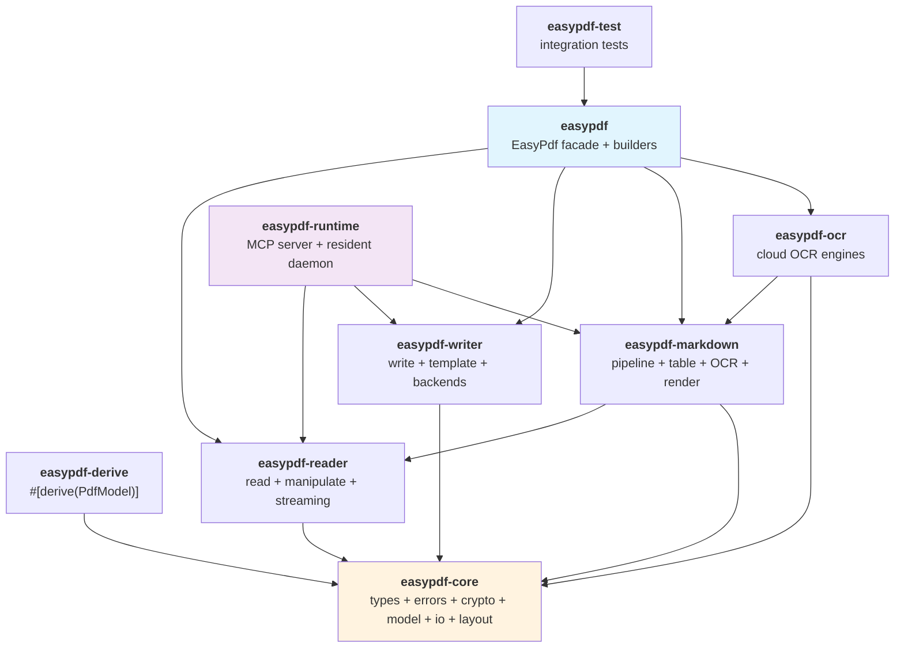

<a id="readme-top"></a>

<div align="center">

# easypdf-rust

**An idiomatic Rust PDF toolkit -- create, read, manipulate, convert, encrypt, and sign.**

Inspired by [Alibaba EasyExcel](https://github.com/alibaba/easyexcel)'s builder-pattern API design.

[](https://crates.io/crates/easypdf)
[](https://docs.rs/easypdf)
[](#toolchain)
[](LICENSE)
[](https://github.com/rust-secure-code/safety-dance)
[]()

[English](./README.md) · [简体中文](./README.zh_CN.md)

</div>

---

> **Version**: `0.1.0` · **MSRV**: Rust `1.88` · **Edition**: `2024` · **License**: Apache-2.0

## Architecture

9-crate workspace with clean separation of concerns:



## Key Capabilities

| Capability | Status | Details |
|---|---|---|
| PDF creation | Stable | Builder pattern, text/images/shapes, custom fonts, metadata |
| PDF reading | Stable | 3 strategies (Full/Lazy/Streaming), session reuse (~129x faster) |
| Page manipulation | Stable | Merge, split, rotate, reorder, watermark, extract |
| Form filling | Stable | AcroForm field mapping via `#[derive(PdfModel)]` |
| PDF to Markdown | Preview | Pipeline with profiles, table detection, OCR fallback |
| Cloud OCR | Preview | GLM, HunyuanOCR, Baidu -- synchronous HTTP |
| Encryption | Stable | AES-128/256, permission control, ISO 32000 compliant |
| Digital signing | Stable | PKCS#7/CMS, RSA-PKCS#1v1.5 + SHA-256, X.509 |
| MCP server | Preview | 7 tools for LLM agent integration |
| Resident daemon | Preview | In-memory sessions via TCP / Unix socket |

## Quick Start

```toml
# Cargo.toml
[dependencies]
easypdf = "0.1.0"
```

**Create a PDF:**

```rust
use easypdf::prelude::*;

EasyPdf::create("output.pdf")
    .page(PageSize::A4)
    .add_text("Hello, world!")
        .font(PdfFont::helvetica(12.0))
        .position(72.0, 700.0)
    .do_write()?;
# Ok::<(), easypdf::PdfError>(())
```

**Read a PDF:**

```rust
use easypdf::prelude::*;

let text = EasyPdf::read("input.pdf")
    .pages(0..10)
    .extract_text()?;
# Ok::<(), easypdf::PdfError>(())
```

**Merge PDFs:**

```rust
use easypdf::prelude::*;

EasyPdf::merge(&["a.pdf", "b.pdf", "c.pdf"], "merged.pdf")?;
# Ok::<(), easypdf::PdfError>(())
```

**Fill a form:**

```rust
use easypdf::prelude::*;

#[derive(PdfModel)]
struct MyData {
    #[pdf(field = "name")]
    name: String,
}

EasyPdf::fill_form("template.pdf", &MyData { name: "Alice".into() })
    .save("filled.pdf")?;
# Ok::<(), easypdf::PdfError>(())
```

## 9-Crate Overview

| Crate | Role | Key Types |
|---|---|---|
| **easypdf** | Facade + builder API | `EasyPdf`, `PdfCreateBuilder`, `PdfReadBuilder`, `PdfManipulateBuilder` |
| **easypdf-core** | Core types, traits, crypto, model, IO, layout | `PdfError`, `PdfBlock`, `PdfDocumentModel`, `PdfEncryption`, `PdfSigner` |
| **easypdf-derive** | `#[derive(PdfModel)]` proc-macro | `PdfModel` derive, field attributes |
| **easypdf-reader** | PDF parsing, text extraction, page operations | `PdfReader`, `PdfManipulator`, `ReadStrategy` |
| **easypdf-writer** | PDF creation, template filling, backend selection | `PdfWriter`, `PdfTemplateFiller`, `WriteBackend` |
| **easypdf-markdown** | PDF to Markdown conversion pipeline | `ProcessorPipeline`, `MarkdownRenderer`, `MarkdownProfile` |
| **easypdf-ocr** | Cloud OCR engine collection | `GlmConfig`, `HunyuanConfig`, `BaiduConfig` |
| **easypdf-runtime** | MCP server + resident daemon | `McpServer`, `ResidentServer`, `ResidentClient` |
| **easypdf-test** | Integration tests + golden samples | Test harness |

## PDF Creation (Builder Pattern)

The writer supports text, images, shapes, custom fonts, and metadata:

```rust
use easypdf::prelude::*;

let writer = EasyPdf::writer("My Report")
    .backend(WriteBackend::auto(10 * 1024 * 1024))  // 10 MB threshold
    .build()?;

// WriteBackend::InMemory -- default, fast for small docs
// WriteBackend::Spill  -- page-level temp files, constant memory
// WriteBackend::Auto   -- auto-select by threshold
# Ok::<(), easypdf::PdfError>(())
```

## PDF Reading (3 Strategies)

`PdfReader` automatically selects the optimal strategy based on file size:

| File Size | Strategy | Behavior |
|---|---|---|
| 0 -- 5 MB | `Full` | Load entire document into memory |
| 5 -- 100 MB | `Lazy` | Parse headers, load pages on demand |
| > 100 MB | `Streaming` | Byte-stream scan, no Document construction |

Session reuse parses the document once and reuses the in-memory representation -- **~129x faster** than re-opening for repeated access.

## Markdown Conversion

PDF to Markdown with profiles, table detection, and OCR fallback:

```rust
use easypdf::prelude::*;

EasyPdf::export_markdown("input.pdf", "output.md")
    .pages(0..20)
    .profile(MarkdownProfile::Llm)
    .tables(TablePolicy::Detect)
    .ocr(OcrPolicy::Auto)
    .do_export()?;
# Ok::<(), easypdf::PdfError>(())
```

| Profile | Use Case |
|---|---|
| `MarkdownProfile::Gfm` | GitHub/GitLab rendering with GFM tables |
| `MarkdownProfile::Llm` | Token-efficient markup for LLM context |
| `MarkdownProfile::Plain` | Human-readable plain text |

Pipeline flow: `PDF -> PdfReader -> PdfDocumentModel -> ProcessorPipeline -> MarkdownRenderer -> String`

## Encryption and Signing

AES-128/256 encryption with permission control:

```rust
use easypdf::prelude::*;

let enc = PdfEncryption::new("user_pass", "owner_pass")
    .with_algorithm(PdfEncryptionAlgorithm::Aes256)
    .with_permissions(PdfPermissions::PRINT | PdfPermissions::COPY);

let encrypted = encrypt_pdf(&pdf_bytes, &enc)?;
# Ok::<(), easypdf::PdfError>(())
```

PKCS#7 digital signatures with RSA-PKCS#1v1.5 + SHA-256 (via `ring`):

```rust
use easypdf::prelude::*;

let signer = PdfSigner::new(cert_pem, key_pem)
    .with_reason("Document approval")
    .with_location("Beijing");

let signed = sign_pdf(&pdf_bytes, &signer)?;
let info = verify_pdf_signature(&signed)?;
# Ok::<(), easypdf::PdfError>(())
```

## Resident Daemon and MCP Server

**Resident daemon** keeps PDF sessions in memory across requests:

```rust,ignore
use easypdf::EasyPdf;

// Start daemon (blocks):
EasyPdf::serve(None)?;

// Attach from another process:
if let Some(client) = EasyPdf::attach() {
    // use client to interact with the daemon
}
```

**MCP server** exposes 7 tools for LLM agent integration:

| Tool | Description |
|---|---|
| `pdf_read_text` | Extract text from PDF |
| `pdf_to_markdown` | Convert PDF to Markdown |
| `pdf_create_text` | Create text PDF |
| `pdf_merge` | Merge multiple PDFs |
| `pdf_split` | Split PDF into pages |
| `pdf_metadata` | Extract document metadata |
| `pdf_page_count` | Get page count |

```rust,ignore
use easypdf::EasyPdf;

let server = EasyPdf::mcp_server();
server.run()?;
```

## Performance

Benchmarked against pdftotext (Poppler) on Apple M4 Pro:

| Metric | easypdf | pdftotext | Result |
|---|---|---|---|
| 100-page extraction | 2.4 ms | 17 ms | **~7x faster** |
| Peak memory (small files) | ~7 MB | ~10 MB | **29% less** |
| Peak memory (100 pages) | 8.7 MB | 10.5 MB | **17% less** |
| Text accuracy (avg) | 89% | baseline | 92--98% on structured PDFs |
| Session reuse | ~1,047 ns | ~135,011 ns | **~129x faster** |

## Test Coverage

| Metric | Value |
|---|---|
| Tests passed | 136 |
| Code coverage | 91.61% |
| Total Rust code | ~52,626 lines |
| Crates | 9 |

## Cargo Features

| Feature | Enables | Default |
|---|---|:---:|
| `markdown` | PDF to Markdown pipeline | Yes |
| `markdown-table` | Table detection in markdown | No |
| `markdown-ocr` | OCR fallback for scanned pages | No |
| `ocr` | Cloud OCR (GLM/Hunyuan/Baidu) | No |
| `render` | PDF page rendering to PNG | No |
| `html` | HTML to PDF (requires Chromium) | No |
| `runtime` | Resident daemon + MCP server | No |
| `mcp` | MCP server only | No |
| `resident` | Resident daemon only | No |
| `full` | Everything enabled | No |

```toml
# Default: markdown enabled
easypdf = "0.1.0"

# Minimal build (no markdown)
easypdf = { version = "0.1.0", default-features = false }

# Enable everything
easypdf = { version = "0.1.0", features = ["full"] }
```

## Toolchain

| Item | Value |
|---|---|
| MSRV | Rust 1.88 |
| Edition | 2024 |
| Resolver | 3 |
| unsafe | `forbid` (workspace-wide) |
| Platform | macOS / Linux / Windows |

## Documentation

| Document | Description |
|---|---|
| [Architecture (EN)](docs/easypdf-rust-Architecture.md) | Architecture design document |
| [Architecture (中文)](docs/easypdf-rust-Architecture.zh_CN.md) | 架构设计文档 |
| [Usage Guide](docs/usage-guide.md) | Complete API guide with 12 chapters |
| [Benchmark Report](docs/performance/BENCHMARK.md) | Performance baseline vs pdftotext |
| [Compatibility](docs/compatibility.md) | Feature matrix + coverage report |
| [Roadmap](docs/roadmap.md) | Detailed roadmap |
| [Changelog](CHANGELOG.md) | Version history |
| [Contributing](CONTRIBUTING.md) | Development setup and conventions |

## Roadmap

| Version | Focus | Status |
|---|---|:---:|
| v0.1 | Foundation: core types, read/write/manipulate/template, derive macro | Done |
| v0.2 | Architecture consolidation: 9 crates, streaming, OCR, MCP, resident | Done |
| v0.3 | Rich content: tables, images, shapes, custom fonts | In Progress |
| v0.4 | Watermarks and layout engine | Planned |
| v0.5 | AES-256 encryption/decryption, password protection | Planned |
| v0.6 | PDF/A validation, digital signatures, XMP metadata | Planned |
| v0.7 | HTML/Markdown/SVG to PDF converters | Planned |
| v1.0 | Stable API, full test coverage, benchmarks | Planned |

## Contributing

Before submitting, run all quality gates:

```bash
cargo check -p easypdf --no-default-features
cargo check -p easypdf --all-features
cargo test --workspace --quiet
cargo doc --workspace --no-deps
```

New public API must include docs, examples, tests, and SemVer impact notes.

## License

Licensed under [Apache-2.0](LICENSE).

## Related Projects

- [easyexcel-rs](https://github.com/easy-4-rust/easyexcel-rs) -- Rust port of Alibaba EasyExcel
- [easyexcel](https://github.com/alibaba/easyexcel) -- Original Java library
- [lopdf](https://crates.io/crates/lopdf) -- Pure Rust PDF manipulation
- [printpdf](https://crates.io/crates/printpdf) -- Pure Rust PDF generation

---

<div align="center">

[Back to top](#readme-top) · [docs.rs](https://docs.rs/easypdf) · [crates.io](https://crates.io/crates/easypdf) · [Issues](https://github.com/easy-4-rust/easypdf-rust/issues)

</div>
