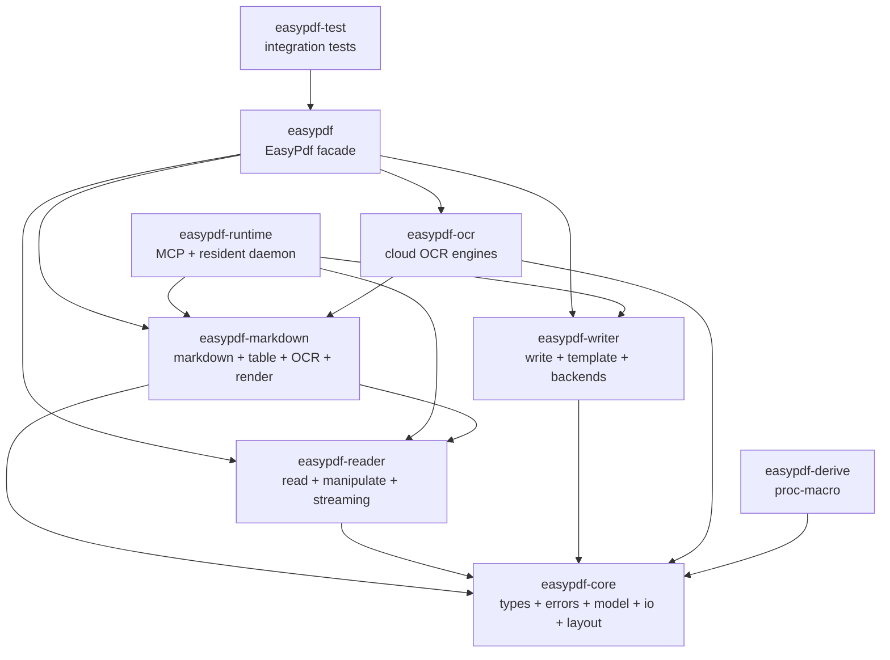

<a id="readme-top"></a>

<div align="center">

# easypdf-rust

**An idiomatic Rust library for quick PDF operations.**
Inspired by [Alibaba EasyExcel](https://github.com/alibaba/easyexcel)'s builder-pattern API design.

[](https://crates.io/crates/easypdf)
[](https://docs.rs/easypdf)
[](#3-rust-baseline--platform-support)
[](LICENSE)
[](https://github.com/rust-secure-code/safety-dance)
[]()

[English](./README.md) · [简体中文](./README.zh-CN.md)

[定位](#1-project-positioning--status) · [功能](#2-features--maturity) · [架构](#5-workspace--crate-architecture) ·
[快速开始](#7-quick-start) · [Markdown](#8-pdf--markdown-export) · [Features](#6-cargo-features) ·
[质量](#14-build-test--quality-gates) · [路线图](#12-roadmap) · [贡献](#16-contributing--license)

</div>

---

> **Current Version**: `0.2.0`
> **MSRV**: Rust `1.88`
> **Edition**: `2024`
> **Workspace Resolver**: `3`
> **Maturity**: Experimental (API and behavior may change)
> **License**: Apache-2.0
> **Last Verified**: 2026-08-09

## 1. Project Positioning & Status

### 1.1 What it is

**easypdf-rust is an idiomatic Rust workspace for quick PDF operations — creation, reading, manipulation, template filling, and PDF → Markdown conversion.**

| Dimension | Detail |
|---|---|
| Root crate | `easypdf` |
| Current version | `0.1.0` |
| MSRV / Edition | `1.88` / `2024` |
| Default features | `markdown` |
| unsafe policy | `#![forbid(unsafe_code)]` in every crate |
| Release status | Workspace-only (not yet on crates.io) |
| License | `Apache-2.0` |

### 1.2 What it is NOT

- Not a 1:1 port of Java EasyExcel — PDF and Excel are fundamentally different paradigms.
- Does not claim implemented features that only return `UnsupportedFeature` or produce stub output.
- Does not enable encryption or signing — these return explicit errors, not simulated success.
- Does not perform real OCR, table detection, or image extraction — the markdown pipeline emits structured warnings for these gaps.

### 1.3 Status Evidence

| Claim | Value | Evidence |
|---|---|---|
| Workspace builds | ✅ | `cargo check -p easypdf --all-features` |
| Tests pass | 136 passed, 1 ignored (legacy trybuild) | `cargo test --workspace --quiet` |
| New crates pass clippy | ✅ | `clippy -D warnings` on easypdf-model, easypdf-io, easypdf-markdown |
| No-default-features builds | ✅ | `cargo check -p easypdf --no-default-features` |
| Docs build | ✅ | `cargo doc --workspace --no-deps` |
| Reader session reuse | ~129x faster than re-open | `cargo bench -p easypdf-reader --bench reader_session` |
| crates.io | Not published | Workspace-only manifest |

## 2. Features & Maturity

### 2.1 Feature Matrix

| Feature | Status | Crate / Feature | Limitations | Verification |
|---|:---:|---|---|---|
| Create PDF (text, fonts, metadata) | ✅ Stable | `easypdf-writer` | Built-in fonts only by default | Tests + examples |
| Read / extract text + metadata | ✅ Stable | `easypdf-reader` | Text extraction depends on font encoding | Tests + benchmark |
| Streaming read strategy | ✅ Preview | `easypdf-reader` | `ReadStrategy::Streaming` for large files | Strategy tests |
| PDF → Markdown | ✅ Preview | `easypdf-markdown` / `markdown` | Native text MVP; tables/images/OCR emit warnings | 6 profile tests |
| Merge / Split / Rotate / Reorder | ✅ Stable | `easypdf-reader::manipulate` | Valid `/Pages` tree on output | Manipulate tests |
| Fill AcroForm fields | ✅ Stable | `easypdf-writer::template` | Field name matching | Template tests |
| `#[derive(PdfModel)]` | ✅ Stable | `easypdf-derive` | Extended attrs: `field`/`order`/`skip`/`default`/`required`/`format`/`nested` | trybuild + integration tests |
| Table detection | ✅ Preview | `easypdf-markdown::table` | Pipe, tab, whitespace patterns | Integration tests |
| OCR pipeline | ✅ Preview | `easypdf-markdown::ocr` | Trait-based `OcrEngine` abstraction | Integration tests |
| Cloud OCR (GLM/Hunyuan/Baidu) | ✅ Preview | `easypdf-ocr` | Synchronous HTTP via reqwest | Integration tests |
| Page rendering | ✅ Preview | `easypdf-markdown::render` | Text renderer (pdfium optional) | Integration tests |
| Resident daemon | ✅ Preview | `easypdf-runtime` / `resident` | Unix socket IPC | Integration tests |
| MCP server | ✅ Preview | `easypdf-runtime` / `mcp` | JSON-RPC over stdio for LLMs | Unit tests |
| Writer backend selection | ✅ Stable | `easypdf-writer` | `InMemory` / `Spill` / `Auto` | Integration tests |
| Writer lifecycle hooks | ✅ Stable | `easypdf-writer` | `PdfWriteHandler` trait | Handler lifecycle test |
| Event-driven read listeners | ✅ Stable | `easypdf-reader` | `PdfReadListener` trait | Listener test |
| Atomic output | ✅ Stable | `easypdf-core::io` | Temp file + atomic rename | All save operations |
| Resource limits | ✅ Stable | `easypdf-core::io` | File size, page count, text length | Limit exceeded tests |
| Engine-neutral semantic model | ✅ Preview | `easypdf-core::model` | `PdfBlock` / `PdfPageModel` / `PdfDocumentModel` | Markdown pipeline |
| tracing observability | ✅ Stable | `easypdf-core::logging` | Structured spans, env-filter, JSON | All crates |
| Tables, images, shapes | 🚧 Planned | — | Not yet implemented | v0.3 roadmap |
| Custom TTF/OTF fonts | 🚧 Planned | — | Partial: `register_font_from_path` exists | v0.3 roadmap |
| Encryption | ⛔ Not implemented | — | Returns `UnsupportedFeature` | Explicit error test |
| Digital signatures | ⛔ Not implemented | — | Returns `UnsupportedFeature` | Explicit error test |

### 2.2 Status Definitions

| Status | Definition |
|---|---|
| ✅ Stable | Public API, tests, and documentation complete; behavior verified |
| 🧪 Preview | Usable but API or behavior may change |
| 🚧 Partial | Only explicitly listed subsets are available |
| 🗓️ Planned | No callable implementation yet |
| ⛔ Not implemented | Returns explicit error; will not silently simulate success |

## 3. Rust Baseline & Platform Support

### 3.1 Toolchain

| Item | Value | Source |
|---|---|---|
| MSRV | `1.88` | `workspace.package.rust-version` |
| Edition | `2024` | `workspace.package.edition` |
| Resolver | `3` | `workspace.resolver` |
| unsafe | `forbid` | `workspace.lints.rust.unsafe_code` |

### 3.2 Platform

| Platform | Status | Notes |
|---|---|---|
| Linux (x86_64) | ✅ | Primary CI target |
| macOS (ARM64 / x86_64) | ✅ | Development platform |
| Windows | Expected | No blocking platform-specific code |
| WASM | Not tested | lopdf/printpdf may have constraints |

## 4. Document Processing Pipeline

```text
Input PDF / bytes / path
        │
        ▼
Resource limit check (file size, page count)
        │
        ▼
lopdf parse → PdfReader session (single-parse, reusable)
        │
        ├──► extract_text / extract_metadata
        ├──► PdfDocumentModel (engine-neutral IR)
        │         │
        │         ▼
        │    MarkdownRenderer (GFM / LLM / Plain profiles)
        │         │
        │         ├──► Output .md file (atomic write)
        │         └──► MarkdownExportReport + structured warnings
        │
        ├──► Merge / Split / Rotate / Reorder
        │         │
        │         └──► Atomic output (temp + rename)
        │
        └──► Template fill (AcroForm fields)
                  │
                  └──► Atomic output
```

## 5. Workspace & Crate Architecture

### 5.1 Crate Map



### 5.2 Crate Responsibilities

| Crate | Purpose | Backend |
|---|---|---|
| **easypdf** | Facade + `EasyPdf` entry point + all Builder types | Depends on core, reader, writer, markdown, ocr |
| **easypdf-core** | Types, enums, traits, `PdfError`, semantic IR, resource limits, atomic output, layout abstractions | thiserror, chrono (no engine) |
| **easypdf-derive** | `#[derive(PdfModel)]` proc-macro with extended field attributes | syn, quote |
| **easypdf-reader** | PDF parsing, text extraction, metadata, session reuse, merge/split/rotate/reorder, streaming strategy | lopdf |
| **easypdf-writer** | PDF creation with text, images, shapes, fonts, `WriteBackend` selection, AcroForm filling | printpdf |
| **easypdf-markdown** | PDF → Markdown with profiles, processor pipeline, table detection, OCR fallback, page rendering | lopdf + easypdf-core |
| **easypdf-ocr** | Cloud OCR engine collection (GLM, HunyuanOCR, Baidu) | reqwest (blocking) |
| **easypdf-runtime** | MCP server (`easypdf-mcp` binary) + resident daemon for in-memory sessions | Feature-gated `mcp` / `resident` |
| **easypdf-test** | Integration test harness with golden files and sample PDFs | Test-only |

### 5.3 Dependency Rules

- `easypdf-core` has zero engine dependencies — it is the shared vocabulary (types, model, io, layout).
- `easypdf-derive` depends only on `easypdf-core`.
- Domain crates (reader, writer, markdown) do NOT depend on each other.
- `easypdf-ocr` depends on `easypdf-markdown` (for the `OcrEngine` trait) and `easypdf-core`.
- `easypdf-runtime` depends on reader, writer, and markdown for the MCP/resident daemons.
- Only the `easypdf` facade depends on all sub-crates.

## 6. Cargo Features

| Feature | Crates enabled | Impact | Default |
|---|---|---|:---:|
| `markdown` | `easypdf-markdown` | PDF → Markdown pipeline | ✅ |
| `html` | `printpdf/html` | HTML → PDF (requires Chromium) | ❌ |
| `markdown-table` | `easypdf-markdown-table` | Table detection in markdown pipeline | ❌ |
| `markdown-ocr` | `easypdf-markdown-ocr` | OCR fallback for scanned pages | ❌ |
| `ocr` | alias for `markdown-ocr` | OCR (alias) | ❌ |
| `render` | `easypdf-render` | PDF page rendering to PNG | ❌ |
| `resident` | `easypdf-resident` | Resident daemon for in-memory sessions | ❌ |
| `mcp` | `easypdf-mcp` | MCP server for LLM agents | ❌ |
| `full` | all optional crates | Everything enabled | ❌ |

```toml
# Default: markdown enabled
easypdf = "0.1.0"

# Disable markdown (smaller build)
easypdf = { version = "0.1.0", default-features = false }

# Enable HTML → PDF
easypdf = { version = "0.1.0", features = ["html"] }

# Enable markdown with table detection
easypdf = { version = "0.1.0", features = ["markdown-table"] }

# Enable OCR pipeline
easypdf = { version = "0.1.0", features = ["ocr"] }

# Enable everything
easypdf = { version = "0.1.0", features = ["full"] }
```

## 7. Quick Start

### 7.1 Create a PDF

```rust
use easypdf::prelude::*;

EasyPdf::create("output.pdf")
    .page(PageSize::A4)
    .add_text("Hello, world!")
        .font(PdfFont::helvetica(12.0))
        .position(72.0, 700.0)
    .do_write()?;
# Ok::<(), easypdf::PdfError>(())
```

### 7.2 Read a PDF

```rust
use easypdf::prelude::*;

let text = EasyPdf::read("input.pdf")
    .pages(0..10)
    .extract_text()?;

let meta = EasyPdf::read("input.pdf")
    .extract_metadata()?;
# Ok::<(), easypdf::PdfError>(())
```

### 7.3 Merge PDFs

```rust
use easypdf::prelude::*;

EasyPdf::merge(&["a.pdf", "b.pdf", "c.pdf"], "merged.pdf")?;
# Ok::<(), easypdf::PdfError>(())
```

### 7.4 Split PDF

```rust
use easypdf::prelude::*;

EasyPdf::split("input.pdf")
    .output_dir("/tmp/pages")
    .do_split()?;
# Ok::<(), easypdf::PdfError>(())
```

### 7.5 Manipulate Pages

```rust
use easypdf::prelude::*;

EasyPdf::manipulate("input.pdf")
    .rotate_all(Rotation::Clockwise90)
    .reorder_pages(&[2, 0, 1])
    .save("reordered.pdf")?;
# Ok::<(), easypdf::PdfError>(())
```

### 7.6 Fill a Form

```rust
use easypdf::prelude::*;

#[derive(PdfModel)]
struct MyData {
    #[pdf(field = "name")]
    name: String,
}

EasyPdf::fill_form("template.pdf", &MyData { name: "Alice".into() })
    .save("filled.pdf")?;
# Ok::<(), easypdf::PdfError>(())
```

## 8. PDF → Markdown Export

The `easypdf-markdown` crate provides deterministic PDF → Markdown conversion with profile-based rendering, zero-based page ranges, export reports, and structured warnings.

### 8.1 Export API

```rust
use easypdf::prelude::*;

EasyPdf::export_markdown("input.pdf", "output.md")
    .pages(0..20)
    .profile(MarkdownProfile::Llm)
    .tables(TablePolicy::Detect)
    .ocr(OcrPolicy::Auto)
    .do_export()?;
# Ok::<(), easypdf::PdfError>(())
```

### 8.2 Markdown Profiles

| Profile | Target use case | Output style |
|---|---|---|
| `MarkdownProfile::Gfm` | GitHub / GitLab rendering | Standard GFM with tables and fenced blocks |
| `MarkdownProfile::Llm` | LLM context injection | Clean, minimal markup optimized for token efficiency |
| `MarkdownProfile::Plain` | Human reading / plain text | Minimal formatting, maximum readability |

### 8.3 Structured Warnings

When a capability is not yet implemented, the markdown pipeline emits structured warnings rather than simulating success:

```rust
use easypdf::prelude::*;

let report = EasyPdf::export_markdown("input.pdf", "output.md")
    .do_export()?;

for warning in report.warnings() {
    match warning {
        MarkdownWarning::TableDetectionUnavailable { page } => { /* ... */ }
        MarkdownWarning::ImageExtractionUnavailable { page } => { /* ... */ }
        MarkdownWarning::OcrUnavailable { page } => { /* ... */ }
    }
}
# Ok::<(), easypdf::PdfError>(())
```

### 8.4 Markdown Pipeline with Table Detection

```rust
use easypdf::prelude::*;

let mut pipeline = EasyPdf::markdown_pipeline(MarkdownProfile::Gfm);
pipeline.register(Box::new(EasyPdf::table_detector()));
# Ok::<(), easypdf::PdfError>(())
```

### 8.5 Render PDF Page to PNG

```rust,ignore
use easypdf::EasyPdf;

EasyPdf::render_page("input.pdf".as_ref(), 0, "page_0.png".as_ref(), 150)?;
# Ok::<(), easypdf::RenderError>(())
```

### 8.6 Writer with Backend Selection

```rust
use easypdf::prelude::*;

let writer = EasyPdf::writer("Big Report")
    .backend(WriteBackend::default())
    .build()?;
# Ok::<(), easypdf::PdfError>(())
```

### 8.7 Resident Daemon

```rust,ignore
use easypdf::EasyPdf;

// Start daemon (blocks):
EasyPdf::serve(None)?;

// Or attach from another process:
if let Some(client) = EasyPdf::attach() {
    // use client to interact with daemon
}
# Ok::<(), easypdf::PdfError>(())
```

### 8.8 MCP Server

```rust,ignore
use easypdf::EasyPdf;

let server = EasyPdf::mcp_server();
server.run()?;
# Ok::<(), easypdf::PdfError>(())
```

## 9. Core API Overview

### 9.1 Entry Points

| Method | Returns | Feature | Purpose |
|---|---|---|---|
| `EasyPdf::create(path)` | `PdfCreateBuilder` | — | Build and write a new PDF |
| `EasyPdf::read(path)` | `PdfReadBuilder` | — | Extract text and metadata |
| `EasyPdf::export_markdown(input, output)` | `PdfMarkdownExportBuilder` | `markdown` | PDF → Markdown (file) |
| `EasyPdf::to_markdown(input)` | `PdfMarkdownBuilder` | `markdown` | PDF → Markdown (in-memory) |
| `EasyPdf::merge(&[paths], output)` | `Result<()>` | — | Merge multiple PDFs |
| `EasyPdf::split(path)` | `PdfSplitBuilder` | — | Split PDF into pages |
| `EasyPdf::manipulate(path)` | `PdfManipulateBuilder` | — | Rotate, reorder pages |
| `EasyPdf::fill_form(path, data)` | `PdfFillBuilder` | — | Fill AcroForm fields |
| `EasyPdf::writer(title)` | `PdfWriterBuilder` | — | Create PDF Writer with backend selection |
| `EasyPdf::markdown_pipeline(profile)` | `ProcessorPipeline` | `markdown` | Markdown conversion pipeline |
| `EasyPdf::table_detector()` | `TableDetectorProcessor` | `markdown-table` | Table detection processor |
| `EasyPdf::render_page(path, page, out, dpi)` | `Result<(), RenderError>` | `render` | Render PDF page to PNG |
| `EasyPdf::mcp_server()` | `McpServer` | `mcp` | Launch MCP server |
| `EasyPdf::serve(socket)` | `Result<()>` | `resident` | Start resident daemon |
| `EasyPdf::attach()` | `Option<ResidentClient>` | `resident` | Attach to running daemon |
| `EasyPdf::encrypt(input, output, pwd)` | `Result<()>` | — | ⛔ Returns `UnsupportedFeature` |
| `EasyPdf::sign(input, output, reason)` | `Result<()>` | — | ⛔ Returns `UnsupportedFeature` |

### 9.2 Reader Session Reuse

The `PdfReader` parses the document exactly once and retains it in memory. Subsequent operations on the same reader reuse the parsed session without re-opening the file.

```text
Reader::open(path)     → parse PDF once, retain Document
  .pages(0..5)         → filter page range (0-based)
  .extract_text()      → iterate selected pages
  .extract_metadata()  → read /Info dictionary
```

Benchmark (local, 3-page PDF):

| Operation | Latency | Ratio |
|---|---:|---:|
| Reuse parsed session | ~1,047 ns/iter | 1x |
| Re-open + re-parse | ~135,011 ns/iter | ~129x |

### 9.3 Traits

| Trait | Role | Analogy from EasyExcel |
|---|---|---|
| `PdfModel` | Map struct fields to PDF elements + form descriptors (derive) | `ExcelRow` |
| `PdfReadListener` | Event-driven text extraction callbacks | `ReadListener<T>` |
| `PdfWriteHandler` | Page lifecycle hooks (before/after page) | `WriteHandler` |
| `PdfConverter<T>` | Bidirectional Rust ⇄ PDF string | `Converter<T>` |
| `LayoutSink` | Backend-neutral layout consumption | — |
| `OcrEngine` | OCR backend abstraction | — |
| `PdfMarkdownProcessor` | Markdown pipeline processor | — |
| `PdfRenderer` | PDF page rasterization | — |

### 9.4 `#[derive(PdfModel)]` Field Attributes

| Attribute | Effect |
|---|---|
| `#[pdf(text, position = (x, y))]` | Render as positioned text |
| `#[pdf(table, position = (x, y))]` | Render as table |
| `#[pdf(image, position = (x, y))]` | Render as image |
| `#[pdf(ignore)]` / `#[pdf(skip)]` | Skip field entirely |
| `#[pdf(field = "name")]` | Map to PDF form field name |
| `#[pdf(order = N)]` | Display/render order |
| `#[pdf(default = "value")]` | Default value when empty |
| `#[pdf(required)]` | Field must be non-empty |
| `#[pdf(format = "pattern")]` | Format pattern (e.g. `"YYYY-MM-DD"`) |
| `#[pdf(nested)]` | Recursively render inner model |

## 10. Error Handling & Resource Limits

### 10.1 Error Type

```rust
pub enum PdfError {
    Io(std::io::Error),
    Parse(String),
    InvalidPage(usize),
    UnsupportedFeature(String),
    ResourceLimitExceeded { resource: &'static str, limit: u64, actual: u64 },
    Encryption(String),
    Other(String),
}

pub type Result<T, E = PdfError> = std::result::Result<T, E>;
```

### 10.2 Resource Limits

All file and memory operations are bounded by `ResourceLimits`:

| Resource | Default | Exceeded behavior |
|---|---|---|
| Max file size | 100 MB | `ResourceLimitExceeded` error |
| Max pages | 10,000 | `ResourceLimitExceeded` error |
| Max text length | 10 MB | `ResourceLimitExceeded` error |

### 10.3 Atomic Output

All save operations (`Writer`, `Manipulate`, `Template`, `Markdown`) use atomic output: write to a temporary file, then rename on success. If the operation fails, the original file is not corrupted.

## 11. Safety & Non-Goals

| Non-Goal | Rationale |
|---|---|
| Encryption / signing | Not implemented; returns `UnsupportedFeature` — no fake security |
| OCR | Not implemented; markdown export emits `OcrUnavailable` warning |
| Table detection | Not implemented; markdown export emits `TableDetectionUnavailable` warning |
| Image extraction | Not implemented; markdown export emits `ImageExtractionUnavailable` warning |
| 1:1 Java EasyExcel compatibility | PDF and Excel are different paradigms; API is inspired-by, not clone-of |

## 12. Roadmap

| Phase | Focus | Key Deliverables | Status |
|:---:|---|---|:---:|
| **v0.1** | Foundation | 11 crates, core types, read/write/manipulate/template/markdown, derive macro, builder API, atomic output, resource limits | ✅ |
| **v0.2** | Architecture + OCR | 9-crate consolidation, streaming read, WriteBackend, cloud OCR (GLM/Hunyuan/Baidu), MCP, resident daemon, tracing | ✅ |
| **v0.3** | Rich content | Tables, images, vector shapes, custom TTF/OTF fonts, page headers/footers | 🚧 |
| **v0.4** | Watermarks & layout | Text/image watermarks, layout engine, PDF layers (OCG) | 🗓️ |
| **v0.5** | Security | AES-256 encryption/decryption, password protection | 🗓️ |
| **v0.6** | Compliance | PDF/A validation, digital signatures, XMP metadata | 🗓️ |
| **v0.7** | Converters | HTML → PDF, Markdown → PDF, SVG → PDF | 🗓️ |
| **v1.0** | Stable | Stable API, full test coverage, performance benchmarks | 🗓️ |

## 13. Performance & Benchmarks

```bash
cargo bench -p easypdf-reader --bench reader_session
```

| Scenario | Data size | Latency | Notes |
|---|---:|---:|---|
| Session reuse (parsed in memory) | 3-page PDF | ~1,047 ns/iter | Single parse, repeated access |
| Re-open + re-parse | 3-page PDF | ~135,011 ns/iter | Full I/O + parse each time |
| Speedup | — | ~129x | Session reuse vs re-open |

Hardware: local development machine. Benchmark does not equal production SLA.

## 14. Build, Test & Quality Gates

### 14.1 Basic Gates

```bash
cargo check -p easypdf --no-default-features
cargo check -p easypdf --all-features
cargo test --workspace --quiet
cargo doc --workspace --no-deps
```

### 14.2 Extended Gates

```bash
cargo fmt --all -- --check
cargo clippy --workspace --all-targets --all-features -- -D warnings
cargo clippy -p easypdf-model -p easypdf-io -p easypdf-markdown -- -D warnings
```

### 14.3 Test Matrix

| Type | Scope | Command |
|---|---|---|
| Unit tests | All crates | `cargo test --workspace` |
| Compile tests | derive macro | trybuild (1 ignored legacy test) |
| Doc tests | API examples | `cargo test --doc` |
| Feature combinations | default, no-default, all | `cargo check` variants |

## 15. Documents & Examples

| Document | Description |
|---|---|
| [Architecture (EN)](docs/easypdf-rust-Architecture.md) | Architecture design document (English) |
| [Architecture (中文)](docs/easypdf-rust-Architecture.zh_CN.md) | 架构设计文档（中文） |
| [Usage Guide](docs/usage-guide.md) | Complete API guide with 12 chapters of examples |
| [Compatibility](docs/compatibility.md) | Feature matrix + coverage report |
| [Roadmap](docs/roadmap.md) | Detailed roadmap with current/target/non-goal separation |
| [Changelog](CHANGELOG.md) | Version history and release notes |
| [Contributing](CONTRIBUTING.md) | Development setup, quality gates, commit conventions |

## 16. Contributing & License

Before submitting, run all basic gates. New public API must include docs, examples, tests, and SemVer impact notes.

This project is licensed under [Apache-2.0](LICENSE).

## 17. Related Projects

- [easyexcel-rs](https://github.com/easy-4-rust/easyexcel-rs) — Rust port of Alibaba EasyExcel
- [easyexcel](https://github.com/alibaba/easyexcel) — Original Java library
- [lopdf](https://crates.io/crates/lopdf) — Pure Rust PDF manipulation
- [printpdf](https://crates.io/crates/printpdf) — Pure Rust PDF generation

---

<div align="center">

[Back to top](#readme-top) · [docs.rs](https://docs.rs/easypdf) · [crates.io](https://crates.io/crates/easypdf) · [Issues](https://github.com/easy-4-rust/easypdf-rust/issues)

</div>
