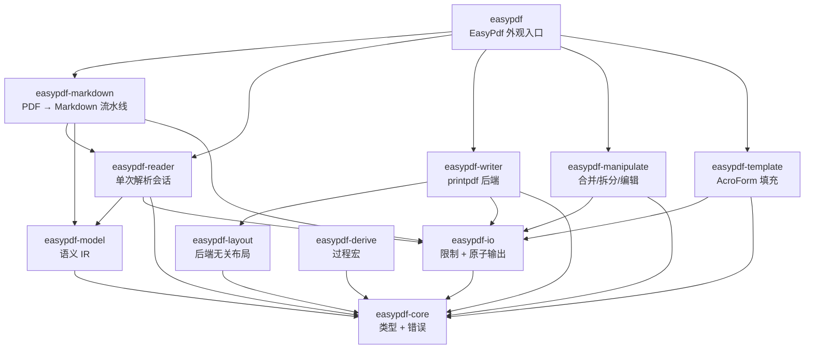

<a id="readme-top"></a>

<div align="center">

# easypdf-rust

**符合 Rust 惯用风格的 PDF 操作库**
灵感来自 [Alibaba EasyExcel](https://github.com/alibaba/easyexcel) 的 Builder 模式 API 设计

[](https://crates.io/crates/easypdf)
[](https://docs.rs/easypdf)
[](#3-rust-基线与平台支持)
[](LICENSE)
[](https://github.com/rust-secure-code/safety-dance)
[]()

[English](./README.md) · [简体中文](./README.zh-CN.md)

[定位](#1-项目定位与状态) · [功能](#2-功能与成熟度) · [架构](#5-workspace-与-crate-架构) ·
[快速开始](#7-快速开始) · [Markdown](#8-pdf--markdown-导出) · [Features](#6-cargo-features) ·
[质量](#14-构建测试与质量门禁) · [路线图](#12-路线图) · [贡献](#16-贡献与许可证)

</div>

---

> **当前版本**：`0.1.0`
> **MSRV**：Rust `1.88`
> **Edition**：`2024`
> **Workspace Resolver**：`3`
> **成熟度**：实验性（API 和行为可能变化）
> **许可证**：Apache-2.0
> **最后核验**：2026-08-09

## 1. 项目定位与状态

### 1.1 是什么

**easypdf-rust 是一个符合 Rust 惯用风格的 workspace 库，用于快速执行 PDF 操作——创建、读取、页面操作、模板填充和 PDF → Markdown 转换。**

| 维度 | 内容 |
|---|---|
| 根 crate | `easypdf` |
| 当前版本 | `0.1.0` |
| MSRV / Edition | `1.88` / `2024` |
| 默认 features | `markdown` |
| unsafe 策略 | 每个 crate 均使用 `#![forbid(unsafe_code)]` |
| 发布状态 | 仅 workspace 内部（尚未发布至 crates.io） |
| 许可证 | `Apache-2.0` |

### 1.2 不是什么

- 不是 Java EasyExcel 的 1:1 移植——PDF 和 Excel 是根本不同的范式。
- 不会把仅返回 `UnsupportedFeature` 或产生 stub 输出的能力标记为已实现。
- 不启用加密或签名——这些功能返回明确错误，而非模拟成功。
- 不执行真正的 OCR、表格检测或图片提取——Markdown 流水线对这些缺口发出结构化警告。

### 1.3 状态证据

| 声明 | 当前值 | 证据 |
|---|---|---|
| Workspace 可构建 | ✅ | `cargo check -p easypdf --all-features` |
| 测试通过 | 136 passed, 1 ignored (legacy trybuild) | `cargo test --workspace --quiet` |
| 新 crate 通过 clippy | ✅ | `clippy -D warnings` on easypdf-model, easypdf-io, easypdf-markdown |
| no-default-features 构建 | ✅ | `cargo check -p easypdf --no-default-features` |
| 文档构建 | ✅ | `cargo doc --workspace --no-deps` |
| Reader 会话复用 | ~129x 加速 | `cargo bench -p easypdf-reader --bench reader_session` |
| crates.io | 未发布 | 仅 workspace manifest |

## 2. 功能与成熟度

### 2.1 功能矩阵

| 功能 | 状态 | Crate / Feature | 限制 | 验证 |
|---|:---:|---|---|---|
| 创建 PDF（文本、字体、元数据） | ✅ 稳定 | `easypdf-writer` | 默认仅内置字体 | 测试 + 示例 |
| 读取 / 提取文本 + 元数据 | ✅ 稳定 | `easypdf-reader` | 文本提取依赖字体编码 | 测试 + 基准 |
| PDF → Markdown | ✅ 预览 | `easypdf-markdown` / `markdown` | 原生文本 MVP；表格/图片/OCR 发出警告 | 6 个 profile 测试 |
| 合并 PDF | ✅ 稳定 | `easypdf-manipulate` | 输出有效 `/Pages` 树 | 合并测试 |
| 拆分 PDF | ✅ 稳定 | `easypdf-manipulate` | 每个输出有效 `/Pages` 树 | 拆分测试 |
| 旋转 / 重排页面 | ✅ 稳定 | `easypdf-manipulate` | 按页或全部页面 | 操作测试 |
| 填充 AcroForm 表单 | ✅ 稳定 | `easypdf-template` | 字段名匹配 | 模板测试 |
| `#[derive(PdfModel)]` | ✅ 稳定 | `easypdf-derive` | 仅编译期 | trybuild 测试 |
| Writer 生命周期钩子 | ✅ 稳定 | `easypdf-writer` | `PdfWriteHandler` trait | 钩子生命周期测试 |
| 事件驱动读取监听器 | ✅ 稳定 | `easypdf-reader` | `PdfReadListener` trait | 监听器测试 |
| 原子输出 | ✅ 稳定 | `easypdf-io` | 临时文件 + 原子重命名 | 所有保存操作 |
| 资源限制 | ✅ 稳定 | `easypdf-io` | 文件大小、页数、文本长度 | 超限测试 |
| 引擎无关语义模型 | ✅ 预览 | `easypdf-model` | `PdfBlock` / `PdfPageModel` / `PdfDocumentModel` | Markdown 流水线 |
| 表格、图片、矢量图形 | 🚧 计划 | — | 尚未实现 | v0.2 路线图 |
| 自定义 TTF/OTF 字体 | 🚧 计划 | — | 部分：`register_font_from_path` 已存在 | v0.2 路线图 |
| 加密 | ⛔ 未实现 | — | 返回 `UnsupportedFeature` | 显式错误测试 |
| 数字签名 | ⛔ 未实现 | — | 返回 `UnsupportedFeature` | 显式错误测试 |

### 2.2 状态定义

| 状态 | 定义 |
|---|---|
| ✅ 稳定 | 公共 API、测试和文档完整；行为已验证 |
| 🧪 预览 | 可用但 API 或行为可能变化 |
| 🚧 部分 | 仅列出的子集可用 |
| 🗓️ 计划 | 尚无可调用实现 |
| ⛔ 未实现 | 返回明确错误；不会静默模拟成功 |

## 3. Rust 基线与平台支持

### 3.1 Toolchain

| 项目 | 值 | 来源 |
|---|---|---|
| MSRV | `1.88` | `workspace.package.rust-version` |
| Edition | `2024` | `workspace.package.edition` |
| Resolver | `3` | `workspace.resolver` |
| unsafe | `forbid` | `workspace.lints.rust.unsafe_code` |

### 3.2 平台

| 平台 | 状态 | 说明 |
|---|---|---|
| Linux (x86_64) | ✅ | 主要 CI 目标 |
| macOS (ARM64 / x86_64) | ✅ | 开发平台 |
| Windows | 预期可用 | 无阻塞性平台特定代码 |
| WASM | 未测试 | lopdf/printpdf 可能有约束 |

## 4. 文档处理流水线

```text
输入 PDF / 字节流 / 路径
        │
        ▼
资源限制检查（文件大小、页数）
        │
        ▼
lopdf 解析 → PdfReader 会话（单次解析，可复用）
        │
        ├──► extract_text / extract_metadata
        ├──► PdfDocumentModel（引擎无关 IR）
        │         │
        │         ▼
        │    MarkdownRenderer（GFM / LLM / Plain profiles）
        │         │
        │         ├──► 输出 .md 文件（原子写入）
        │         └──► MarkdownExportReport + 结构化警告
        │
        ├──► 合并 / 拆分 / 旋转 / 重排
        │         │
        │         └──► 原子输出（临时文件 + 重命名）
        │
        └──► 模板填充（AcroForm 字段）
                  │
                  └──► 原子输出
```

## 5. Workspace 与 Crate 架构

### 5.1 Crate 地图



### 5.2 Crate 职责

| Crate | 用途 | 后端 |
|---|---|---|
| **easypdf** | 外观入口 + `EasyPdf` + 所有 Builder 类型 | 依赖所有子 crate |
| **easypdf-core** | 类型、枚举、trait、`PdfError` | thiserror, chrono（无引擎） |
| **easypdf-model** | 引擎无关语义 IR（`PdfBlock`, `PdfPageModel`, `PdfDocumentModel`） | 无引擎依赖 |
| **easypdf-io** | `ResourceLimits`、`PdfInput`、`AtomicFileOutput` | 仅 std |
| **easypdf-derive** | `#[derive(PdfModel)]` 过程宏 | syn, quote |
| **easypdf-layout** | 后端无关布局抽象（`LayoutSink` trait、`FlowLayout`） | 无引擎依赖 |
| **easypdf-reader** | PDF 解析、文本提取、元数据、会话复用 | lopdf |
| **easypdf-writer** | PDF 创建（文本、图片、矢量图形、字体） | printpdf |
| **easypdf-manipulate** | 合并、拆分、旋转、重排页面 | lopdf |
| **easypdf-template** | AcroForm 字段填充 | lopdf |
| **easypdf-markdown** | PDF → Markdown 转换（profiles + 结构化警告） | lopdf + easypdf-model |

### 5.3 依赖规则

- `easypdf-core` 零引擎依赖——它是共享词汇表。
- `easypdf-model` 和 `easypdf-io` 零引擎依赖——它们是引擎无关基础设施。
- `easypdf-layout` 不依赖 `easypdf-writer`——它暴露 `LayoutSink`，由 Writer 实现。
- 领域 crate（reader、writer、manipulate、template、markdown）之间不互相依赖。
- 仅 `easypdf` 外观依赖所有子 crate。

## 6. Cargo Features

| Feature | 启用的 Crate | 影响 | 默认 |
|---|---|---|:---:|
| `markdown` | `easypdf-markdown` | PDF → Markdown 流水线 | ✅ |
| `html` | `printpdf/html` | HTML → PDF（需要 Chromium） | ❌ |

```toml
# 默认：启用 markdown
easypdf = "0.1.0"

# 禁用 markdown（更小编译体积）
easypdf = { version = "0.1.0", default-features = false }

# 启用 HTML → PDF
easypdf = { version = "0.1.0", features = ["html"] }
```

## 7. 快速开始

### 7.1 创建 PDF

```rust
use easypdf::prelude::*;

EasyPdf::create("output.pdf")
    .page(PageSize::A4)
    .add_text("Hello, world!")
        .font(PdfFont::helvetica(12.0))
        .position(72.0, 700.0)
    .do_write()?;
# Ok::<(), easypdf::PdfError>(())
```

### 7.2 读取 PDF

```rust
use easypdf::prelude::*;

let text = EasyPdf::read("input.pdf")
    .pages(0..10)
    .extract_text()?;

let meta = EasyPdf::read("input.pdf")
    .extract_metadata()?;
# Ok::<(), easypdf::PdfError>(())
```

### 7.3 合并 PDF

```rust
use easypdf::prelude::*;

EasyPdf::merge(&["a.pdf", "b.pdf", "c.pdf"], "merged.pdf")?;
# Ok::<(), easypdf::PdfError>(())
```

### 7.4 拆分 PDF

```rust
use easypdf::prelude::*;

EasyPdf::split("input.pdf")
    .output_dir("/tmp/pages")
    .do_split()?;
# Ok::<(), easypdf::PdfError>(())
```

### 7.5 页面操作

```rust
use easypdf::prelude::*;

EasyPdf::manipulate("input.pdf")
    .rotate_all(Rotation::Clockwise90)
    .reorder_pages(&[2, 0, 1])
    .save("reordered.pdf")?;
# Ok::<(), easypdf::PdfError>(())
```

### 7.6 填充表单

```rust
use easypdf::prelude::*;

#[derive(PdfModel)]
struct MyData {
    #[pdf(field = "name")]
    name: String,
}

EasyPdf::fill_form("template.pdf", &MyData { name: "Alice".into() })
    .save("filled.pdf")?;
# Ok::<(), easypdf::PdfError>(())
```

## 8. PDF → Markdown 导出

`easypdf-markdown` crate 提供确定性 PDF → Markdown 转换，支持 profile 渲染、0 基页范围、导出报告和结构化警告。

### 8.1 导出 API

```rust
use easypdf::prelude::*;

EasyPdf::export_markdown("input.pdf", "output.md")
    .pages(0..20)
    .profile(MarkdownProfile::Llm)
    .tables(TablePolicy::Detect)
    .ocr(OcrPolicy::Auto)
    .do_export()?;
# Ok::<(), easypdf::PdfError>(())
```

### 8.2 Markdown Profiles

| Profile | 目标场景 | 输出风格 |
|---|---|---|
| `MarkdownProfile::Gfm` | GitHub / GitLab 渲染 | 标准 GFM，含表格和围栏代码块 |
| `MarkdownProfile::Llm` | LLM 上下文注入 | 精简标记，优化 token 效率 |
| `MarkdownProfile::Plain` | 人类阅读 / 纯文本 | 最小格式化，最大可读性 |

### 8.3 结构化警告

当某能力尚未实现时，Markdown 流水线发出结构化警告而非模拟成功：

```rust
use easypdf::prelude::*;

let report = EasyPdf::export_markdown("input.pdf", "output.md")
    .do_export()?;

for warning in report.warnings() {
    match warning {
        MarkdownWarning::TableDetectionUnavailable { page } => { /* ... */ }
        MarkdownWarning::ImageExtractionUnavailable { page } => { /* ... */ }
        MarkdownWarning::OcrUnavailable { page } => { /* ... */ }
    }
}
# Ok::<(), easypdf::PdfError>(())
```

## 9. 核心 API 概览

### 9.1 入口方法

| 方法 | 返回类型 | 用途 |
|---|---|---|
| `EasyPdf::create(path)` | `PdfCreateBuilder` | 构建并写入新 PDF |
| `EasyPdf::read(path)` | `PdfReadBuilder` | 提取文本和元数据 |
| `EasyPdf::export_markdown(input, output)` | `PdfMarkdownExportBuilder` | PDF → Markdown |
| `EasyPdf::merge(&[paths], output)` | `Result<()>` | 合并多个 PDF |
| `EasyPdf::split(path)` | `PdfSplitBuilder` | 拆分 PDF 为单页 |
| `EasyPdf::manipulate(path)` | `PdfManipulateBuilder` | 旋转、重排页面 |
| `EasyPdf::fill_form(path, data)` | `PdfFillBuilder` | 填充 AcroForm 字段 |
| `EasyPdf::encrypt(input, output, pwd)` | `Result<()>` | ⛔ 返回 `UnsupportedFeature` |
| `EasyPdf::sign(input, output, reason)` | `Result<()>` | ⛔ 返回 `UnsupportedFeature` |

### 9.2 Reader 会话复用

`PdfReader` 仅解析文档一次并保留在内存中。后续操作复用已解析的会话，无需重新打开文件。

```text
Reader::open(path)     → 解析 PDF 一次，保留 Document
  .pages(0..5)         → 过滤页范围（0 基）
  .extract_text()      → 遍历选定页面
  .extract_metadata()  → 读取 /Info 字典
```

基准测试（本地 3 页 PDF）：

| 操作 | 延迟 | 倍率 |
|---|---:|---:|
| 复用已解析会话 | ~1,047 ns/iter | 1x |
| 重新打开 + 解析 | ~135,011 ns/iter | ~129x |

### 9.3 Trait 扩展点

| Trait | 角色 | EasyExcel 类比 |
|---|---|---|
| `PdfModel` | 将结构体字段映射为 PDF 元素（derive） | `ExcelRow` |
| `PdfReadListener` | 事件驱动文本提取回调 | `ReadListener<T>` |
| `PdfWriteHandler` | 页面生命周期钩子（before/after page） | `WriteHandler` |
| `PdfConverter<T>` | 双向 Rust ⇄ PDF 字符串转换 | `Converter<T>` |
| `LayoutSink` | 后端无关布局消费 | — |

## 10. 错误处理与资源限制

### 10.1 错误类型

```rust
pub enum PdfError {
    Io(std::io::Error),
    Parse(String),
    InvalidPage(usize),
    UnsupportedFeature(String),
    ResourceLimitExceeded { resource: &'static str, limit: u64, actual: u64 },
    Encryption(String),
    Other(String),
}

pub type Result<T, E = PdfError> = std::result::Result<T, E>;
```

### 10.2 资源限制

所有文件和内存操作均受 `ResourceLimits` 约束：

| 资源 | 默认值 | 超限行为 |
|---|---|---|
| 最大文件大小 | 100 MB | `ResourceLimitExceeded` 错误 |
| 最大页数 | 10,000 | `ResourceLimitExceeded` 错误 |
| 最大文本长度 | 10 MB | `ResourceLimitExceeded` 错误 |

### 10.3 原子输出

所有保存操作（Writer、Manipulate、Template、Markdown）使用原子输出：写入临时文件，成功后重命名。如果操作失败，原始文件不会被损坏。

## 11. 安全与非目标

| 非目标 | 理由 |
|---|---|
| 加密 / 签名 | 未实现；返回 `UnsupportedFeature`——不伪造安全性 |
| OCR | 未实现；Markdown 导出发出 `OcrUnavailable` 警告 |
| 表格检测 | 未实现；Markdown 导出发出 `TableDetectionUnavailable` 警告 |
| 图片提取 | 未实现；Markdown 导出发出 `ImageExtractionUnavailable` 警告 |
| 1:1 Java EasyExcel 兼容 | PDF 和 Excel 是不同范式；API 受启发，非克隆 |

## 12. 路线图

| 阶段 | 重点 | 关键交付物 | 状态 |
|:---:|---|---|:---:|
| **v0.1** | 基础 | 11 个 crate，核心类型，读/写/操作/模板/Markdown，derive 宏，Builder API，原子输出，资源限制 | ✅ |
| **v0.2** | 丰富内容 | 表格、图片、矢量图形、自定义 TTF/OTF 字体、页眉/页脚 | 🚧 |
| **v0.3** | 水印与布局 | 文本/图片水印、布局引擎、PDF 图层（OCG） | 🗓️ |
| **v0.4** | 安全 | AES-256 加密/解密、密码保护 | 🗓️ |
| **v0.5** | 合规 | PDF/A 验证、数字签名、XMP 元数据 | 🗓️ |
| **v0.6** | 转换器 | HTML → PDF、Markdown → PDF、SVG → PDF | 🗓️ |
| **v1.0** | 稳定 | 稳定 API、完整测试覆盖、性能基准 | 🗓️ |

## 13. 性能与基准

```bash
cargo bench -p easypdf-reader --bench reader_session
```

| 场景 | 数据规模 | 延迟 | 说明 |
|---|---:|---:|---|
| 会话复用（已解析在内存中） | 3 页 PDF | ~1,047 ns/iter | 单次解析，重复访问 |
| 重新打开 + 解析 | 3 页 PDF | ~135,011 ns/iter | 每次完整 I/O + 解析 |
| 加速比 | — | ~129x | 会话复用 vs 重新打开 |

硬件：本地开发机器。基准不等于生产 SLA。

## 14. 构建、测试与质量门禁

### 14.1 基础门禁

```bash
cargo check -p easypdf --no-default-features
cargo check -p easypdf --all-features
cargo test --workspace --quiet
cargo doc --workspace --no-deps
```

### 14.2 扩展门禁

```bash
cargo fmt --all -- --check
cargo clippy --workspace --all-targets --all-features -- -D warnings
cargo clippy -p easypdf-model -p easypdf-io -p easypdf-markdown -- -D warnings
```

### 14.3 测试矩阵

| 类型 | 范围 | 命令 |
|---|---|---|
| 单元测试 | 所有 crate | `cargo test --workspace` |
| 编译期测试 | derive 宏 | trybuild（1 个忽略的遗留测试） |
| 文档测试 | API 示例 | `cargo test --doc` |
| Feature 组合 | default, no-default, all | `cargo check` 变体 |

## 15. 文档与示例

| 文档 | 说明 |
|---|---|
| [架构设计（中文）](docs/easypdf-rust-Architecture.zh_CN.md) | 架构设计文档（中文） |
| [Architecture (EN)](docs/easypdf-rust-Architecture.md) | Architecture design document (English) |
| [使用指南](docs/usage-guide.md) | 完整 API 指南，含 12 章节代码示例 |
| [兼容性](docs/compatibility.md) | 功能矩阵 + 覆盖率报告 |
| [路线图](docs/roadmap.md) | 详细路线图，含当前态/目标态/非目标分离 |
| [更新日志](CHANGELOG.md) | 版本历史和发布说明 |
| [贡献指南](CONTRIBUTING.md) | 开发环境、质量门禁、提交规范 |

## 16. 贡献与许可证

提交前请运行所有基础门禁。新增公共 API 必须包含文档、示例、测试和 SemVer 影响说明。

本项目采用 [Apache-2.0](LICENSE) 许可证。

## 17. 相关项目

- [easyexcel-rs](https://github.com/easy-4-rust/easyexcel-rs) — Alibaba EasyExcel 的 Rust 移植
- [easyexcel](https://github.com/alibaba/easyexcel) — Alibaba 原始 Java 库
- [lopdf](https://crates.io/crates/lopdf) — 纯 Rust PDF 操作库
- [printpdf](https://crates.io/crates/printpdf) — 纯 Rust PDF 生成库

---

<div align="center">

[返回顶部](#readme-top) · [docs.rs](https://docs.rs/easypdf) · [crates.io](https://crates.io/crates/easypdf) · [Issues](https://github.com/easy-4-rust/easypdf-rust/issues)

</div>
