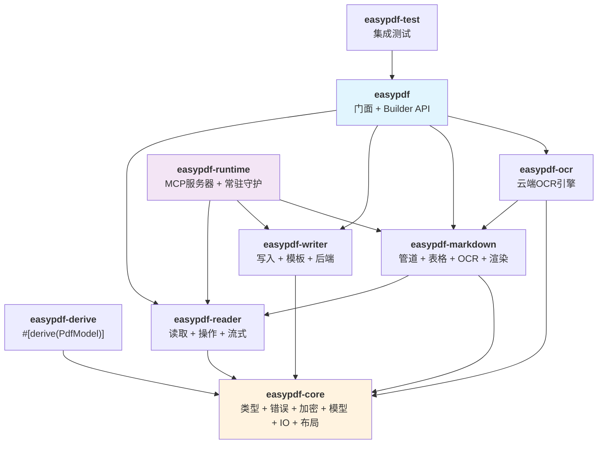

<a id="readme-top"></a>

<div align="center">

# easypdf-rust

**符合Rust惯用风格的PDF工具库——创建、读取、操作、转换、加密和签名。**

灵感来自[Alibaba EasyExcel](https://github.com/alibaba/easyexcel)的Builder模式API设计。

[](https://crates.io/crates/easypdf)
[](https://docs.rs/easypdf)
[](#工具链)
[](LICENSE)
[](https://github.com/rust-secure-code/safety-dance)
[]()

[English](./README.md) · [简体中文](./README.zh_CN.md)

</div>

---

> **版本**：`0.1.0` · **MSRV**：Rust `1.88` · **Edition**：`2024` · **许可证**：Apache-2.0

## 架构

9个crate的workspace，职责清晰分离：



## 核心能力

| 能力 | 状态 | 说明 |
|---|---|---|
| PDF创建 | 稳定 | Builder模式，文本/图片/形状，自定义字体，元数据 |
| PDF读取 | 稳定 | 3种策略（Full/Lazy/Streaming），会话复用（约129倍加速） |
| 页面操作 | 稳定 | 合并、拆分、旋转、重排、水印、提取 |
| 表单填充 | 稳定 | 通过`#[derive(PdfModel)]`映射AcroForm字段 |
| PDF转Markdown | 预览 | 带Profile的管道，表格检测，OCR回退 |
| 云端OCR | 预览 | GLM、混元、百度——同步HTTP |
| 加密 | 稳定 | AES-128/256，权限控制，符合ISO 32000 |
| 数字签名 | 稳定 | PKCS#7/CMS，RSA-PKCS#1v1.5 + SHA-256，X.509 |
| MCP服务器 | 预览 | 7个工具，供LLM Agent集成 |
| 常驻守护 | 预览 | 通过TCP/Unix socket的内存会话 |

## 快速开始

```toml
# Cargo.toml
[dependencies]
easypdf = "0.1.0"
```

**创建PDF：**

```rust
use easypdf::prelude::*;

EasyPdf::create("output.pdf")
    .page(PageSize::A4)
    .add_text("Hello, world!")
        .font(PdfFont::helvetica(12.0))
        .position(72.0, 700.0)
    .do_write()?;
# Ok::<(), easypdf::PdfError>(())
```

**读取PDF：**

```rust
use easypdf::prelude::*;

let text = EasyPdf::read("input.pdf")
    .pages(0..10)
    .extract_text()?;
# Ok::<(), easypdf::PdfError>(())
```

**合并PDF：**

```rust
use easypdf::prelude::*;

EasyPdf::merge(&["a.pdf", "b.pdf", "c.pdf"], "merged.pdf")?;
# Ok::<(), easypdf::PdfError>(())
```

**填充表单：**

```rust
use easypdf::prelude::*;

#[derive(PdfModel)]
struct MyData {
    #[pdf(field = "name")]
    name: String,
}

EasyPdf::fill_form("template.pdf", &MyData { name: "Alice".into() })
    .save("filled.pdf")?;
# Ok::<(), easypdf::PdfError>(())
```

## 9个Crate概览

| Crate | 职责 | 关键类型 |
|---|---|---|
| **easypdf** | 门面 + Builder API | `EasyPdf`、`PdfCreateBuilder`、`PdfReadBuilder`、`PdfManipulateBuilder` |
| **easypdf-core** | 核心类型、trait、加密、模型、IO、布局 | `PdfError`、`PdfBlock`、`PdfDocumentModel`、`PdfEncryption`、`PdfSigner` |
| **easypdf-derive** | `#[derive(PdfModel)]`过程宏 | `PdfModel`派生、字段属性 |
| **easypdf-reader** | PDF解析、文本提取、页面操作 | `PdfReader`、`PdfManipulator`、`ReadStrategy` |
| **easypdf-writer** | PDF创建、模板填充、后端选择 | `PdfWriter`、`PdfTemplateFiller`、`WriteBackend` |
| **easypdf-markdown** | PDF转Markdown转换管道 | `ProcessorPipeline`、`MarkdownRenderer`、`MarkdownProfile` |
| **easypdf-ocr** | 云端OCR引擎集合 | `GlmConfig`、`HunyuanConfig`、`BaiduConfig` |
| **easypdf-runtime** | MCP服务器 + 常驻守护 | `McpServer`、`ResidentServer`、`ResidentClient` |
| **easypdf-test** | 集成测试 + 黄金样本 | 测试框架 |

## PDF创建（Builder模式）

写入器支持文本、图片、形状、自定义字体和元数据：

```rust
use easypdf::prelude::*;

let writer = EasyPdf::writer("My Report")
    .backend(WriteBackend::auto(10 * 1024 * 1024))  // 10 MB阈值
    .build()?;

// WriteBackend::InMemory —— 默认，适合小文档
// WriteBackend::Spill  —— 页面级临时文件，恒定内存
// WriteBackend::Auto   —— 按阈值自动选择
# Ok::<(), easypdf::PdfError>(())
```

## PDF读取（3种策略）

`PdfReader`根据文件大小自动选择最优策略：

| 文件大小 | 策略 | 行为 |
|---|---|---|
| 0 -- 5 MB | `Full` | 将整个文档加载到内存 |
| 5 -- 100 MB | `Lazy` | 解析头部，按需加载页面 |
| > 100 MB | `Streaming` | 字节流扫描，不构建Document对象 |

会话复用仅解析文档一次并保留内存表示——重复访问时比重新打开快**约129倍**。

## Markdown转换

PDF转Markdown，支持Profile、表格检测和OCR回退：

```rust
use easypdf::prelude::*;

EasyPdf::export_markdown("input.pdf", "output.md")
    .pages(0..20)
    .profile(MarkdownProfile::Llm)
    .tables(TablePolicy::Detect)
    .ocr(OcrPolicy::Auto)
    .do_export()?;
# Ok::<(), easypdf::PdfError>(())
```

| Profile | 用途 |
|---|---|
| `MarkdownProfile::Gfm` | GitHub/GitLab渲染，支持GFM表格 |
| `MarkdownProfile::Llm` | 面向LLM上下文的Token高效标记 |
| `MarkdownProfile::Plain` | 人类可读的纯文本 |

管道流程：`PDF -> PdfReader -> PdfDocumentModel -> ProcessorPipeline -> MarkdownRenderer -> String`

## 加密与签名

AES-128/256加密，支持权限控制：

```rust
use easypdf::prelude::*;

let enc = PdfEncryption::new("user_pass", "owner_pass")
    .with_algorithm(PdfEncryptionAlgorithm::Aes256)
    .with_permissions(PdfPermissions::PRINT | PdfPermissions::COPY);

let encrypted = encrypt_pdf(&pdf_bytes, &enc)?;
# Ok::<(), easypdf::PdfError>(())
```

PKCS#7数字签名，使用RSA-PKCS#1v1.5 + SHA-256（通过`ring`）：

```rust
use easypdf::prelude::*;

let signer = PdfSigner::new(cert_pem, key_pem)
    .with_reason("Document approval")
    .with_location("Beijing");

let signed = sign_pdf(&pdf_bytes, &signer)?;
let info = verify_pdf_signature(&signed)?;
# Ok::<(), easypdf::PdfError>(())
```

## 常驻守护与MCP服务器

**常驻守护**在请求间保持PDF会话在内存中：

```rust,ignore
use easypdf::EasyPdf;

// 启动守护（阻塞）：
EasyPdf::serve(None)?;

// 从其他进程连接：
if let Some(client) = EasyPdf::attach() {
    // 使用client与守护交互
}
```

**MCP服务器**暴露7个工具供LLM Agent集成：

| 工具 | 说明 |
|---|---|
| `pdf_read_text` | 从PDF提取文本 |
| `pdf_to_markdown` | 将PDF转为Markdown |
| `pdf_create_text` | 创建文本PDF |
| `pdf_merge` | 合并多个PDF |
| `pdf_split` | 将PDF拆分为页面 |
| `pdf_metadata` | 提取文档元数据 |
| `pdf_page_count` | 获取页数 |

```rust,ignore
use easypdf::EasyPdf;

let server = EasyPdf::mcp_server();
server.run()?;
```

## 性能

在Apple M4 Pro上与pdftotext（Poppler）对比测试：

| 指标 | easypdf | pdftotext | 结果 |
|---|---|---|---|
| 100页提取 | 2.4 ms | 17 ms | **快约7倍** |
| 峰值内存（小文件） | 约7 MB | 约10 MB | **减少29%** |
| 峰值内存（100页） | 8.7 MB | 10.5 MB | **减少17%** |
| 文本准确率（平均） | 89% | 基准 | 结构化PDF达92--98% |
| 会话复用 | 1,047 ns | 135,011 ns | **快约129倍** |

## 测试覆盖

| 指标 | 数值 |
|---|---|
| 通过测试数 | 136 |
| 代码覆盖率 | 91.61% |
| Rust代码总量 | 约52,626行 |
| Crate数量 | 9 |

## Cargo Features

| Feature | 启用内容 | 默认 |
|---|---|:---:|
| `markdown` | PDF转Markdown管道 | 是 |
| `markdown-table` | Markdown中的表格检测 | 否 |
| `markdown-ocr` | 扫描页面的OCR回退 | 否 |
| `ocr` | 云端OCR（GLM/混元/百度） | 否 |
| `render` | PDF页面渲染为PNG | 否 |
| `html` | HTML转PDF（需要Chromium） | 否 |
| `runtime` | 常驻守护 + MCP服务器 | 否 |
| `mcp` | 仅MCP服务器 | 否 |
| `resident` | 仅常驻守护 | 否 |
| `full` | 启用全部功能 | 否 |

```toml
# 默认：启用markdown
easypdf = "0.1.0"

# 最小构建（无markdown）
easypdf = { version = "0.1.0", default-features = false }

# 启用全部功能
easypdf = { version = "0.1.0", features = ["full"] }
```

## 工具链

| 项目 | 值 |
|---|---|
| MSRV | Rust 1.88 |
| Edition | 2024 |
| Resolver | 3 |
| unsafe | 全局禁止（`forbid`） |
| 平台 | macOS / Linux / Windows |

## 文档

| 文档 | 说明 |
|---|---|
| [架构设计（英文）](docs/easypdf-rust-Architecture.md) | 架构设计文档 |
| [架构设计（中文）](docs/easypdf-rust-Architecture.zh_CN.md) | 架构设计文档 |
| [使用指南](docs/usage-guide.md) | 完整API指南，12章示例 |
| [性能基准](docs/performance/BENCHMARK.md) | 与pdftotext的性能对比 |
| [兼容性](docs/compatibility.md) | 功能矩阵 + 覆盖率报告 |
| [版本规划](docs/superpowers/version-plan.md) | 版本规划与路线图 |
| [变更日志](CHANGELOG.md) | 版本历史 |
| [贡献指南](CONTRIBUTING.md) | 开发环境和规范 |

## 路线图

| 版本 | 重点 | 状态 |
|---|---|:---:|
| v0.1 | 基础：核心类型、读写/操作/模板、派生宏、Builder API | 已完成 |
| v0.2 | 架构整合：9个crate、流式读取、OCR、MCP、常驻守护 | 已完成 |
| v0.3 | 丰富内容：表格、图片、矢量形状、自定义字体 | 进行中 |
| v0.4 | 水印与布局引擎 | 计划中 |
| v0.5 | AES-256加密/解密、密码保护 | 计划中 |
| v0.6 | PDF/A验证、数字签名、XMP元数据 | 计划中 |
| v0.7 | HTML/Markdown/SVG转PDF转换器 | 计划中 |
| v1.0 | 稳定API、完整测试覆盖、性能基准 | 计划中 |

## 贡献

提交前请运行所有质量门禁：

```bash
cargo check -p easypdf --no-default-features
cargo check -p easypdf --all-features
cargo test --workspace --quiet
cargo doc --workspace --no-deps
```

新增公开API须包含文档、示例、测试和SemVer影响说明。

## 许可证

基于[Apache-2.0](LICENSE)许可。

## 相关项目

- [easyexcel-rs](https://github.com/easy-4-rust/easyexcel-rs)——Alibaba EasyExcel的Rust移植
- [easyexcel](https://github.com/alibaba/easyexcel)——原始Java库
- [lopdf](https://crates.io/crates/lopdf)——纯Rust PDF操作库
- [printpdf](https://crates.io/crates/printpdf)——纯Rust PDF生成库

---

<div align="center">

[回到顶部](#readme-top) · [docs.rs](https://docs.rs/easypdf) · [crates.io](https://crates.io/crates/easypdf) · [Issues](https://github.com/easy-4-rust/easypdf-rust/issues)

</div>
