# easypdf-rust 项目事实清单

> 本文档是**前置单一事实源**，供后续 9 个文档生成 agent 共享。
> 每个数据点均标注代码位置引用。
> 置信度标记：✅ 直接从代码确认 / ⚠️ 推断 / ❓ 不确定

---

## 1. 工作区概览

### 1.1 Workspace Metadata

| 属性 | 值 | 代码位置 |
|------|-----|----------|
| 版本 | `0.1.0` | `Cargo.toml:workspace.package.version` |
| Rust 版本 (MSRV) | `1.88` | `Cargo.toml:workspace.package.rust-version` |
| Edition | `2024` | `Cargo.toml:workspace.package.edition` |
| Resolver | `3` | `Cargo.toml:resolver` |
| License | `Apache-2.0` | `Cargo.toml:workspace.package.license` |
| 仓库 | `https://github.com/easy-4-rust/easypdf-rust` | `Cargo.toml:workspace.package.repository` |
| 总代码量 | ~52,626 行 Rust | `find crates/*/src -name "*.rs" \| wc -l` |
| 总 crate 数 | 9（8 个 crates/ + 1 个 easypdf-test/） | `Cargo.toml:workspace.members` |

### 1.2 Workspace Members

| Crate | 路径 | 角色 |
|-------|------|------|
| `easypdf` | `crates/easypdf/` | 门面 crate，提供 `EasyPdf` 入口和 builder API |
| `easypdf-core` | `crates/easypdf-core/` | 核心类型、trait、错误、加密、模型、IO、布局 |
| `easypdf-derive` | `crates/easypdf-derive/` | `#[derive(PdfModel)]` proc-macro |
| `easypdf-reader` | `crates/easypdf-reader/` | PDF 读取、文本提取、合并/拆分/旋转（lopdf 后端） |
| `easypdf-writer` | `crates/easypdf-writer/` | PDF 创建与写入（printpdf 后端） |
| `easypdf-markdown` | `crates/easypdf-markdown/` | PDF→Markdown 转换管道（含表格检测、渲染、OCR） |
| `easypdf-ocr` | `crates/easypdf-ocr/` | 云端 OCR 引擎集合（GLM / HunyuanOCR / Baidu） |
| `easypdf-runtime` | `crates/easypdf-runtime/` | 运行时层：MCP server + Resident daemon |
| `easypdf-test` | `easypdf-test/` | 集成测试与 golden samples |

### 1.3 依赖关系图

```
easypdf (门面)
├── easypdf-core (必选)
├── easypdf-derive (必选)
├── easypdf-reader (必选)
├── easypdf-writer (必选)
├── easypdf-markdown (optional, feature = "markdown")
├── easypdf-ocr (optional, feature = "ocr")
└── easypdf-runtime (optional, feature = "runtime")

easypdf-reader
└── easypdf-core

easypdf-writer
└── easypdf-core

easypdf-markdown
├── easypdf-core
└── easypdf-reader

easypdf-ocr
├── easypdf-core
└── easypdf-markdown

easypdf-runtime
├── easypdf-core
├── easypdf-reader
├── easypdf-writer
└── easypdf-markdown

easypdf-derive
└── (独立 proc-macro，仅编译期依赖 syn/quote)
```

✅ `Cargo.toml` 各 crate 的 `[dependencies]` 确认

### 1.4 Feature 矩阵（easypdf 门面 crate）

| Feature | 启用行为 | 代码位置 |
|---------|---------|----------|
| `default` | 包含 `markdown` | `crates/easypdf/Cargo.toml:features.default` |
| `markdown` | 启用 `easypdf-markdown`，PDF→Markdown 转换 | `crates/easypdf/Cargo.toml` |
| `markdown-table` | 表格检测（隐含 `markdown`） | `crates/easypdf/Cargo.toml` |
| `markdown-ocr` | Markdown OCR（隐含 `markdown`） | `crates/easypdf/Cargo.toml` |
| `ocr` | 云端 OCR 引擎（隐含 `markdown`） | `crates/easypdf/Cargo.toml` |
| `render` | PDF 页面渲染为图片（隐含 `markdown`） | `crates/easypdf/Cargo.toml` |
| `html` | HTML→PDF（需 Chromium，通过 printpdf） | `crates/easypdf/Cargo.toml` |
| `runtime` | 启用 `easypdf-runtime` | `crates/easypdf/Cargo.toml` |
| `mcp` | MCP server（隐含 `runtime`） | `crates/easypdf/Cargo.toml` |
| `resident` | Resident daemon（隐含 `runtime`） | `crates/easypdf/Cargo.toml` |
| `full` | `markdown-table + ocr + render + mcp + resident` | `crates/easypdf/Cargo.toml` |

### 1.5 外部关键依赖

| 依赖 | 版本 | 用途 | 代码位置 |
|------|------|------|----------|
| `lopdf` | `0.44.0` | PDF 解析/读取/加密后端 | `Cargo.toml:workspace.dependencies` |
| `printpdf` | `0.12.4` | PDF 创建/写入后端 | `Cargo.toml:workspace.dependencies` |
| `ring` | `0.17` | constant-time RSA 签名 | `Cargo.toml:workspace.dependencies` |
| `thiserror` | `2.0.18` | 错误类型派生 | `Cargo.toml:workspace.dependencies` |
| `chrono` | `0.4.45` | 日期/时间处理 | `Cargo.toml:workspace.dependencies` |
| `image` | `0.25.9` | 图片处理 | `Cargo.toml:workspace.dependencies` |
| `tracing` | `0.1` | 结构化日志 | `Cargo.toml:workspace.dependencies` |
| `tracing-subscriber` | `>=0.3.20` | 日志订阅者 | `Cargo.toml:workspace.dependencies` |
| `serde` / `serde_json` | `1.0.228` / `1.0.150` | 序列化 | `Cargo.toml:workspace.dependencies` |
| `flate2` | `1.1.9` | PDF 流解压缩 | `Cargo.toml:workspace.dependencies` |
| `reqwest` | `0.12` | OCR HTTP 客户端（easypdf-ocr） | `crates/easypdf-ocr/Cargo.toml` |
| `x509-parser` | `0.16` | X.509 证书解析（easypdf-core） | `crates/easypdf-core/Cargo.toml` |

---

## 2. 每个 Crate 的事实清单

---

### `easypdf`

**版本**: 0.1.0
**路径**: `crates/easypdf/`
**角色**: 门面 crate，提供统一的 `EasyPdf` 入口和 builder 模式 API

#### 公开 API

- **Struct**:
  - `EasyPdf` (`crates/easypdf/src/lib.rs:182`) — 主入口，提供静态工厂方法
  - `PdfCreateBuilder` (`crates/easypdf/src/builders.rs`) — 创建 PDF 的 builder
  - `PdfReadBuilder` (`crates/easypdf/src/builders.rs`) — 读取 PDF 的 builder
  - `PdfManipulateBuilder` (`crates/easypdf/src/builders.rs`) — 操作 PDF 的 builder
  - `PdfSplitBuilder` (`crates/easypdf/src/builders.rs`) — 拆分 PDF 的 builder
  - `PdfFillBuilder` (`crates/easypdf/src/pdf_fill_builder.rs`) — 表单填充 builder
  - `PdfTextBuilder` (`crates/easypdf/src/builders.rs`) — 文本内容 builder
  - `PdfImageBuilder` (`crates/easypdf/src/builders.rs`) — 图片内容 builder
  - `PdfTableBuilder` (`crates/easypdf/src/builders.rs`) — 表格内容 builder
  - `PdfPositionedTextBuilder` (`crates/easypdf/src/builders.rs`) — 定位文本 builder
  - `HtmlToPdfBuilder` (`crates/easypdf/src/html.rs`, feature = "html") — HTML→PDF builder

- **关键函数**:
  - `EasyPdf::create(path)` — 创建新 PDF (`crates/easypdf/src/lib.rs:190`)
  - `EasyPdf::read(path)` — 读取 PDF (`crates/easypdf/src/lib.rs:226`)
  - `EasyPdf::merge(inputs, output)` — 合并 PDF (`crates/easypdf/src/lib.rs:260`)
  - `EasyPdf::split(path)` — 拆分 PDF (`crates/easypdf/src/lib.rs:268`)
  - `EasyPdf::manipulate(path)` — 操作 PDF (`crates/easypdf/src/lib.rs:276`)
  - `EasyPdf::fill_form(path, data)` — 表单填充 (`crates/easypdf/src/lib.rs:286`)
  - `EasyPdf::from_html(html)` — HTML→PDF（需 `html` feature）(`crates/easypdf/src/lib.rs:202`)
  - `EasyPdf::from_markdown(md)` — Markdown→PDF（需 `html` feature）(`crates/easypdf/src/lib.rs:214`)
  - `EasyPdf::export_markdown(input, output)` — PDF→Markdown 文件导出 (`crates/easypdf/src/lib.rs:237`)
  - `EasyPdf::to_markdown(input)` — PDF→Markdown 内存转换 (`crates/easypdf/src/lib.rs:249`)
  - `write_table()` — 表格写入辅助函数 (`crates/easypdf/src/writer_helpers.rs`)

- **Re-exports**: 几乎所有子 crate 的公开类型都通过 `pub use` 重导出 (`crates/easypdf/src/lib.rs:59-139`)

#### 重要代码片段

```rust
// 创建 PDF 示例 (crates/easypdf/src/lib.rs:9-17)
EasyPdf::create("output.pdf")
    .page(PageSize::A4)
    .add_text("Hello, world!")
        .font(PdfFont::helvetica(12.0))
    .do_write()?;
```

```rust
// 读取 PDF 示例 (crates/easypdf/src/lib.rs:22-23)
let text = EasyPdf::read("input.pdf").extract_text()?;
```

```rust
// 表单填充示例 (crates/easypdf/src/lib.rs:32-39)
#[derive(PdfModel)]
struct MyData {
    #[pdf(field = "name")]
    name: String,
}
EasyPdf::fill_form("template.pdf", &MyData { name: "Alice".into() })
    .save("filled.pdf")?;
```

#### 已发布文档/示例

- README.md: ❌ 不存在（门面 crate 无独立 README）
- examples/: 12 个示例文件
  - `create_basic.rs`, `create_multi_page.rs`, `create_table.rs`
  - `read_basic.rs`, `streaming_read.rs`
  - `merge_pdfs.rs`, `split_pdf.rs`, `manipulate_rotate.rs`
  - `fill_form.rs`
  - `pdf_to_markdown.rs`, `markdown_pipeline.rs`
  - `README.md`
- tests/: `crates/easypdf/src/tests.rs`

---

### `easypdf-core`

**版本**: 0.1.0
**路径**: `crates/easypdf-core/`
**角色**: 核心类型、trait、错误定义、加密/签名、语义模型、IO 原语、布局引擎

#### 公开 API

- **Enum**:
  - `PageSize` (`crates/easypdf-core/src/enums.rs:4`) — A0-A5/Letter/Legal/Custom
  - `Orientation` (`crates/easypdf-core/src/enums.rs:45`) — Portrait/Landscape
  - `Rotation` (`crates/easypdf-core/src/enums.rs:55`) — None/Clockwise90/180/270
  - `TextAlignment` (`crates/easypdf-core/src/enums.rs:68`) — Left/Center/Right/Justify
  - `VerticalAlignment` (`crates/easypdf-core/src/enums.rs:82`) — Top/Middle/Bottom
  - `ImageFormat` (`crates/easypdf-core/src/enums.rs:94`) — Jpeg/Png
  - `PdfBlock` (`crates/easypdf-core/src/model/pdf_block.rs:12`) — 14 个语义内容块变体（`#[non_exhaustive]`）
  - `PdfBlockType` (`crates/easypdf-core/src/model/pdf_block_type.rs:10`) — 14 种内容块分类
  - `PdfError` (`crates/easypdf-core/src/error.rs:12`) — 9 种错误变体
  - `PdfErrorCode` (`crates/easypdf-core/src/error.rs:78`) — 机器可读错误码
  - `CapabilityLevel` (`crates/easypdf-core/src/traits.rs:363`) — None/Heuristic/Structural/Cloud
  - `PdfEncryptionAlgorithm` (`crates/easypdf-core/src/crypto/encrypt.rs:104`) — Aes128/Aes256
  - `BuiltInFont` (`crates/easypdf-core/src/style.rs`) — 14 种内置字体
  - `Direction` (`crates/easypdf-core/src/layout/direction.rs`) — 布局方向

- **Struct**:
  - `PdfMetadata` (`crates/easypdf-core/src/metadata.rs`) — 文档元数据（title/author/subject/keywords）
  - `PdfBookmark` (`crates/easypdf-core/src/metadata.rs`) — 书签（支持嵌套）
  - `PdfFont` (`crates/easypdf-core/src/style.rs`) — 字体配置
  - `FontFamily` (`crates/easypdf-core/src/style.rs`) — BuiltIn/Custom
  - `FontStyle` (`crates/easypdf-core/src/style.rs`) — bold/italic
  - `PdfColor` (`crates/easypdf-core/src/style.rs`) — Rgb/Cmyk/Gray
  - `TableStyle` (`crates/easypdf-core/src/style.rs`) — 表格样式
  - `TableBorder` (`crates/easypdf-core/src/style.rs`) — 表格边框
  - `PdfText` (`crates/easypdf-core/src/content.rs`) — 文本内容
  - `PdfTable` (`crates/easypdf-core/src/content.rs`) — 表格内容
  - `PdfTableCell` (`crates/easypdf-core/src/content.rs`) — 表格单元格
  - `PdfImage` (`crates/easypdf-core/src/content.rs`) — 图片内容
  - `PdfLine` (`crates/easypdf-core/src/content.rs`) — 线条
  - `PdfRect` (`crates/easypdf-core/src/content.rs`) — 矩形
  - `PdfDocumentModel` (`crates/easypdf-core/src/model/pdf_document_model.rs:13`) — 文档语义模型
  - `PdfPageModel` (`crates/easypdf-core/src/model/pdf_page_model.rs:12`) — 页面语义模型
  - `ImageData` (`crates/easypdf-core/src/model/image_data.rs`) — 图片元数据
  - `ListItem` (`crates/easypdf-core/src/model/list_item.rs`) — 列表项
  - `SourceLocation` (`crates/easypdf-core/src/model/source_location.rs`) — 源位置（页码+置信度）
  - `PageIndex` (`crates/easypdf-core/src/page_index.rs`) — 零基页索引
  - `PageNumber` (`crates/easypdf-core/src/page_number.rs`) — 一基页码
  - `PageRange` (`crates/easypdf-core/src/page_range.rs`) — 页码范围
  - `PdfModelMetadata` (`crates/easypdf-core/src/traits.rs:75`) — 模型元数据
  - `PdfFieldDescriptor` (`crates/easypdf-core/src/traits.rs:40`) — 表单字段描述符
  - `EngineCapabilities` (`crates/easypdf-core/src/traits.rs:275`) — 引擎能力（布尔）
  - `DetailedEngineCapabilities` (`crates/easypdf-core/src/traits.rs:390`) — 引擎能力（分级）
  - `FlowLayout` (`crates/easypdf-core/src/layout/flow_layout.rs`) — 自动流式布局
  - `ResourceLimits` (`crates/easypdf-core/src/io/resource_limits.rs`) — 资源限制配置
  - `AtomicFileOutput` (`crates/easypdf-core/src/io/atomic_file_output.rs`) — 原子文件写入
  - `PdfInput` (`crates/easypdf-core/src/io/pdf_input.rs`) — PDF 输入抽象
  - `PdfEncryption` (`crates/easypdf-core/src/crypto/encrypt.rs:130`) — 加密配置
  - `PdfPermissions` (`crates/easypdf-core/src/crypto/encrypt.rs:56`) — 权限位标志
  - `EncryptionInfo` (`crates/easypdf-core/src/crypto/encrypt.rs:292`) — 加密元信息
  - `PdfSigner` (`crates/easypdf-core/src/crypto/sign.rs:57`) — 签名配置
  - `SignatureInfo` (`crates/easypdf-core/src/crypto/sign.rs:121`) — 签名信息

- **Trait**:
  - `PdfModel` (`crates/easypdf-core/src/traits.rs:12`) — 模型渲染 trait（通常 derive）
  - `PdfReadListener` (`crates/easypdf-core/src/traits.rs:139`) — 读取事件监听器（Send）
  - `PdfWriteHandler` (`crates/easypdf-core/src/traits.rs:183`) — 写入生命周期钩子（Send）
  - `PdfConverter<T>` (`crates/easypdf-core/src/traits.rs:228`) — 双向类型转换器（Send）
  - `PdfEngine` (`crates/easypdf-core/src/traits.rs:264`) — 抽象引擎接口（Send+Sync）
  - `LayoutSink` (`crates/easypdf-core/src/layout/layout_sink.rs`) — 布局输出 sink

- **关键函数**:
  - `encrypt_pdf()` — AES-128/256 加密 (`crates/easypdf-core/src/crypto/encrypt.rs:182`)
  - `decrypt_pdf()` — PDF 解密 (`crates/easypdf-core/src/crypto/encrypt.rs:221`)
  - `get_encryption_info()` — 查询加密信息 (`crates/easypdf-core/src/crypto/encrypt.rs:244`)
  - `sign_pdf()` — PKCS#7 数字签名 (`crates/easypdf-core/src/crypto/sign_pdf.rs`)
  - `verify_pdf_signature()` — 签名验证 (`crates/easypdf-core/src/crypto/sign_pdf.rs`)
  - `init_logging()` / `init_logging_json()` — 日志初始化 (`crates/easypdf-core/src/logging.rs`)
  - `attempt_repair()` — PDF 自修复 (`crates/easypdf-core/src/io/repair.rs`)
  - `guard_decompression_bomb()` — 解压炸弹防护 (`crates/easypdf-core/src/io/guards.rs`)
  - `guard_element_explosion()` — 元素爆炸防护 (`crates/easypdf-core/src/io/guards.rs`)

#### 关键依赖

- `lopdf: 0.44.0` — PDF 解析（加密也通过 lopdf 的 encrypt/decrypt API）
- `ring: 0.17` — constant-time RSA 签名（sign 模块）
- `aes/cbc/cipher` — AES 加密原语
- `x509-parser: 0.16` — X.509 证书解析
- `bitflags: 2` — PdfPermissions 位标志

#### 重要代码片段

```rust
// PdfBlock 14 变体（crates/easypdf-core/src/model/pdf_block.rs:12-123）
#[non_exhaustive]
pub enum PdfBlock {
    Heading { level: u8, text: String, source: SourceLocation },
    Paragraph { text: String, source: SourceLocation },
    List { ordered: bool, items: Vec<ListItem>, source: SourceLocation },
    Table { headers: Vec<String>, rows: Vec<Vec<String>>, source: SourceLocation },
    Image { data: ImageData, source: SourceLocation },
    Code { language: Option<String>, text: String, source: SourceLocation },
    Formula { latex: String, source: SourceLocation },
    PageBreak { source: SourceLocation },
    Footnote { reference_id: String, text: String, source: SourceLocation },
    TableCell { row_span: u32, col_span: u32, text: String, source: SourceLocation },
    BlockQuote { text: String, source: SourceLocation },
    HorizontalRule { source: SourceLocation },
    Link { url: String, text: String, source: SourceLocation },
    Unknown { raw: String, source: SourceLocation },
}
```

```rust
// 加密用法（crates/easypdf-core/src/crypto/encrypt.rs:18-31）
let enc = PdfEncryption::new("user", "owner")
    .with_algorithm(PdfEncryptionAlgorithm::Aes256)
    .with_permissions(PdfPermissions::PRINT | PdfPermissions::COPY);
let encrypted = encrypt_pdf(&pdf_bytes, &enc).unwrap();
```

#### 已发布文档/示例

- README.md: ✅ 存在
- examples/: 无
- tests/: 内联测试（lib.rs + 各模块内 `#[cfg(test)]`）

---

### `easypdf-derive`

**版本**: 0.1.0
**路径**: `crates/easypdf-derive/`
**角色**: Proc-macro crate，提供 `#[derive(PdfModel)]`

#### 公开 API

- **Proc-macro**:
  - `PdfModel` (`crates/easypdf-derive/src/lib.rs:54`) — 派生宏，生成 `PdfModel` trait 实现

#### 支持的属性

| 属性 | 用途 | 代码位置 |
|------|------|----------|
| `#[pdf(page = A4, orientation = Portrait)]` | 结构体级页面配置 | `crates/easypdf-derive/src/lib.rs:44` |
| `#[pdf(text, position = (x, y))]` | 字段渲染为定位文本 | `crates/easypdf-derive/src/lib.rs:46` |
| `#[pdf(table, position = (x, y))]` | 字段渲染为表格 | `crates/easypdf-derive/src/lib.rs:47` |
| `#[pdf(image, position = (x, y))]` | 字段渲染为图片 | `crates/easypdf-derive/src/lib.rs:48` |
| `#[pdf(field = "name")]` | 映射到 PDF 表单字段名 | `crates/easypdf-derive/src/lib.rs:50` |
| `#[pdf(order = N)]` | 显示/渲染顺序 | `crates/easypdf-derive/src/lib.rs:51` |
| `#[pdf(ignore)]` / `#[pdf(skip)]` | 跳过字段 | `crates/easypdf-derive/src/lib.rs:49` |
| `#[pdf(default = "value")]` | 默认值 | `crates/easypdf-derive/src/lib.rs:52` |
| `#[pdf(required)]` | 必填字段 | `crates/easypdf-derive/src/lib.rs:53` |
| `#[pdf(format = "pattern")]` | 格式模式 | `crates/easypdf-derive/src/lib.rs:54` |
| `#[pdf(nested)]` | 递归包含内部模型 | `crates/easypdf-derive/src/lib.rs:55` |
| `#[pdf(font = ...)]` | 设置字体 | `crates/easypdf-derive/src/lib.rs:33` |
| `#[pdf(size = N)]` | 设置字号 | `crates/easypdf-derive/src/lib.rs:34` |

#### 关键依赖

- `syn: 3.0.3` — Rust 源码解析（features = ["full"]）
- `quote: 1.0.47` — 代码生成
- `proc-macro2: 1.0.107` — proc-macro 2.0 基础
- `proc-macro-crate: 3.5.0` — crate 名解析

#### 已发布文档/示例

- README.md: ✅ 存在
- examples/: 无
- tests/: `trybuild` 编译期测试（dev-dependency）

---

### `easypdf-reader`

**版本**: 0.1.0
**路径**: `crates/easypdf-reader/`
**角色**: PDF 读取、文本提取、页面操作（合并/拆分/旋转/重排/水印），lopdf 后端

#### 公开 API

- **Struct**:
  - `PdfReader` (`crates/easypdf-reader/src/reader/mod.rs:36`) — PDF 读取器
  - `PdfManipulator` (`crates/easypdf-reader/src/manipulate.rs:13`) — PDF 操作器

- **Enum**:
  - `ReadStrategy` (`crates/easypdf-reader/src/strategy.rs:29`) — Full/Lazy/Streaming

- **关键函数（PdfReader）**:
  - `PdfReader::open(path)` — 自动策略选择打开 (`crates/easypdf-reader/src/reader/mod.rs:57`)
  - `PdfReader::from_bytes(bytes)` — 从内存字节打开 (`crates/easypdf-reader/src/reader/mod.rs:70`)
  - `PdfReader::open_with_strategy(path, strategy)` — 指定策略打开 (`crates/easypdf-reader/src/reader/mod.rs:98`)
  - `PdfReader::open_with_repair(path, repair, strategy)` — 自修复打开 (`crates/easypdf-reader/src/reader/mod.rs:112`)
  - `PdfReader::open_with_limits(input, limits)` — 指定资源限制 (`crates/easypdf-reader/src/reader/mod.rs:85`)
  - `reader.extract_text()` — 提取文本（在 `reader/extract.rs`）
  - `reader.extract_metadata()` — 提取元数据
  - `reader.page_count()` — 页数
  - `reader.pages(range)` — 限定页范围

- **关键函数（PdfManipulator）**:
  - `PdfManipulator::open(path)` — 打开 (`crates/easypdf-reader/src/manipulate.rs:23`)
  - `PdfManipulator::merge_files(paths, output)` — 合并文件 (`crates/easypdf-reader/src/manipulate.rs:37`)
  - `manipulator.rotate_page(page, rotation)` — 旋转页面 (`crates/easypdf-reader/src/manipulate.rs:71`)
  - `manipulator.reorder_pages(order)` — 重排页面 (`crates/easypdf-reader/src/manipulate.rs:109`)
  - `manipulator.extract_pages(range)` — 提取页面 (`crates/easypdf-reader/src/manipulate.rs:147`)
  - `manipulator.add_text_watermark(text, size, opacity)` — 添加水印 (`crates/easypdf-reader/src/manipulate.rs:179`)
  - `manipulator.add_layer(name)` — 添加可选内容组（图层）(`crates/easypdf-reader/src/manipulate.rs:226`)
  - `manipulator.validate_pdfa()` — PDF/A-1b 合规验证 (`crates/easypdf-reader/src/manipulate.rs:260`)

#### ReadStrategy 自动选择阈值

| 文件大小 | 策略 | 代码位置 |
|---------|------|----------|
| 0 - 5 MB | `Full` | `crates/easypdf-reader/src/strategy.rs:56` |
| 5 - 100 MB | `Lazy` | `crates/easypdf-reader/src/strategy.rs:58` |
| > 100 MB | `Streaming` | `crates/easypdf-reader/src/strategy.rs:68` |

#### Streaming 模块

- `StreamScanner` (`crates/easypdf-reader/src/streaming/scanner.rs`) — 字节流扫描器
- `StreamScanResult` (`crates/easypdf-reader/src/streaming/mod.rs:24`) — 扫描结果
- 支持 CMap/ToUnicode 编码字体 (`crates/easypdf-reader/src/streaming/cmap.rs`)
- 精度低于 Full/Lazy（⚠️ CJK 边界可能不准确）

#### 关键依赖

- `easypdf-core: ^0.1.0`
- `lopdf: 0.44.0`
- `flate2: 1.1.9`

#### 已发布文档/示例

- README.md: ✅ 存在
- examples/: 无（示例在 easypdf 门面 crate）
- tests/: `crates/easypdf-reader/src/reader/tests.rs`, `crates/easypdf-reader/src/streaming/tests.rs`
- benches/: `crates/easypdf-reader/benches/reader_session.rs`

---

### `easypdf-writer`

**版本**: 0.1.0
**路径**: `crates/easypdf-writer/`
**角色**: PDF 创建与写入，printpdf 后端

#### 公开 API

- **Struct**:
  - `PdfWriter` (`crates/easypdf-writer/src/writer.rs`) — PDF 写入器
  - `PdfWriterBuilder` (`crates/easypdf-writer/src/builder.rs`) — 写入器 builder
  - `PdfTemplateFiller` (`crates/easypdf-writer/src/template.rs`) — AcroForm 表单填充器

- **Enum**:
  - `WriteBackend` (`crates/easypdf-writer/src/backend.rs`) — InMemory/Spill/Auto

- **关键函数（PdfWriter）**:
  - `PdfWriter::new(title)` — 创建写入器
  - `PdfWriter::new_from_writer(writer)` — 写入到任意 `Write`
  - `writer.add_page(size, orientation)` — 添加页面
  - `writer.write_text(text, x, y)` — 写入文本
  - `writer.write_text_with_custom_font(text, font_name, size, x, y)` — 自定义字体
  - `writer.add_text(font, text)` — 便捷文本追加
  - `writer.add_text_colored(font, color, text)` — 带颜色文本
  - `writer.write_image(image, x, y, w, h)` — 写入图片
  - `writer.add_image_from_path(path, w, h)` — 从路径添加图片
  - `writer.write_svg(svg, x, y, w, h)` — 写入 SVG
  - `writer.draw_line(x1, y1, x2, y2, width)` — 画线
  - `writer.draw_rect_stroke(x, y, w, h, width)` — 画矩形
  - `writer.draw_circle(cx, cy, r, width)` — 画圆
  - `writer.register_handler(handler)` — 注册写入处理器
  - `writer.register_font_from_path(path)` — 注册自定义字体
  - `writer.register_font_from_bytes(name, bytes)` — 从字节注册字体
  - `writer.finish(path)` — 完成并保存
  - `writer.flush()` — 刷新到 writer

- **WriteBackend**:
  - `WriteBackend::InMemory` — 默认，适合小文档
  - `WriteBackend::Spill` — 页面级临时文件，恒定内存
  - `WriteBackend::auto(threshold)` — 按阈值自动选择

#### 关键依赖

- `easypdf-core: ^0.1.0`
- `printpdf: 0.12.4`（features: png, html, svg）
- `lopdf: 0.44.0`（用于模板填充）
- `image: 0.25.9`
- `serde` / `serde_json`（模板数据）

#### 已发布文档/示例

- README.md: ✅ 存在
- examples/: 无
- tests/: 内联测试（`crates/easypdf-writer/src/lib.rs` 底部）

---

### `easypdf-markdown`

**版本**: 0.1.0
**路径**: `crates/easypdf-markdown/`
**角色**: 确定性 PDF→Markdown 转换管道（含表格检测、页面渲染、OCR fallback）

#### 公开 API

- **核心管道**:
  - `PdfMarkdownProcessor` trait (`crates/easypdf-markdown/src/pdf_markdown_processor.rs`) — 单个语义增强处理器
  - `ProcessorPipeline` (`crates/easypdf-markdown/src/processor_pipeline.rs`) — 按优先级组合多个处理器
  - `MarkdownRenderer` (`crates/easypdf-markdown/src/markdown_renderer.rs`) — 模型→Markdown 渲染器
  - `PdfMarkdownBuilder` (`crates/easypdf-markdown/src/pdf_markdown_builder.rs`) — 内存转换 builder
  - `PdfMarkdownExportBuilder` (`crates/easypdf-markdown/src/pdf_markdown_export_builder.rs`) — 文件导出 builder

- **Profile 配置**:
  - `MarkdownProfile` (`crates/easypdf-markdown/src/markdown_profile.rs`) — 转换预设
  - `MarkdownProfileBuilder` (`crates/easypdf-markdown/src/markdown_profile.rs`) — 自定义 profile builder

- **策略/策略枚举**:
  - `TablePolicy` (`crates/easypdf-markdown/src/table_policy.rs`) — 表格检测策略
  - `OcrPolicy` (`crates/easypdf-markdown/src/ocr_policy.rs`) — OCR 触发策略
  - `ImagePolicy` (`crates/easypdf-markdown/src/image_policy.rs`) — 图片处理策略

- **结果类型**:
  - `MarkdownConversionResult` (`crates/easypdf-markdown/src/markdown_conversion_result.rs`) — 转换结果
  - `MarkdownExportResult` (`crates/easypdf-markdown/src/markdown_export_result.rs`) — 导出结果
  - `MarkdownExportReport` (`crates/easypdf-markdown/src/markdown_export_report.rs`) — 导出报告
  - `MarkdownWarning` (`crates/easypdf-markdown/src/markdown_warning.rs`) — 转换警告
  - `MarkdownProcessorCapabilities` (`crates/easypdf-markdown/src/markdown_processor_capabilities.rs`) — 处理器能力

- **处理器能力**:
  - `ProcessorCapability` (`crates/easypdf-markdown/src/processor_capability.rs`) — 单个处理器能力
  - `DetailedProcessorCapabilities` (`crates/easypdf-markdown/src/processor_capability.rs`) — 详细能力描述
  - `PRIORITY_GENERIC` / `PRIORITY_SPECIFIC` (`crates/easypdf-markdown/src/processor_pipeline.rs`) — 优先级常量

- **内置处理器**:
  - `ReadingOrderProcessor` (`crates/easypdf-markdown/src/processors/reading_order.rs`) — 阅读顺序检测
  - `HeadingDetectorProcessor` (`crates/easypdf-markdown/src/processors/heading_detector.rs`) — 标题检测
  - `LinkExtractorProcessor` (`crates/easypdf-markdown/src/processors/link_extractor.rs`) — 链接提取

- **表格检测**（`table` 子模块）:
  - `TableDetectorProcessor` (`crates/easypdf-markdown/src/table/detector.rs`) — 表格检测处理器
  - `TableDetectionConfig` (`crates/easypdf-markdown/src/table/config.rs`) — 检测配置
  - `ColumnSeparator` (`crates/easypdf-markdown/src/table/mod.rs`) — 列分隔符

- **渲染**（`render` 子模块）:
  - `PdfRenderer` trait (`crates/easypdf-markdown/src/render/traits.rs`) — 渲染器 trait
  - `RenderBackend` (`crates/easypdf-markdown/src/render/backend.rs`) — Text/Pdfium 后端选择
  - `RenderConfig` (`crates/easypdf-markdown/src/render/config.rs`) — 渲染配置（DPI/格式/背景）
  - `RenderedImage` (`crates/easypdf-markdown/src/render/traits.rs`) — 渲染结果
  - `RenderError` (`crates/easypdf-markdown/src/render/error.rs`) — 渲染错误
  - `render_page_to_png()` — 便捷单页渲染 (`crates/easypdf-markdown/src/render/mod.rs:71`)
  - `render_all_pages_to_dir()` — 批量渲染 (`crates/easypdf-markdown/src/render/mod.rs:107`)

- **OCR**（`ocr` 子模块）:
  - `OcrProcessor` (`crates/easypdf-markdown/src/ocr/processor.rs`) — OCR 处理器
  - `OcrEngine` trait (`crates/easypdf-markdown/src/ocr/engine.rs`) — OCR 引擎 trait
  - `OcrConfig` (`crates/easypdf-markdown/src/ocr/config.rs`) — OCR 配置
  - `OcrTrigger` (`crates/easypdf-markdown/src/ocr/config.rs`) — 触发条件
  - `OcrImage` / `OcrResult` / `WordBox` (`crates/easypdf-markdown/src/ocr/engine.rs`) — OCR 数据类型

#### 架构流程

```
PdfInput → PdfReader → PdfDocumentModel → ProcessorPipeline → MarkdownRenderer → String
```

✅ `crates/easypdf-markdown/src/lib.rs:6-7` 注释确认

#### Feature 矩阵（easypdf-markdown）

| Feature | 依赖 | 启用行为 |
|---------|------|---------|
| `pdfium` | `pdfium-render: 0.8` | 高质量 PDFium 渲染后端 |
| `ocrs` | `ocrs: 0.9` | 纯 Rust OCR 引擎 |
| `llm` | `rig-core: 0.8`, `base64`, `tokio` | LLM Vision OCR（OpenAI/Gemini/DeepSeek） |

#### 已发布文档/示例

- README.md: ✅ 存在
- examples/: 无
- tests/: `crates/easypdf-markdown/src/table/tests.rs`

---

### `easypdf-ocr`

**版本**: 0.1.0
**路径**: `crates/easypdf-ocr/`
**角色**: 云端 OCR 引擎集合（GLM / HunyuanOCR / 百度），同步 HTTP 客户端

#### 公开 API

- **通用 HTTP OCR**:
  - `HttpOcrEngine` (`crates/easypdf-ocr/src/http/client/mod.rs`) — 通用 HTTP OCR 引擎
  - `HttpClientConfig` (`crates/easypdf-ocr/src/http/client/mod.rs`) — HTTP 客户端配置
  - `AuthMethod` (`crates/easypdf-ocr/src/http/auth.rs`) — 认证方式
  - `OcrHttpError` (`crates/easypdf-ocr/src/http/error.rs`) — HTTP OCR 错误
  - `RateLimitConfig` (`crates/easypdf-ocr/src/http/rate_limit.rs`) — 速率限制配置
  - `BackoffStrategy` (`crates/easypdf-ocr/src/http/retry.rs`) — 退避策略
  - `EncodedImage` / `ImageEncoding` (`crates/easypdf-ocr/src/http/image.rs`) — 图片编码
  - `OcrRequest` / `RequestConfig` (`crates/easypdf-ocr/src/http/request.rs`) — 请求配置
  - `OcrResponseParser` (`crates/easypdf-ocr/src/http/response.rs`) — 响应解析器
  - `build_http_engine()` / `build_http_engine_with_config()` — 构建引擎

- **GLM OCR**:
  - `GlmConfig` (`crates/easypdf-ocr/src/glm/config.rs`) — GLM 配置
  - `GlmOcrRequest` (`crates/easypdf-ocr/src/glm/request.rs`) — GLM 请求
  - `GlmOcrParser` (`crates/easypdf-ocr/src/glm/parser.rs`) — GLM 响应解析
  - `GlmOutputFormat` (`crates/easypdf-ocr/src/glm/config.rs`) — 输出格式
  - `create_glm_ocr_engine()` — 创建 GLM 引擎

- **HunyuanOCR**:
  - `HunyuanConfig` (`crates/easypdf-ocr/src/hunyuan/config.rs`) — 混元配置
  - `HunyuanOcrRequest` (`crates/easypdf-ocr/src/hunyuan/request.rs`) — 混元请求
  - `HunyuanOcrParser` (`crates/easypdf-ocr/src/hunyuan/parser.rs`) — 混元响应解析
  - `HunyuanMode` (`crates/easypdf-ocr/src/hunyuan/config.rs`) — 模式
  - `create_hunyuan_ocr_engine()` — 创建混元引擎

- **百度 OCR**:
  - `BaiduConfig` (`crates/easypdf-ocr/src/baidu/config.rs`) — 百度配置
  - `BaiduOcrEngine` (`crates/easypdf-ocr/src/baidu/mod.rs`) — 百度 OCR 引擎
  - `BaiduOcrParser` (`crates/easypdf-ocr/src/baidu/parser.rs`) — 百度响应解析
  - `BaiduApi` (`crates/easypdf-ocr/src/baidu/config.rs`) — API 类型
  - `BaiduResult` / `BaiduError` (`crates/easypdf-ocr/src/baidu/mod.rs`) — 结果/错误
  - `TokenManager` (`crates/easypdf-ocr/src/baidu/token.rs`) — Token 管理

#### 关键依赖

- `reqwest: 0.12`（features: json, rustls-tls, multipart, blocking）— 同步 HTTP
- `hmac/sha2` — API 签名
- `base64` — 图片编码

#### 已发布文档/示例

- README.md: ✅ 存在
- examples/: 无
- tests/: `crates/easypdf-ocr/src/http/client/tests.rs`

---

### `easypdf-runtime`

**版本**: 0.1.0
**路径**: `crates/easypdf-runtime/`
**角色**: 运行时层，提供 MCP server（LLM agent 接口）和 Resident daemon（内存常驻 PDF 会话）

#### 公开 API

- **MCP 子模块**（feature = "mcp"）:
  - `McpServer` (`crates/easypdf-runtime/src/mcp/server.rs`) — MCP 服务器
  - `ToolDefinition` (`crates/easypdf-runtime/src/mcp/tools.rs:17`) — 工具定义
  - `ToolResult` (`crates/easypdf-runtime/src/mcp/tools.rs:28`) — 工具结果
  - `ContentBlock` (`crates/easypdf-runtime/src/mcp/tools.rs:39`) — 内容块
  - `McpError` (`crates/easypdf-runtime/src/mcp/error.rs`) — MCP 错误

- **MCP 工具列表**（7 个工具，`crates/easypdf-runtime/src/mcp/tools.rs:54-63`）:
  1. `pdf_read_text` — 提取 PDF 文本
  2. `pdf_to_markdown` — PDF→Markdown 转换
  3. `pdf_create_text` — 创建文本 PDF
  4. `pdf_merge` — 合并 PDF
  5. `pdf_split` — 拆分 PDF
  6. `pdf_metadata` — 提取元数据
  7. `pdf_page_count` — 获取页数

- **MCP 二进制**: `easypdf-mcp` (`crates/easypdf-runtime/src/mcp/main.rs`)

- **Resident 子模块**（feature = "resident"）:
  - `ResidentServer` (`crates/easypdf-runtime/src/resident/server.rs`) — 常驻服务器
  - `ResidentClient` (`crates/easypdf-runtime/src/resident/client.rs`) — 客户端
  - `ResidentConfig` (`crates/easypdf-runtime/src/resident/config.rs`) — 配置
  - `AutosaveMode` (`crates/easypdf-runtime/src/resident/config.rs`) — 自动保存模式（Disabled/Fixed/Adaptive）
  - `DocumentSession` (`crates/easypdf-runtime/src/resident/session.rs`) — 文档会话
  - `Request` / `Response` / `ResponseData` (`crates/easypdf-runtime/src/resident/protocol.rs`) — 协议类型
  - `OpenMode` (`crates/easypdf-runtime/src/resident/protocol.rs`) — ReadOnly/ReadWrite
  - `SessionId` (`crates/easypdf-runtime/src/resident/protocol.rs`) — 会话 ID
  - `Connection` / `Transport` traits (`crates/easypdf-runtime/src/resident/transport.rs`) — 传输层抽象
  - `TcpTransport` (`crates/easypdf-runtime/src/resident/tcp.rs`) — TCP 传输
  - `UnixTransport` (`crates/easypdf-runtime/src/resident/unix.rs`, cfg(unix)) — Unix socket 传输

- **便捷函数**:
  - `serve(socket_path)` — 启动前台服务器 (`crates/easypdf-runtime/src/resident/mod.rs:73`)
  - `try_attach()` — 尝试连接运行中的 daemon (`crates/easypdf-runtime/src/resident/mod.rs:85`)
  - `default_socket_path()` — 默认 socket 路径 (`crates/easypdf-runtime/src/resident/mod.rs:39`)
  - `socket_path_for_file(pdf_path)` — 按文件路径生成 socket 路径 (`crates/easypdf-runtime/src/resident/mod.rs:50`)

#### Feature 矩阵（easypdf-runtime）

| Feature | 启用行为 |
|---------|---------|
| `default` | `mcp + resident` |
| `mcp` | MCP server 模块 |
| `resident` | Resident daemon 模块 |

#### 已发布文档/示例

- README.md: ✅ 存在
- examples/: 无
- tests/: 内联测试（`crates/easypdf-runtime/src/resident/mod.rs` 底部大量集成测试）

---

### `easypdf-test`（集成测试 crate）

**路径**: `easypdf-test/`
**角色**: 端到端集成测试与 golden samples

#### 结构

- `src/lib.rs` — 测试库入口
- `src/bin/` — 测试二进制
- `tests/` — 集成测试
- `golden/` — Golden sample PDF 文件
- `samples/` — 测试用 PDF 样本

---

## 3. 跨 Crate 数据流图

### 3.1 PDF 读取流程

```
用户调用 EasyPdf::read(path)
  → PdfReadBuilder (easypdf)
    → PdfReader::open(path) (easypdf-reader)
      → ReadStrategy::auto(file_size) 选择策略
        → Full: lopdf::Document::load_mem()
        → Lazy: lopdf::Document::load_mem() + LazyPageLoader（按需加载页面）
        → Streaming: StreamScanner（字节流扫描，不构建 Document）
      → guard_element_explosion() (easypdf-core::io::guards)
      → reader.extract_text()
        → lopdf::Document::extract_text() 或 StreamScanner
    → PdfReadListener 回调 (easypdf-core::traits)
```

### 3.2 PDF 写入流程

```
用户调用 EasyPdf::create(path)
  → PdfCreateBuilder (easypdf)
    → PdfWriter::new(title) (easypdf-writer)
      → WriteBackend 选择（InMemory/Spill/Auto）
      → writer.add_page(size, orientation)
        → printpdf 后端创建页面
      → writer.write_text(text, x, y)
        → PdfWriteHandler.before_page() 钩子
        → printpdf 写入文本
        → PdfWriteHandler.after_page() 钩子
      → writer.finish(path)
        → AtomicFileOutput (easypdf-core::io) 原子写入
```

### 3.3 Markdown 转换流程

```
用户调用 EasyPdf::to_markdown(input)
  → PdfMarkdownBuilder (easypdf)
    → PdfReader::open() (easypdf-reader) 解析 PDF
    → PdfDocumentModel 构建 (easypdf-core::model)
    → ProcessorPipeline 执行 (easypdf-markdown)
      → ReadingOrderProcessor（阅读顺序）
      → HeadingDetectorProcessor（标题检测）
      → LinkExtractorProcessor（链接提取）
      → TableDetectorProcessor（表格检测，可选）
      → OcrProcessor（OCR fallback，可选）
    → MarkdownRenderer 渲染为 Markdown 字符串
    → MarkdownConversionResult 返回
```

### 3.4 签名/验证流程

```
用户调用 sign_pdf(pdf_bytes, signer) (easypdf-core::crypto::sign)
  → PdfSigner 配置（证书 + 私钥 + 元信息）
  → sign_pdf.rs:
    1. 解析 PDF，定位签名占位区域
    2. 计算 /ByteRange
    3. 构建 CMS SignedData（sign_cms.rs）
       → RSA-PKCS#1v1.5 + SHA-256（via ring）
       → DER 编码（sign_der.rs）
    4. 嵌入签名到 PDF
  → verify_pdf_signature(pdf_bytes)
    1. 解析签名字段
    2. 提取 /ByteRange 和 /Contents
    3. 验证 CMS 签名
    4. 解析 X.509 证书（via x509-parser）
    5. 返回 SignatureInfo
```

### 3.5 加密/解密流程

```
用户调用 encrypt_pdf(pdf_bytes, encryption) (easypdf-core::crypto::encrypt)
  → PdfEncryption 配置（密码 + 算法 + 权限）
  → encrypt_pdf():
    1. lopdf::Document::load_mem() 解析
    2. generate_file_encryption_key() 生成密钥
    3. build_encryption_version() 构建 V4/V5 配置
    4. lopdf::EncryptionState::try_from() 派生加密状态
    5. doc.encrypt() 透明加密所有对象
    6. doc.save_to() 序列化

用户调用 decrypt_pdf(encrypted_bytes, password)
  → lopdf::Document::load_mem() 解析
  → doc.decrypt(password) 解密
  → doc.save_to() 序列化
```

---

## 4. 关键 Trait 关系图

### 4.1 Trait 实现关系

| Trait | 定义位置 | 实现者 |
|-------|---------|--------|
| `PdfModel` | `easypdf-core/src/traits.rs:12` | 通过 `#[derive(PdfModel)]` 自动生成（easypdf-derive） |
| `PdfReadListener` | `easypdf-core/src/traits.rs:139` | 用户自定义实现（要求 `Send`） |
| `PdfWriteHandler` | `easypdf-core/src/traits.rs:183` | 用户自定义实现（要求 `Send`）；`PageNumberHandler`（easypdf/src/writer_helpers.rs） |
| `PdfConverter<T>` | `easypdf-core/src/traits.rs:228` | 用户自定义实现；`Box<dyn PdfConverter<T>>` blanket impl |
| `PdfEngine` | `easypdf-core/src/traits.rs:264` | 预留接口（要求 `Send+Sync`），当前无具体实现 |
| `PdfMarkdownProcessor` | `easypdf-markdown/src/pdf_markdown_processor.rs` | `ReadingOrderProcessor`, `HeadingDetectorProcessor`, `LinkExtractorProcessor`, `TableDetectorProcessor`, `OcrProcessor` |
| `OcrEngine` | `easypdf-markdown/src/ocr/engine.rs` | `MockOcrEngine`, `ocrs` backend, `llm` backend |
| `PdfRenderer` | `easypdf-markdown/src/render/traits.rs` | `TextRenderer`, `PdfiumRenderer` |
| `LayoutSink` | `easypdf-core/src/layout/layout_sink.rs` | 布局输出消费者 |
| `Transport` | `easypdf-runtime/src/resident/transport.rs` | `TcpTransport`, `UnixTransport` |
| `Connection` | `easypdf-runtime/src/resident/transport.rs` | TCP/Unix 连接实现 |

### 4.2 Mermaid 类图

```mermaid
classDiagram
    class PdfModel {
        +render() Result~Vec~RenderedElement~~
        +metadata() PdfModelMetadata
        +field_descriptors() Vec~PdfFieldDescriptor~
    }
    class PdfReadListener {
        <<trait Send>>
        +on_page_start(page_number) Result
        +on_text(page_number, text) Result
        +on_page_end(page_number) Result
        +on_document_end() Result
    }
    class PdfWriteHandler {
        <<trait Send>>
        +before_document() Result
        +before_page(page_number) Result
        +after_page(page_number) Result
        +after_document() Result
    }
    class PdfConverter~T~ {
        <<trait Send>>
        +to_pdf_string(value) Result~String~
        +from_pdf_string(s) Result~T~
    }
    class PdfEngine {
        <<trait Send+Sync>>
        +name() &str
        +capabilities() EngineCapabilities
    }
    class PdfMarkdownProcessor {
        <<trait>>
        +name() &str
        +capabilities() ProcessorCapability
        +process(blocks) Result
    }
    class OcrEngine {
        <<trait>>
        +recognize(image) Result~OcrResult~
    }
    class PdfRenderer {
        <<trait>>
        +render_page(index, config) Result~RenderedImage~
        +render_page_to_path(index, config, path) Result
    }
    class LayoutSink {
        <<trait>>
        +push_text(text, x, y)
        +push_image(image, x, y)
    }
    class Transport {
        <<trait>>
        +bind() Result
        +accept() Result~Connection~
    }

    PdfModel <|.. PdfModel_Derive : #[derive(PdfModel)]
    PdfReadListener <|.. UserListener : 自定义实现
    PdfWriteHandler <|.. PageNumberHandler : 页码处理器
    PdfMarkdownProcessor <|.. ReadingOrderProcessor
    PdfMarkdownProcessor <|.. HeadingDetectorProcessor
    PdfMarkdownProcessor <|.. TableDetectorProcessor
    PdfMarkdownProcessor <|.. OcrProcessor
    OcrEngine <|.. MockOcrEngine
    OcrEngine <|.. OcrsBackend : feature="ocrs"
    PdfRenderer <|.. TextRenderer : 默认
    PdfRenderer <|.. PdfiumRenderer : feature="pdfium"
    Transport <|.. TcpTransport
    Transport <|.. UnixTransport : cfg(unix)
```



---

## 5. 数据模型（IR）

### 5.1 PdfDocumentModel 结构

```
PdfDocumentModel
├── metadata: PdfMetadata
│   ├── title: Option<String>
│   ├── author: Option<String>
│   ├── subject: Option<String>
│   ├── keywords: Option<String>
│   ├── creator: Option<String>
│   └── producer: Option<String>
└── pages: Vec<PdfPageModel>
    ├── index: PageIndex (零基)
    ├── blocks: Vec<PdfBlock> (14 种变体)
    ├── width_pt: Option<f64>
    ├── height_pt: Option<f64>
    └── rotation: u16 (0/90/180/270)
```

✅ `crates/easypdf-core/src/model/pdf_document_model.rs:13-16` 确认

### 5.2 PdfBlock 14 变体详解

| 变体 | 字段 | 用途 | 代码位置 |
|------|------|------|----------|
| `Heading` | level(u8), text, source | 分级标题（1-6） | `model/pdf_block.rs:14` |
| `Paragraph` | text, source | 普通段落 | `model/pdf_block.rs:22` |
| `List` | ordered(bool), items(Vec<ListItem>), source | 有序/无序列表 | `model/pdf_block.rs:28` |
| `Table` | headers(Vec<String>), rows(Vec<Vec<String>>), source | 表格 | `model/pdf_block.rs:36` |
| `Image` | data(ImageData), source | 图片 | `model/pdf_block.rs:44` |
| `Code` | language(Option<String>), text, source | 代码块 | `model/pdf_block.rs:50` |
| `Formula` | latex, source | LaTeX 公式 | `model/pdf_block.rs:58` |
| `PageBreak` | source | 分页符 | `model/pdf_block.rs:63` |
| `Footnote` | reference_id, text, source | 脚注 | `model/pdf_block.rs:68` |
| `TableCell` | row_span(u32), col_span(u32), text, source | 细粒度表格单元格 | `model/pdf_block.rs:76` |
| `BlockQuote` | text, source | 引用块 | `model/pdf_block.rs:85` |
| `HorizontalRule` | source | 水平分隔线 | `model/pdf_block.rs:91` |
| `Link` | url, text, source | 超链接 | `model/pdf_block.rs:96` |
| `Unknown` | raw, source | 无法识别内容 | `model/pdf_block.rs:104` |

所有变体均携带 `SourceLocation`（页码 + 置信度 f32）。
`PdfBlock` 标注 `#[non_exhaustive]`，未来可扩展。

### 5.3 SourceLocation

```
SourceLocation
├── page_index: PageIndex (零基)
└── confidence: f32 (0.0-1.0，提取置信度)
```

✅ `crates/easypdf-core/src/model/source_location.rs` 确认

### 5.4 序列化格式

- `PdfDocumentModel` 本身**不实现** Serialize/Deserialize（纯内存语义模型）
- Resident daemon 的 `Request`/`Response` 使用 `serde_json` 序列化（`crates/easypdf-runtime/src/resident/protocol.rs`）
- MCP 工具的 `ToolDefinition`/`ToolResult` 使用 `serde_json`（`crates/easypdf-runtime/src/mcp/tools.rs`）

---

## 6. 已知限制

### 6.1 加密/签名限制

- **加密实现**：依赖 `lopdf::Document::encrypt/decrypt`，遵循 ISO 32000 标准加密流程 ✅
  - 支持 AES-128（V4/R4）和 AES-256（V5/R6）✅
  - 权限控制完整（PRINT/MODIFY/COPY/FILL_FORMS 等 8 种）✅
  - 代码位置：`crates/easypdf-core/src/crypto/encrypt.rs`

- **签名实现**：自实现 PKCS#7/CMS SignedData，RSA-PKCS#1v1.5 + SHA-256 ✅
  - 使用 `ring` 做 constant-time RSA 操作 ✅
  - X.509 证书通过 `x509-parser` 解析 ✅
  - RFC 3161 时间戳服务器：字段已预留但**尚未实现** ⚠️（`crates/easypdf-core/src/crypto/sign.rs:69`）
  - 代码位置：`crates/easypdf-core/src/crypto/sign.rs`

### 6.2 Streaming 精度限制

- `ReadStrategy::Streaming` 不构建完整对象树，精度低于 Full/Lazy ⚠️
  - 跳过交叉引用解析和字体编码（CMap/ToUnicode）
  - CJK 文本边界可能不准确 ⚠️
  - 适用场景：超大文件（>100MB）或内存受限环境
  - 代码位置：`crates/easypdf-reader/src/strategy.rs:47-51`

### 6.3 依赖漏洞状态

| 漏洞 | 状态 | 说明 | 代码位置 |
|------|------|------|----------|
| RUSTSEC-2023-0071 (rsa 0.9.x Marvin Attack) | ✅ 已修 | 仅 dev-dependency（测试用），不在生产路径 | `Cargo.toml:workspace.metadata.audit` |
| RUSTSEC-2026-0253 (lru 0.16.4 unsound) | ⚠️ 无法 patch | `azul-layout 0.0.13` 硬钉 `lru = "^0.16.1"`，Cargo 不允许 patch 跨 semver 边界。advisory 级别为 "unsound"（警告），非 "vulnerability"（错误）。待 azul-layout 发布 lru>=0.17 版本后重新评估。 | `Cargo.toml:workspace.metadata.audit` |

### 6.4 其他限制

- `PdfEngine` trait 已定义但**无具体实现**——等待第二个成熟引擎 ⚠️（`crates/easypdf-core/src/traits.rs:260-263`）
- HTML→PDF 需要 Chromium 运行时（通过 printpdf 的 html feature）⚠️
- PDFium 渲染需要 `libpdfium` 动态库（feature = "pdfium"）⚠️
- `unsafe_code = "forbid"` 全工作区禁止 unsafe ✅（`Cargo.toml:workspace.lints.rust`）

---

## 7. 部署/构建信息

### 7.1 构建命令

```bash
# 默认构建（包含 markdown feature）
cargo build

# 全功能构建
cargo build --features full

# 仅核心（无 markdown/ocr/runtime）
cargo build --no-default-features

# MCP server 二进制
cargo build --bin easypdf-mcp --features mcp

# 运行全部测试
cargo test --workspace

# 运行特定 crate 测试
cargo test -p easypdf-core
cargo test -p easypdf-reader
```

### 7.2 MSRV 与平台

| 属性 | 值 | 代码位置 |
|------|-----|----------|
| MSRV | Rust 1.88 | `Cargo.toml:workspace.package.rust-version` |
| Edition | 2024 | `Cargo.toml:workspace.package.edition` |
| unsafe 代码 | 全局禁止 | `Cargo.toml:workspace.lints.rust:unsafe_code = "forbid"` |
| 平台 | 跨平台（macOS/Linux/Windows）；Unix socket 仅 cfg(unix) | `crates/easypdf-runtime/src/resident/unix.rs` |

### 7.3 Clippy 配置

```toml
# Cargo.toml [workspace.lints.clippy]
all = "warn"
pedantic = "warn"
similar_names = { level = "allow", priority = -1 }  # 测试代码误报
```

✅ `Cargo.toml:workspace.lints.clippy` 确认

### 7.4 现有文档目录

```
docs/
├── architecture.md
├── compatibility.md
├── easypdf-rust-Architecture.md
├── easypdf-rust-Architecture.zh_CN.md
├── migration-verification.md
├── performance/
├── printpdf-evaluation.md
├── security/
├── superpowers/
│   ├── plans/            (7 plan files)
│   ├── specs/            (11 spec files)
│   └── version-plan.md
└── usage-guide.md
```

### 7.5 各 Crate README 状态

| Crate | 有 README |
|-------|-----------|
| easypdf | ❌ |
| easypdf-core | ✅ |
| easypdf-derive | ✅ |
| easypdf-reader | ✅ |
| easypdf-writer | ✅ |
| easypdf-markdown | ✅ |
| easypdf-ocr | ✅ |
| easypdf-runtime | ✅ |

### 7.6 根 README 信息

- 存在 `README.md` 和 `README.zh-CN.md`（中英双语）
- 包含 badges: crates.io, docs.rs, MSRV, license, unsafe-forbidden, tests
- 声明 136 个测试通过 ✅（`README.md` badges）
- 当前版本 `0.1.0` ✅

---

## 附录：CHANGELOG 0.1.0 摘要

> 来源：`CHANGELOG.md`

### 架构变更：22 crate 整合为 9 crate

旧 crate 合并映射：

| 旧 crate | 新位置 |
|----------|--------|
| `easypdf-model` | `easypdf-core::model` |
| `easypdf-io` | `easypdf-core::io` |
| `easypdf-layout` | `easypdf-core::layout` |
| `easypdf-manipulate` | `easypdf-reader::manipulate` |
| `easypdf-template` | `easypdf-writer::template` |
| `easypdf-markdown-table` | `easypdf-markdown::table` |
| `easypdf-render` | `easypdf-markdown::render` |
| `easypdf-resident` | `easypdf-runtime::resident` |
| `easypdf-mcp` | `easypdf-runtime::mcp` |

### 新增功能

- **Streaming ReadStrategy**：字节流扫描，不构建 Document 对象
- **CMap/ToUnicode 支持**：修复 CJK 文本提取乱码
- **WriteBackend 选择**：InMemory/Spill/Auto 三种后端
- **PdfWriterBuilder + WriteHandlerChain**：可组合写处理器 pipeline
- **ConverterRegistry**：类型擦除双向转换器注册表
