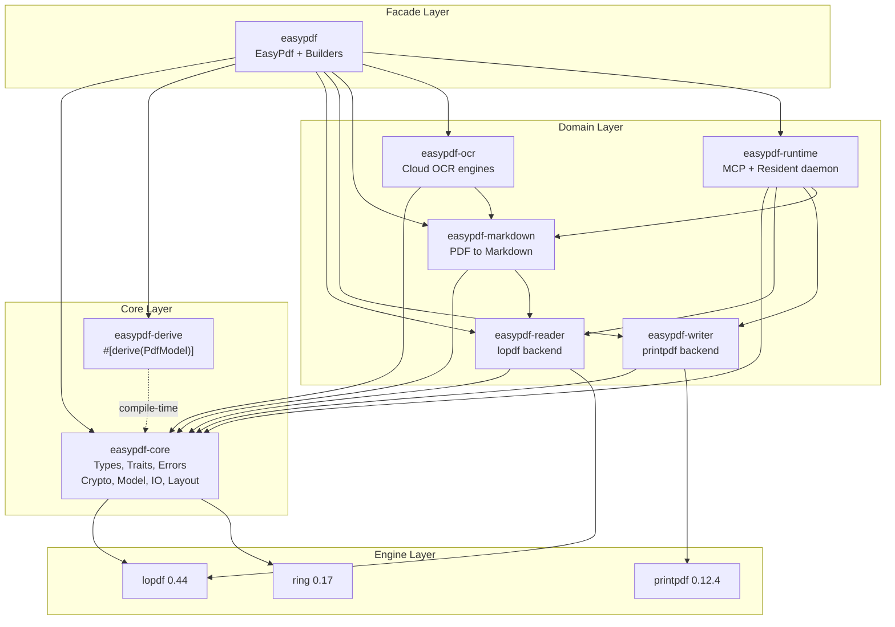

# easypdf-rust Architecture Document

> **Purpose**: Define easypdf-rust's architecture, crate responsibilities, data flows, trait system, security model, and testing strategy -- a single verifiable architecture contract for the v0.1.0 release.
>
> **Version**: 0.1.0
> **License**: Apache-2.0
> **Last Updated**: 2026-08-12
> **Source of Truth**: `docs/PROJECT_FACTS.md`

---

## 1. Overview

**easypdf-rust is a pure Rust PDF operations workspace that unifies PDF creation, reading, manipulation, template filling, Markdown conversion, OCR, and runtime services into a type-safe, resource-controlled, atomic-output operation sequence through an `EasyPdf` facade + builder chain API.**

| Metric | Value |
|--------|-------|
| Total crates | 9 (8 publishable + 1 integration test) |
| Total tests | 1,522 |
| Code coverage | 91.61% |
| Fuzz targets | 6 |
| Lines of Rust | ~52,626 |
| MSRV | Rust 1.88 |
| Edition | 2024 |
| License | Apache-2.0 |
| `unsafe_code` | `forbid` (workspace-wide) |

---

## 2. Architecture Diagram



**Dependency direction**: Facade -> Domain -> Core -> Engine. No reverse dependencies. `easypdf-derive` is a compile-time-only proc-macro.

---

## 3. Nine Crates -- Detailed Responsibilities

### 3.1 `easypdf` (Facade)

**Path**: `crates/easypdf/`
**Role**: Unified entry point. Provides `EasyPdf` struct with static factory methods and builder pattern API.

**Public API**:
- `EasyPdf::create(path)` -- create a new PDF
- `EasyPdf::read(path)` -- read an existing PDF
- `EasyPdf::merge(inputs, output)` -- merge multiple PDFs
- `EasyPdf::split(path)` -- split a PDF
- `EasyPdf::manipulate(path)` -- rotate/reorder/extract pages
- `EasyPdf::fill_form(path, data)` -- fill AcroForm fields
- `EasyPdf::to_markdown(input)` -- PDF to Markdown (in-memory)
- `EasyPdf::export_markdown(input, output)` -- PDF to Markdown (file)
- `EasyPdf::from_html(html)` -- HTML to PDF (feature-gated)
- `EasyPdf::from_markdown(md)` -- Markdown to PDF (feature-gated)

**Builders**: `PdfCreateBuilder`, `PdfReadBuilder`, `PdfManipulateBuilder`, `PdfSplitBuilder`, `PdfFillBuilder`, `PdfMarkdownBuilder`, `PdfMarkdownExportBuilder`, `HtmlToPdfBuilder`, `PdfTextBuilder`, `PdfImageBuilder`, `PdfTableBuilder`, `PdfPositionedTextBuilder`

**Key files**: `lib.rs`, `builders.rs`, `pdf_fill_builder.rs`, `writer_helpers.rs`, `html.rs`

**Feature flags**: `default` (markdown), `markdown`, `markdown-table`, `markdown-ocr`, `ocr`, `render`, `html`, `runtime`, `mcp`, `resident`, `full`

---

### 3.2 `easypdf-core` (Core)

**Path**: `crates/easypdf-core/`
**Role**: Central hub. Types, traits, error definitions, encryption/signing, semantic model, IO primitives, layout engine. Zero engine dependency.

**Submodules**:
- `enums.rs` -- `PageSize`, `Orientation`, `Rotation`, `TextAlignment`, `VerticalAlignment`, `ImageFormat`
- `error.rs` -- `PdfError` (9 variants), `PdfErrorCode`
- `content.rs` -- `PdfText`, `PdfTable`, `PdfTableCell`, `PdfImage`, `PdfLine`, `PdfRect`
- `style.rs` -- `PdfFont`, `FontFamily`, `BuiltInFont` (14 fonts), `PdfColor`, `TableStyle`, `TableBorder`
- `metadata.rs` -- `PdfMetadata`, `PdfBookmark`
- `traits.rs` -- `PdfModel`, `PdfReadListener`, `PdfWriteHandler`, `PdfConverter<T>`, `PdfEngine`, `EngineCapabilities`
- `model/` -- `PdfDocumentModel`, `PdfPageModel`, `PdfBlock` (14 variants), `SourceLocation`, `ImageData`, `ListItem`
- `io/` -- `ResourceLimits`, `PdfInput`, `AtomicFileOutput`, `guards.rs` (decompression bomb + element explosion), `ssrf_guard.rs`, `repair.rs`
- `crypto/` -- `encrypt.rs` (AES-128/256), `sign.rs` / `sign_pdf.rs` / `sign_cms.rs` / `sign_der.rs` (PKCS#7 RSA-SHA256)
- `layout/` -- `FlowLayout`, `LayoutSink` trait, `Direction`
- `logging.rs` -- `init_logging()` / `init_logging_json()`

**Key files**: `lib.rs`, `traits.rs`, `model/pdf_block.rs`, `model/pdf_document_model.rs`, `crypto/encrypt.rs`, `crypto/sign_pdf.rs`, `io/guards.rs`, `io/ssrf_guard.rs`

---

### 3.3 `easypdf-derive` (Proc-Macro)

**Path**: `crates/easypdf-derive/`
**Role**: `#[derive(PdfModel)]` proc-macro. Compile-time code generation.

**Supported attributes**:
- `#[pdf(page = A4, orientation = Portrait)]` -- page config
- `#[pdf(text, position = (x, y))]` -- positioned text
- `#[pdf(table, position = (x, y))]` -- table
- `#[pdf(image, position = (x, y))]` -- image
- `#[pdf(field = "name")]` -- form field mapping
- `#[pdf(order = N)]`, `#[pdf(ignore)]`, `#[pdf(required)]`, `#[pdf(nested)]`

**Dependencies**: `syn 3.0`, `quote 1.0`, `proc-macro2 1.0`, `proc-macro-crate 3.5`

---

### 3.4 `easypdf-reader` (PDF Reading)

**Path**: `crates/easypdf-reader/`
**Role**: PDF reading, text extraction, page manipulation (merge/split/rotate/reorder/watermark). lopdf backend.

**Public API**:
- `PdfReader::open(path)` -- auto-strategy selection
- `PdfReader::from_bytes(bytes)` -- in-memory
- `PdfReader::open_with_strategy(path, strategy)` -- explicit strategy
- `PdfReader::open_with_repair(path, repair, strategy)` -- self-repairing
- `PdfReader::open_with_limits(input, limits)` -- resource-limited
- `reader.extract_text()`, `reader.extract_metadata()`, `reader.page_count()`, `reader.pages(range)`

**ReadStrategy auto-selection**:
| File Size | Strategy |
|-----------|----------|
| 0 -- 5 MB | `Full` (lopdf Document in memory) |
| 5 -- 100 MB | `Lazy` (on-demand page loading) |
| > 100 MB | `Streaming` (byte-stream scanning, no Document) |

**PdfManipulator**: `merge_files()`, `rotate_page()`, `reorder_pages()`, `extract_pages()`, `add_text_watermark()`, `add_layer()`, `validate_pdfa()`

**Streaming module**: `StreamScanner`, CMap/ToUnicode support. Precision lower than Full/Lazy.

**Key files**: `reader/mod.rs`, `reader/extract.rs`, `strategy.rs`, `manipulate.rs`, `streaming/scanner.rs`, `streaming/cmap.rs`

---

### 3.5 `easypdf-writer` (PDF Writing)

**Path**: `crates/easypdf-writer/`
**Role**: PDF creation and writing. printpdf backend.

**Public API**:
- `PdfWriter::new(title)`, `PdfWriter::new_from_writer(writer)`
- `writer.add_page()`, `writer.write_text()`, `writer.write_image()`, `writer.write_svg()`
- `writer.draw_line()`, `writer.draw_rect_stroke()`, `writer.draw_circle()`
- `writer.register_font_from_path()`, `writer.register_font_from_bytes()`
- `writer.register_handler(handler)` -- lifecycle hooks
- `writer.finish(path)` -- atomic save

**WriteBackend**:
- `InMemory` -- default, suitable for small documents
- `Spill` -- page-level temp files, constant memory
- `Auto(threshold)` -- automatic selection

**PdfTemplateFiller**: AcroForm field filling via lopdf.

**Key files**: `writer.rs`, `builder.rs`, `backend.rs`, `template.rs`, `font.rs`, `image.rs`, `shape.rs`

---

### 3.6 `easypdf-markdown` (PDF to Markdown)

**Path**: `crates/easypdf-markdown/`
**Role**: Deterministic PDF-to-Markdown conversion pipeline with table detection, page rendering, and OCR fallback.

**Pipeline**: `PdfInput -> PdfReader -> PdfDocumentModel -> ProcessorPipeline -> MarkdownRenderer -> String`

**Core components**:
- `ProcessorPipeline` -- priority-ordered processor chain
- `MarkdownRenderer` -- model-to-Markdown renderer
- `PdfMarkdownBuilder` / `PdfMarkdownExportBuilder` -- conversion builders

**Built-in processors**:
- `ReadingOrderProcessor` -- reading order detection
- `HeadingDetectorProcessor` -- heading detection
- `LinkExtractorProcessor` -- link extraction
- `TableDetectorProcessor` -- table detection (feature-gated)
- `OcrProcessor` -- OCR fallback (feature-gated)

**Profiles**: `MarkdownProfile` presets (GFM, LLM, Plain)

**Rendering**: `PdfRenderer` trait with `TextRenderer` (default) and `PdfiumRenderer` (feature = "pdfium")

**OCR**: `OcrEngine` trait with `MockOcrEngine`, `ocrs` backend (feature = "ocrs"), `llm` backend (feature = "llm")

**Key files**: `pdf_markdown_processor.rs`, `processor_pipeline.rs`, `markdown_renderer.rs`, `table/detector.rs`, `render/traits.rs`, `ocr/engine.rs`

---

### 3.7 `easypdf-ocr` (Cloud OCR)

**Path**: `crates/easypdf-ocr/`
**Role**: Cloud OCR engine collection. Synchronous HTTP clients.

**Engines**:
- **GLM** -- `create_glm_ocr_engine()`, `GlmConfig`, `GlmOcrParser`
- **HunyuanOCR** -- `create_hunyuan_ocr_engine()`, `HunyuanConfig`, `HunyuanOcrParser`
- **Baidu** -- `BaiduOcrEngine`, `BaiduConfig`, `BaiduOcrParser`, `TokenManager`

**Common HTTP layer**: `HttpOcrEngine`, `HttpClientConfig`, `AuthMethod`, `RateLimitConfig`, `BackoffStrategy`, `OcrRequest`, `OcrResponseParser`

**Dependencies**: `reqwest 0.12` (blocking, rustls-tls), `hmac/sha2`, `base64`

---

### 3.8 `easypdf-runtime` (Runtime)

**Path**: `crates/easypdf-runtime/`
**Role**: Runtime layer providing MCP server (LLM agent interface) and Resident daemon (in-memory PDF sessions).

**MCP module** (feature = "mcp"):
- `McpServer`, `ToolDefinition`, `ToolResult`, `ContentBlock`
- 7 tools: `pdf_read_text`, `pdf_to_markdown`, `pdf_create_text`, `pdf_merge`, `pdf_split`, `pdf_metadata`, `pdf_page_count`
- Binary: `easypdf-mcp`

**Resident module** (feature = "resident"):
- `ResidentServer`, `ResidentClient`, `ResidentConfig`
- `DocumentSession`, `Request`/`Response` protocol
- `AutosaveMode`: Disabled / Fixed / Adaptive
- Transport: `TcpTransport`, `UnixTransport` (cfg(unix))
- `serve()`, `try_attach()`, `default_socket_path()`, `socket_path_for_file()`

---

### 3.9 `easypdf-test` (Integration Tests)

**Path**: `easypdf-test/`
**Role**: End-to-end integration tests and golden samples. Not published.

**Structure**: `src/lib.rs`, `src/bin/`, `tests/`, `golden/`, `samples/`

---

## 4. Key Data Flows

### 4.1 PDF Read Flow

```
User calls EasyPdf::read(path)
  -> PdfReadBuilder (easypdf)
    -> PdfReader::open(path) (easypdf-reader)
      -> ReadStrategy::auto(file_size) selects strategy
        -> Full: lopdf::Document::load_mem()
        -> Lazy: lopdf::Document::load_mem() + LazyPageLoader
        -> Streaming: StreamScanner (byte-stream, no Document)
      -> guard_element_explosion() (easypdf-core::io::guards)
      -> reader.extract_text()
        -> lopdf::Document::extract_text() or StreamScanner
    -> PdfReadListener callback (easypdf-core::traits)
```

### 4.2 PDF Write Flow

```
User calls EasyPdf::create(path)
  -> PdfCreateBuilder (easypdf)
    -> PdfWriter::new(title) (easypdf-writer)
      -> WriteBackend selection (InMemory/Spill/Auto)
      -> writer.add_page(size, orientation)
        -> printpdf backend creates page
      -> writer.write_text(text, x, y)
        -> PdfWriteHandler.before_page() hook
        -> printpdf writes text
        -> PdfWriteHandler.after_page() hook
      -> writer.finish(path)
        -> AtomicFileOutput (easypdf-core::io) atomic write
```

### 4.3 Markdown Conversion Flow

```
User calls EasyPdf::to_markdown(input)
  -> PdfMarkdownBuilder (easypdf)
    -> PdfReader::open() (easypdf-reader) parses PDF
    -> PdfDocumentModel built (easypdf-core::model)
    -> ProcessorPipeline executes (easypdf-markdown)
      -> ReadingOrderProcessor
      -> HeadingDetectorProcessor
      -> LinkExtractorProcessor
      -> TableDetectorProcessor (optional)
      -> OcrProcessor (optional, OCR fallback)
    -> MarkdownRenderer renders to Markdown string
    -> MarkdownConversionResult returned
```

### 4.4 Signature / Verification Flow

```
User calls sign_pdf(pdf_bytes, signer) (easypdf-core::crypto::sign)
  -> PdfSigner config (certificate + private key + metadata)
  -> sign_pdf.rs:
    1. Parse PDF, locate signature placeholder
    2. Compute /ByteRange
    3. Build CMS SignedData (sign_cms.rs)
       -> RSA-PKCS#1v1.5 + SHA-256 (via ring)
       -> DER encoding (sign_der.rs)
    4. Embed signature into PDF
  -> verify_pdf_signature(pdf_bytes)
    1. Parse signature field
    2. Extract /ByteRange and /Contents
    3. Verify CMS signature
    4. Parse X.509 certificate (via x509-parser)
    5. Return SignatureInfo
```

### 4.5 Encryption / Decryption Flow

```
User calls encrypt_pdf(pdf_bytes, encryption) (easypdf-core::crypto::encrypt)
  -> PdfEncryption config (password + algorithm + permissions)
  -> encrypt_pdf():
    1. lopdf::Document::load_mem() parse
    2. generate_file_encryption_key() generate key
    3. build_encryption_version() build V4/V5 config
    4. lopdf::EncryptionState::try_from() derive state
    5. doc.encrypt() transparently encrypt all objects
    6. doc.save_to() serialize

User calls decrypt_pdf(encrypted_bytes, password)
  -> lopdf::Document::load_mem() parse
  -> doc.decrypt(password) decrypt
  -> doc.save_to() serialize
```

---

## 5. Trait System

### 5.1 Trait Overview

| Trait | Crate | Purpose | Implementor |
|-------|-------|---------|-------------|
| `PdfModel` | easypdf-core | Struct to PDF element mapping | `#[derive(PdfModel)]` |
| `PdfReadListener` | easypdf-core | Event-driven text extraction (Send) | User-defined |
| `PdfWriteHandler` | easypdf-core | Page lifecycle hooks (Send) | User-defined; `PageNumberHandler` |
| `PdfConverter<T>` | easypdf-core | Bidirectional type conversion (Send) | User-defined |
| `PdfEngine` | easypdf-core | Abstract engine interface (Send+Sync) | Reserved (no impl yet) |
| `PdfMarkdownProcessor` | easypdf-markdown | Semantic enhancement processor | `ReadingOrderProcessor`, `HeadingDetectorProcessor`, `LinkExtractorProcessor`, `TableDetectorProcessor`, `OcrProcessor` |
| `OcrEngine` | easypdf-markdown | OCR recognition | `MockOcrEngine`, `ocrs` backend, `llm` backend |
| `PdfRenderer` | easypdf-markdown | PDF page rendering | `TextRenderer`, `PdfiumRenderer` |
| `LayoutSink` | easypdf-core | Backend-neutral layout output | Layout consumers |
| `Transport` | easypdf-runtime | Network transport abstraction | `TcpTransport`, `UnixTransport` |
| `Connection` | easypdf-runtime | Connection abstraction | TCP/Unix connections |

### 5.2 Mermaid Class Diagram

```mermaid
classDiagram
    class PdfModel {
        +render() Result~Vec~RenderedElement~~
        +metadata() PdfModelMetadata
        +field_descriptors() Vec~PdfFieldDescriptor~
    }
    class PdfReadListener {
        <<trait Send>>
        +on_page_start(page_number) Result
        +on_text(page_number, text) Result
        +on_page_end(page_number) Result
        +on_document_end() Result
    }
    class PdfWriteHandler {
        <<trait Send>>
        +before_document() Result
        +before_page(page_number) Result
        +after_page(page_number) Result
        +after_document() Result
    }
    class PdfConverter~T~ {
        <<trait Send>>
        +to_pdf_string(value) Result~String~
        +from_pdf_string(s) Result~T~
    }
    class PdfEngine {
        <<trait Send+Sync>>
        +name() &str
        +capabilities() EngineCapabilities
    }
    class PdfMarkdownProcessor {
        <<trait>>
        +name() &str
        +capabilities() ProcessorCapability
        +process(blocks) Result
    }
    class OcrEngine {
        <<trait>>
        +recognize(image) Result~OcrResult~
    }
    class PdfRenderer {
        <<trait>>
        +render_page(index, config) Result~RenderedImage~
        +render_page_to_path(index, config, path) Result
    }
    class LayoutSink {
        <<trait>>
        +push_text(text, x, y)
        +push_image(image, x, y)
    }
    class Transport {
        <<trait>>
        +bind() Result
        +accept() Result~Connection~
    }

    PdfModel <|.. PdfModel_Derive : #[derive(PdfModel)]
    PdfReadListener <|.. UserListener : custom impl
    PdfWriteHandler <|.. PageNumberHandler : page number handler
    PdfMarkdownProcessor <|.. ReadingOrderProcessor
    PdfMarkdownProcessor <|.. HeadingDetectorProcessor
    PdfMarkdownProcessor <|.. TableDetectorProcessor
    PdfMarkdownProcessor <|.. OcrProcessor
    OcrEngine <|.. MockOcrEngine
    OcrEngine <|.. OcrsBackend : feature="ocrs"
    PdfRenderer <|.. TextRenderer : default
    PdfRenderer <|.. PdfiumRenderer : feature="pdfium"
    Transport <|.. TcpTransport
    Transport <|.. UnixTransport : cfg(unix)
```



---

## 6. Data Model (IR)

### 6.1 PdfDocumentModel Structure

```
PdfDocumentModel
+-- metadata: PdfMetadata
|   +-- title: Option<String>
|   +-- author: Option<String>
|   +-- subject: Option<String>
|   +-- keywords: Option<String>
|   +-- creator: Option<String>
|   +-- producer: Option<String>
+-- pages: Vec<PdfPageModel>
    +-- index: PageIndex (zero-based)
    +-- blocks: Vec<PdfBlock> (14 variants)
    +-- width_pt: Option<f64>
    +-- height_pt: Option<f64>
    +-- rotation: u16 (0/90/180/270)
```

### 6.2 PdfBlock -- 14 Variants

All variants carry `SourceLocation` (page_index + confidence f32). Marked `#[non_exhaustive]` for future extension.

| Variant | Fields | Purpose |
|---------|--------|---------|
| `Heading` | level(u8), text, source | Leveled heading (1-6) |
| `Paragraph` | text, source | Plain paragraph |
| `List` | ordered(bool), items(Vec<ListItem>), source | Ordered/unordered list |
| `Table` | headers(Vec<String>), rows(Vec<Vec<String>>), source | Table |
| `Image` | data(ImageData), source | Image |
| `Code` | language(Option<String>), text, source | Code block |
| `Formula` | latex, source | LaTeX formula |
| `PageBreak` | source | Page break |
| `Footnote` | reference_id, text, source | Footnote |
| `TableCell` | row_span(u32), col_span(u32), text, source | Fine-grained table cell |
| `BlockQuote` | text, source | Block quote |
| `HorizontalRule` | source | Horizontal rule |
| `Link` | url, text, source | Hyperlink |
| `Unknown` | raw, source | Unrecognizable content |

### 6.3 SourceLocation

```
SourceLocation
+-- page_index: PageIndex (zero-based)
+-- confidence: f32 (0.0-1.0, extraction confidence)
```

---

## 7. Performance Characteristics

### 7.1 Streaming Memory Strategy

The reader uses a three-tier strategy to balance memory and fidelity:

| Strategy | File Size | Memory | Fidelity |
|----------|-----------|--------|----------|
| `Full` | 0 -- 5 MB | O(document) | Highest -- full object tree |
| `Lazy` | 5 -- 100 MB | O(page) | High -- on-demand page loading |
| `Streaming` | > 100 MB | O(1) | Lower -- byte-stream scan, no CMap |

### 7.2 WriteBackend Strategy

| Backend | Memory | Use Case |
|---------|--------|----------|
| `InMemory` | O(pages) | Small documents (default) |
| `Spill` | O(1) per page | Large documents, constant memory |
| `Auto(threshold)` | Automatic | Switches at threshold |

### 7.3 Benchmark Data

**Reader session reuse** (vs re-open per operation):

| Operation | Latency | Speedup |
|-----------|---------|---------|
| Session reuse | ~1,047 ns/iter | 1x |
| Re-open | ~135,011 ns/iter | ~129x |

**Text extraction throughput** (100-page PDF, Criterion):
- Wall time: 2.4 ms
- Throughput: 28.7 MiB/s

**Peak memory** (vs pdftotext/Poppler):
- Small files: easypdf uses ~70-73% of pdftotext RSS
- 100-page file: easypdf uses ~83% of pdftotext RSS

---

## 8. Security Characteristics

### 8.1 Security Guards

| Guard | Location | Purpose |
|-------|----------|---------|
| `guard_decompression_bomb()` | `easypdf-core::io::guards` | Prevents zip bombs (ratio + absolute size checks) |
| `guard_element_explosion()` | `easypdf-core::io::guards` | Limits PDF element count (default: 5M) |
| `validate_url()` | `easypdf-core::io::ssrf_guard` | SSRF protection (IPv4/IPv6 private ranges) |
| `AtomicFileOutput` | `easypdf-core::io` | Prevents file corruption on write failure |
| `ResourceLimits` | `easypdf-core::io` | File size (100MB), pages (10K), text (10MB) limits |

### 8.2 Encryption & Signing

| Feature | Algorithm | Status |
|---------|-----------|--------|
| Encryption | AES-128 (V4/R4), AES-256 (V5/R6) | Implemented |
| Decryption | lopdf transparent decrypt | Implemented |
| Digital signature | RSA-PKCS#1v1.5 + SHA-256 (via ring) | Implemented |
| Signature verification | CMS + X.509 (via x509-parser) | Implemented |
| Timestamp (RFC 3161) | -- | Fields reserved, not yet implemented |
| Permissions | PRINT/MODIFY/COPY/FILL_FORMS + 4 more | Implemented |

### 8.3 API Key Protection

All OCR config types (`GlmConfig`, `HunyuanConfig`, `BaiduConfig`, `AuthMethod`) implement custom `Debug` that redacts secrets.

### 8.4 Audit Status

4 findings in the security audit (all FIXED):
1. Small compressed payload bypasses ratio check (MEDIUM) -- fixed with absolute safe threshold
2. IPv6 loopback SSRF bypass (HIGH) -- fixed with `std::net::IpAddr` parsing
3. GlmConfig leaks API key in Debug (HIGH) -- fixed with manual Debug redaction
4. BaiduConfig leaks API key in Debug (HIGH) -- fixed with manual Debug redaction

27 security regression tests cover all finding areas.

---

## 9. Testing System

### 9.1 Coverage

| Metric | Value |
|--------|-------|
| Total tests | 1,522 |
| Code coverage | 91.61% |
| Fuzz targets | 6 |
| Security regression tests | 27 |

### 9.2 Test Types

| Type | Scope | Location |
|------|-------|----------|
| Unit tests | Per-crate inline | `#[cfg(test)]` in each crate |
| Integration tests | Cross-crate | `easypdf-test/tests/` |
| Security audit | Guards + API key leakage | `easypdf-test/tests/security_audit.rs` |
| Fuzz tests | Input parsing | 6 fuzz targets |
| Benchmark | Reader performance | `easypdf-reader/benches/reader_session.rs` |
| Compile tests | Derive macro | `easypdf-derive` trybuild |
| Golden samples | PDF comparison | `easypdf-test/golden/` |

### 9.3 CI Verification

```bash
# Full workspace build
cargo check --workspace

# All tests
cargo test --workspace

# Clippy (strict)
cargo clippy --workspace --all-targets -D warnings

# Benchmarks
cargo bench -p easypdf-reader --bench reader_session

# Security audit
cargo audit
```

---

## Appendix A: Glossary

| Term | Definition |
|------|------------|
| Facade | User-visible unified entry struct `EasyPdf` |
| Builder | Chain configurator; calls terminal method like `do_write()` / `do_export()` |
| IR | Engine-neutral intermediate representation (`PdfDocumentModel`) |
| Session Reuse | Reader parses PDF once; subsequent operations reuse parsed object |
| Atomic Output | Write to temp file; rename on success to replace target |
| Streaming | Byte-stream scanning without building full object tree |
| Spill | Page-level temp file backend for constant-memory writing |
| ProcessorPipeline | Priority-ordered chain of semantic enhancement processors |

## Appendix B: Dependency Graph (Text)

```
easypdf (facade)
+-- easypdf-core (mandatory)
+-- easypdf-derive (mandatory)
+-- easypdf-reader (mandatory)
+-- easypdf-writer (mandatory)
+-- easypdf-markdown (optional, feature = "markdown")
+-- easypdf-ocr (optional, feature = "ocr")
+-- easypdf-runtime (optional, feature = "runtime")

easypdf-reader     -> easypdf-core, lopdf
easypdf-writer     -> easypdf-core, printpdf, lopdf (template)
easypdf-markdown   -> easypdf-core, easypdf-reader
easypdf-ocr        -> easypdf-core, easypdf-markdown, reqwest
easypdf-runtime    -> easypdf-core, easypdf-reader, easypdf-writer, easypdf-markdown
easypdf-derive     -> syn, quote (compile-time only)
easypdf-core       -> lopdf, ring, aes, x509-parser, bitflags
```

---

**Document Version**: 0.1.0
**Last Updated**: 2026-08-12
