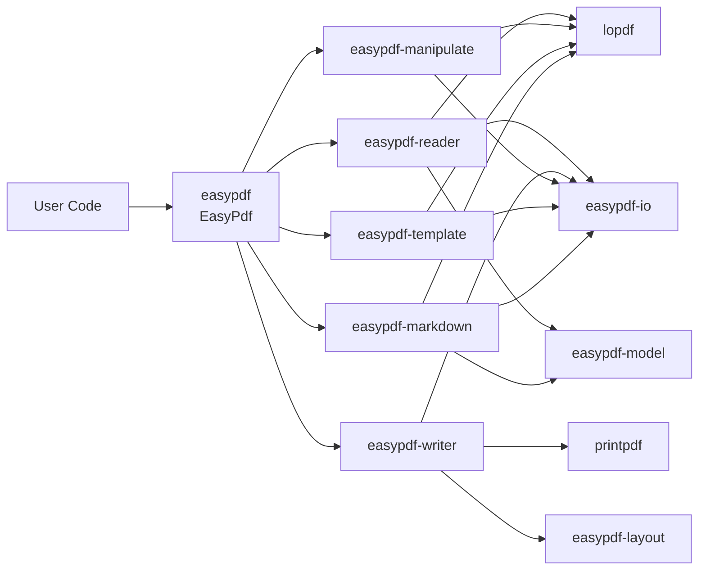
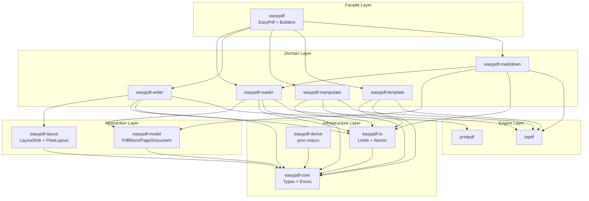
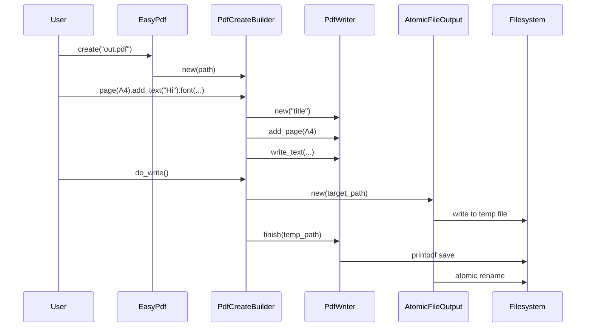
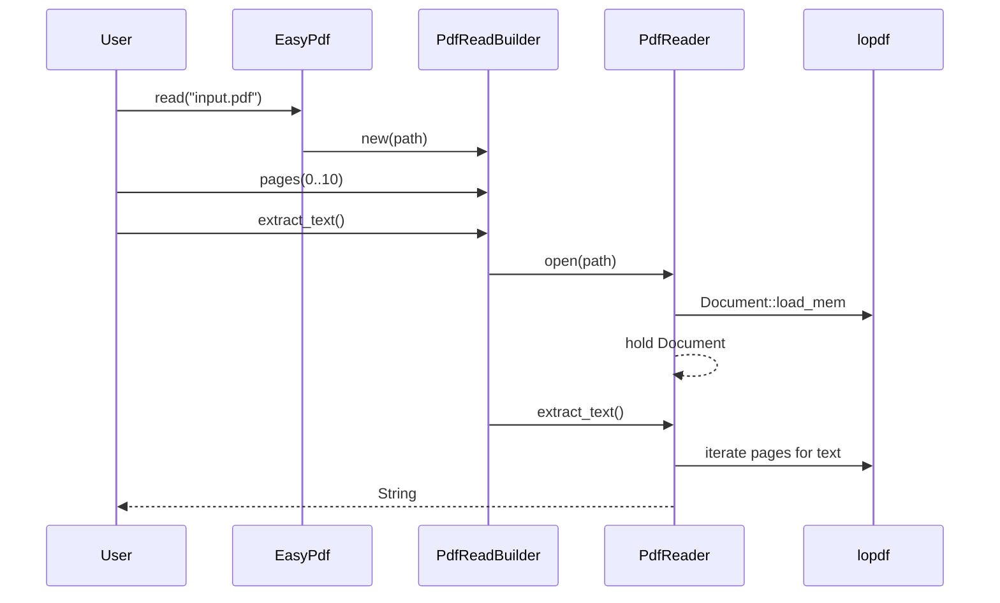
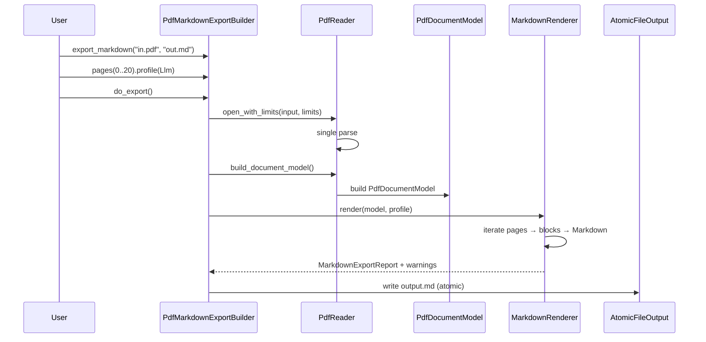
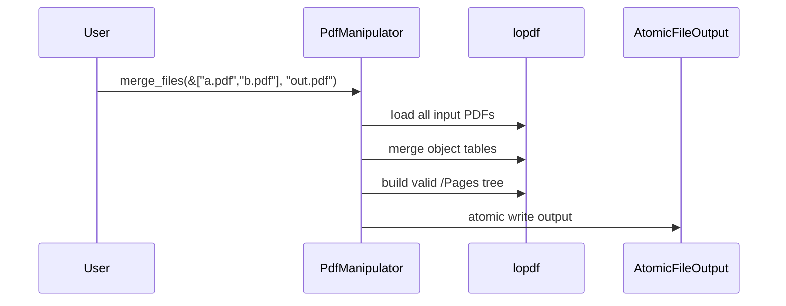
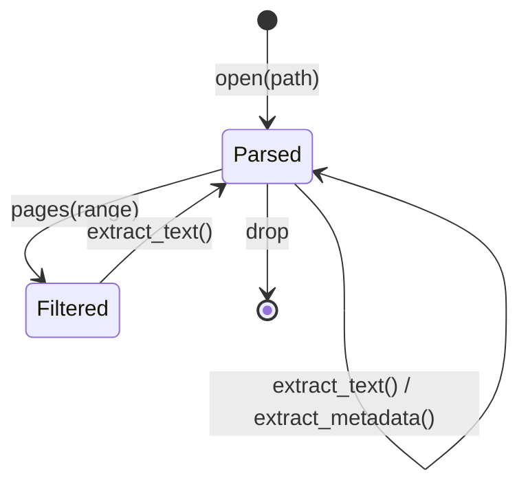
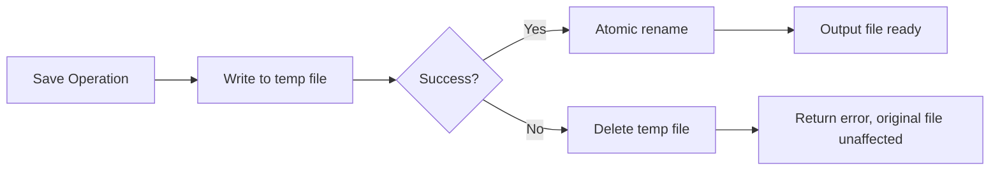
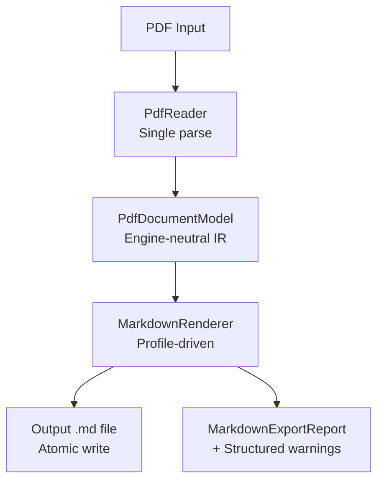

# easypdf-rust Architecture Design Document

> **Purpose**: Define easypdf-rust's architecture goals, boundaries, component responsibilities, data flows, security constraints, and evolution roadmap — providing a single verifiable architecture contract for design, development, testing, and release.
>
> **Architecture Version**: 0.1.0
> **Document Status**: Approved
> **License**: Apache-2.0
> **Last Updated**: 2026-08-09
> **Fact-verification Date**: 2026-08-09

---

## 1. Document Control

### 1.1 Document Info

| Field | Content |
|---|---|
| System/Project | easypdf-rust |
| Architecture Version | 0.1.0 |
| Applicable Code Version | v0.1.0 (workspace, no tag yet) |
| Deployment Form | Local library |
| License | Apache-2.0 |
| MSRV | 1.88 |
| Edition | 2024 |
| Resolver | 3 |

### 1.2 Reader Guide

| Reader | Priority Sections | Expected Outcome |
|---|---|---|
| Users | 2, 5, 7, 10 | Quick start, API entry, format support, examples |
| Developers | 3, 4, 6, 8, 9 | Module boundaries, dependency direction, core model, design constraints |
| Security | 4, 8 | Resource limits, atomic output, failure safety |
| Architecture Review | All | Target vs current gap, evolution roadmap |

### 1.3 Implementation Status Labels

| Label | Definition | Required Evidence |
|---|---|---|
| `[Implemented]` | Current code exists, verifiable via tests | Source code, tests |
| `[Partially Implemented]` | Skeleton or partial loop exists | Completed vs missing list |
| `[Design Goal]` | Target architecture, not yet landed | ADR, plan |
| `[Not a Goal]` | Explicitly not in scope | Alternative or ownership |

---

## 2. Executive Summary

### 2.1 One-line Architecture

**easypdf-rust is a pure Rust PDF operations workspace that unifies PDF creation, reading, manipulation, template filling, and Markdown conversion into a type-safe, resource-controlled, atomic-output operation sequence through `EasyPdf` facade + builder chain API + engine-neutral semantic model.**

### 2.2 At a Glance

```text
User Code
    │
    ▼
EasyPdf Facade (easypdf crate)
    │
    ├──► PdfCreateBuilder ──► easypdf-writer (printpdf) ──► PDF file
    ├──► PdfReadBuilder ────► easypdf-reader (lopdf) ────► text/metadata
    ├──► PdfMarkdownExportBuilder ──► easypdf-markdown ──► .md file
    ├──► PdfSplitBuilder ──► easypdf-manipulate (lopdf) ──► multiple PDFs
    ├──► PdfManipulateBuilder ──► easypdf-manipulate ──► modified PDF
    └──► PdfFillBuilder ───► easypdf-template (lopdf) ──► filled PDF
                                   │
                                   ▼
                          easypdf-io (limits + atomic output)
```

### 2.3 Key Architecture Decisions

| Decision | Choice | Rationale |
|---|---|---|
| Multi-engine backend | lopdf for read/manipulate, printpdf for write | Each engine's strengths; replaceable |
| Single-parse session | Reader holds `lopdf::Document` | ~129x performance improvement |
| Engine-neutral IR | `easypdf-model` as separate crate | Markdown and other transforms not bound to engine |
| Backend-neutral layout | `LayoutSink` trait | Writer implements consumption; layout does not depend on writer |
| Atomic output | temp file + rename | Prevent corruption on write failure |
| Structured warnings | `MarkdownWarning` enum | Unimplemented capabilities do not fake success |
| `#![forbid(unsafe_code)]` | All crates | Consistent with easyexcel-rs safety policy |

## 3. Architecture Drivers & Constraints

### 3.1 Business Drivers

| Driver | Priority | Description |
|---|:---:|---|
| Simple API | P0 | Builder pattern chain calls, one-line operations |
| Type safety | P0 | Compile-time checks, no runtime reflection |
| Pure Rust | P0 | Zero FFI, zero unsafe |
| Engine replaceable | P1 | lopdf/printpdf can be swapped for other engines |
| Align with easyexcel-rs | P1 | Same Builder/Listener/Handler/Converter patterns |
| Resource controlled | P1 | Prevent malicious or oversized input from causing OOM |

### 3.2 Hard Constraints

| Constraint | Description |
|---|---|
| Rust 1.88+ | MSRV, workspace-level unified |
| Edition 2024 | Uses latest language features |
| `unsafe_code = "forbid"` | All crates enforce |
| `missing_docs = "warn"` | Public API must have docs |
| Apache-2.0 | License |

## 4. Scope, Boundaries & Non-Goals

### 4.1 System Boundary



### 4.2 Non-Goals

| Non-Goal | Rationale | Alternative |
|---|---|---|
| Encryption / decryption | Not implemented, returns `UnsupportedFeature` | Planned v0.4 |
| Digital signatures | Not implemented, returns `UnsupportedFeature` | Planned v0.5 |
| OCR | Not implemented, Markdown emits `OcrUnavailable` warning | Planned OCR backend |
| Table detection | Not implemented, Markdown emits `TableDetectionUnavailable` warning | Planned table detection backend |
| Image extraction | Not implemented, Markdown emits `ImageExtractionUnavailable` warning | Planned image extraction |
| HTML → PDF | Requires Chromium, feature-gated | `html` feature |
| PDF → Image | Out of scope | External renderer |
| 1:1 Java EasyExcel compatibility | PDF and Excel are different paradigms | API style alignment, not functional clone |

## 5. Current State vs Target State

### 5.1 Capability Status Overview

| Capability | Current State | Target State | Gap |
|---|---|---|---|
| Create PDF | `[Implemented]` Text, built-in fonts, metadata | Tables, images, vectors, custom fonts | v0.2 |
| Read PDF | `[Implemented]` Text extraction, metadata, session reuse | Streaming read, structured content extraction | v0.2+ |
| PDF → Markdown | `[Implemented]` Native text, GFM/LLM/Plain profiles | Table detection, image extraction, OCR | v0.2+ |
| Merge | `[Implemented]` Valid `/Pages` tree | — | Complete |
| Split | `[Implemented]` Valid `/Pages` tree | — | Complete |
| Rotate/Reorder | `[Implemented]` Per-page or all-page | — | Complete |
| Template Fill | `[Implemented]` AcroForm fields | — | Complete |
| Atomic Output | `[Implemented]` Temp file + rename | — | Complete |
| Resource Limits | `[Implemented]` File size, page count, text length | Configurable limits | v0.2 |
| Reader Session Reuse | `[Implemented]` ~129x speedup | — | Complete |
| Encryption | `[Not a Goal]` Returns `UnsupportedFeature` | AES-256 | v0.4 |
| Signatures | `[Not a Goal]` Returns `UnsupportedFeature` | Digital signatures | v0.5 |
| Layout Engine | `[Partially Implemented]` `FlowLayout` skeleton | Auto-positioning elements | v0.3 |

### 5.2 Architecture Issues Fixed

| Issue | Fix |
|---|---|
| Reader re-opens file on every operation | Single-parse session; `lopdf::Document` held in `PdfReader` |
| 0-based page ranges mixed with PDF 1-based page numbers | Unified to 0-based; Reader maps internally |
| Writer lifecycle incomplete | Full `before_document` / `before_page` / `after_page` / `after_document` |
| Merge/Split generate invalid `/Pages` tree | Correctly build Pages hierarchy |
| `easypdf-layout` reverse-depends on Writer | Introduced `LayoutSink` trait; Writer implements consumption |
| Encryption/signatures fake success | Removed fake implementation; returns `UnsupportedFeature` |
| Output without atomic protection | All save operations use `AtomicFileOutput` |

## 6. Architecture Principles & Key Decisions

### 6.1 Principles

| # | Principle | Practice |
|---|---|---|
| P1 | Pure Rust, zero unsafe | `#![forbid(unsafe_code)]` in every crate |
| P2 | Type-safe Builder | `mut self → Self`, `#[must_use]` |
| P3 | Multi-engine backend | lopdf for read/manipulate, printpdf for write, replaceable |
| P4 | Engine-neutral IR | `easypdf-model` has no engine dependency |
| P5 | Compile-time reflection | `#[derive(PdfModel)]` replaces runtime annotation scanning |
| P6 | Single error type | `PdfError` enum + `thiserror` |
| P7 | Separation of concerns | Core ≠ engine implementation ≠ facade |
| P8 | Atomic output | Temp file + rename; failure does not affect original file |
| P9 | Structured warnings | Unimplemented capabilities do not fake success |

### 6.2 ADR-001: Reader Single-Parse Session

- **Context**: Original Reader re-opened file on every `extract_text()` call
- **Decision**: `PdfReader::open()` parses once, holds `lopdf::Document`
- **Consequence**: ~129x performance improvement; Reader lifetime bound to Document

### 6.3 ADR-002: LayoutSink Decouples Layout from Write

- **Context**: `easypdf-layout` depended on `easypdf-writer`, risking circular dependency
- **Decision**: Define `LayoutSink` trait; Writer implements this trait
- **Consequence**: layout and writer decoupled; can evolve independently

### 6.4 ADR-003: Structured Warnings Replace Fake Success

- **Context**: Original implementation returned empty success for unimplemented features
- **Decision**: `MarkdownWarning` enum + `MarkdownExportReport`
- **Consequence**: Callers know exactly which capabilities are missing

## 7. Overall Architecture & Layering

### 7.1 Layer Diagram



### 7.2 Layer Responsibilities

| Layer | Responsibilities | Not Responsible For |
|---|---|---|
| Facade | Unified entry, Builder routing, prelude | Engine details, IO details |
| Domain | PDF read/write/manipulate/template/markdown concrete logic | Shared types, IO infrastructure |
| Abstraction | Engine-neutral model and layout | Concrete engine calls |
| Infrastructure | Types, errors, IO limits, atomic output, derive | PDF business logic |
| Engine | lopdf / printpdf | This project does not modify engines |

## 8. Crate Dependencies & Responsibilities

### 8.1 Dependency Graph

```text
easypdf (facade)
├── easypdf-core          (types, errors)
├── easypdf-model         (IR, depends on core)
├── easypdf-io            (limits, depends on core)
├── easypdf-derive        (proc-macro, depends on core)
├── easypdf-layout        (layout, depends on core)
├── easypdf-reader        (lopdf, depends on core + model + io)
├── easypdf-writer        (printpdf, depends on core + layout + io)
├── easypdf-manipulate    (lopdf, depends on core + io)
├── easypdf-template      (lopdf, depends on core + io)
└── easypdf-markdown      (optional, depends on reader + model + io)
```

### 8.2 Crate Detail

#### easypdf-core

```text
src/
├── lib.rs          # flat re-exports
├── enums.rs        # PageSize, Orientation, Rotation, TextAlignment
├── error.rs        # PdfError enum, Result<T> alias
├── content.rs      # PdfText, PdfTable, PdfImage, PdfLine, PdfRect
├── style.rs        # PdfColor, PdfFont, FontFamily, BuiltInFont, TableStyle
├── metadata.rs     # PdfMetadata, PdfBookmark
├── traits.rs       # PdfModel, PdfReadListener, PdfWriteHandler, PdfConverter
└── event.rs        # re-exports PdfReadListener
```

Zero engine dependency. Shared vocabulary for all other crates.

#### easypdf-model

```text
src/
├── lib.rs
├── pdf_block.rs          # PdfBlock: Text / Table / Image / Vector / ...
├── pdf_page_model.rs     # PdfPageModel: blocks + page metadata
├── pdf_document_model.rs # PdfDocumentModel: pages + doc metadata
└── source_location.rs    # SourceLocation: page + position
```

Engine-neutral semantic IR. Markdown pipeline consumes this model without directly depending on lopdf objects.

#### easypdf-io

```text
src/
├── lib.rs
├── resource_limits.rs    # ResourceLimits: max_file_size, max_pages, max_text
├── pdf_input.rs          # PdfInput: from_path / from_bytes, read + limit check
└── atomic_file_output.rs # AtomicFileOutput: temp file + rename
```

Shared IO infrastructure for all domain crates.

#### easypdf-reader

Single-parse session. `open()` parses once, holds `lopdf::Document`. Supports 0-based page ranges, event listeners, resource limits.

#### easypdf-writer

printpdf backend. Supports text, images, vector shapes, built-in fonts, custom font registration, metadata, lifecycle hooks. Implements `LayoutSink` trait.

#### easypdf-manipulate

lopdf backend. Merge, split, rotate, reorder. Outputs valid `/Pages` tree. Atomic output.

#### easypdf-template

lopdf backend. AcroForm field filling. Atomic output.

#### easypdf-markdown

PDF → Markdown conversion. Consumes `PdfDocumentModel` (from easypdf-model). Supports GFM/LLM/Plain profiles. Structured warnings.

#### easypdf-layout

Backend-neutral layout abstractions. `LayoutSink` trait (Writer implements), `FlowLayout` (direction, margin, spacing). Does not depend on Writer.

#### easypdf-derive

`#[derive(PdfModel)]` proc-macro. Parses `#[pdf(...)]` attributes, generates impl blocks.

## 9. Runtime Model & Concurrency

### 9.1 Threading Model

- All operations are synchronous blocking calls (no async).
- `PdfReader` / `PdfWriter` are not `Send`/`Sync` (lopdf/printpdf limitations).
- Users operate on a single Reader/Writer instance in a single thread.
- `PdfError` and `Result<T>` are `Send`; errors can be passed across threads.

### 9.2 Memory Model

| Pattern | Memory Complexity | Scenario |
|---|---|---|
| Reader session reuse | `O(document)` | Multiple text/metadata extractions |
| Writer incremental build | `O(pages)` | PDF creation |
| Manipulate load | `O(input)` | Merge/split/rotate |
| Markdown pipeline | `O(document)` | PDF → Markdown |

## 10. Core Data Flows

### 10.1 Create PDF



### 10.2 Read PDF



### 10.3 PDF → Markdown



### 10.4 Merge / Split



## 11. State Machine & Lifecycle

### 11.1 PdfWriter Lifecycle

```mermaid
stateDiagram-v2
    [*] --> Created: PdfWriter::new()
    Created --> PageAdded: add_page()
    PageAdded --> PageAdded: write_text / draw_line / ...
    PageAdded --> PageAdded: add_page() (new page)
    PageAdded --> Finished: finish(path)
    Finished --> [*]

    Created --> Finished: finish(path) (empty document)
```

### 11.2 PdfReader Session



### 11.3 WriteHandler Callback Order

```text
before_document()
  ├─ before_page(0)
  │   └─ after_page(0)
  ├─ before_page(1)
  │   └─ after_page(1)
  └─ ...
after_document()
```

## 12. Semantic Model (IR)

### 12.1 Model Hierarchy

```text
PdfDocumentModel
├── metadata: PdfMetadata
├── pages: Vec<PdfPageModel>
│   ├── page_number: usize
│   ├── blocks: Vec<PdfBlock>
│   │   ├── Text { content, font_info, location }
│   │   ├── Table { rows, location }
│   │   ├── Image { data, location }
│   │   └── Vector { ... }
│   └── source: SourceLocation
└── warnings: Vec<MarkdownWarning>
```

### 12.2 Design Decisions

- `PdfBlock` is an enum (not trait object) — easy to pattern match and serialize.
- `SourceLocation` records original page number and position — useful for debugging and warning localization.
- Model is immutable — read-only after construction.

## 13. Error Handling & Resource Limits

### 13.1 Error Enum

```rust
pub enum PdfError {
    Io(std::io::Error),
    Parse(String),
    InvalidPage(usize),
    UnsupportedFeature(String),
    ResourceLimitExceeded { resource: &'static str, limit: u64, actual: u64 },
    Encryption(String),
    Other(String),
}
```

### 13.2 Resource Limits

| Resource | Default | Check Point |
|---|---|---|
| File size | 100 MB | `PdfInput::read()` |
| Page count | 10,000 | `PdfReader::open_with_limits()` |
| Text length | 10 MB | `PdfReader::extract_text()` |

Exceeding limits returns `ResourceLimitExceeded` error; does not panic.

## 14. Atomic Output Strategy

### 14.1 Flow



### 14.2 Application Scope

| Operation | Backend | Atomic Output |
|---|---|:---:|
| PdfWriter::finish() | printpdf | ✅ |
| PdfManipulator::merge/split/rotate/reorder | lopdf | ✅ |
| PdfTemplateFiller::fill | lopdf | ✅ |
| PdfMarkdownExportBuilder::do_export | lopdf | ✅ |

## 15. Markdown Conversion Pipeline

### 15.1 Architecture



### 15.2 Profile Comparison

| Profile | Target | Output Style | Token Efficiency |
|---|---|---|---|
| Gfm | GitHub/GitLab | Standard GFM tables + fenced blocks | Medium |
| Llm | LLM context | Minimal markup | High |
| Plain | Human reading | Minimal formatting | Highest |

### 15.3 Structured Warnings

| Warning | Trigger | Behavior |
|---|---|---|
| `TableDetectionUnavailable` | Suspected table but no detection backend | Output raw text, warning in report |
| `ImageExtractionUnavailable` | Image found but no extraction backend | Skip image, warning in report |
| `OcrUnavailable` | Scanned page but no OCR backend | Skip page text, warning in report |

## 16. Interface & Trait Design

### 16.1 Trait Overview

| Trait | Defined In | Implemented By | Purpose |
|---|---|---|---|
| `PdfModel` | easypdf-core | User derive | Struct → PDF element mapping |
| `PdfReadListener` | easypdf-core | User implementation | Event-driven text extraction |
| `PdfWriteHandler` | easypdf-core | User implementation | Page lifecycle hooks |
| `PdfConverter<T>` | easypdf-core | User implementation | Rust ⇄ PDF string |
| `LayoutSink` | easypdf-layout | easypdf-writer | Backend-neutral layout consumption |

### 16.2 LayoutSink Interface

```rust
pub trait LayoutSink {
    fn write_text_at(&mut self, text: &str, x: f64, y: f64) -> Result<()>;
    fn write_image_at(&mut self, data: &[u8], x: f64, y: f64, w: f64, h: f64) -> Result<()>;
    fn draw_line(&mut self, x1: f64, y1: f64, x2: f64, y2: f64) -> Result<()>;
    fn new_page(&mut self, size: PageSize) -> Result<usize>;
}
```

`easypdf-writer` implements this trait; `easypdf-layout` consumes layout results through it without directly depending on Writer.

## 17. Safety & Trust Boundaries

### 17.1 unsafe Policy

All crates use `#![forbid(unsafe_code)]`. lopdf and printpdf may use unsafe internally, but this project introduces no additional unsafe.

### 17.2 Input Safety

| Threat | Protection |
|---|---|
| Oversized file | `ResourceLimits.max_file_size` |
| Too many pages | `ResourceLimits.max_pages` |
| Excessive text | `ResourceLimits.max_text_length` |
| Corrupt PDF | lopdf parse error → `PdfError::Parse` |
| Malicious path | Atomic output uses temp file; does not modify input |

### 17.3 Unimplemented Feature Safety

No fake success. `UnsupportedFeature` errors are explicit and do not produce seemingly valid but actually insecure output.

## 18. Performance & Resource Budget

### 18.1 Reader Session Reuse Benchmark

| Operation | Latency | Speedup |
|---|---:|---:|
| Session reuse | ~1,047 ns/iter | 1x |
| Re-open | ~135,011 ns/iter | ~129x |

### 18.2 Resource Budget

| Resource | Budget | Source |
|---|---|---|
| Max file size | 100 MB | `ResourceLimits` default |
| Max pages | 10,000 | `ResourceLimits` default |
| Max text length | 10 MB | `ResourceLimits` default |
| Stack depth | Rust default | No recursion |

## 19. Testing, Verification & Architecture Acceptance

### 19.1 Verification Matrix

| Verification Type | Scope | Command | Status |
|---|---|---|:---:|
| Build check | Full workspace | `cargo check -p easypdf --all-features` | ✅ |
| No default features | Facade | `cargo check -p easypdf --no-default-features` | ✅ |
| Unit tests | Full workspace | `cargo test --workspace --quiet` | ✅ (136 pass) |
| Clippy | New crates | `clippy -D warnings` on model/io/markdown | ✅ |
| Doc build | Full workspace | `cargo doc --workspace --no-deps` | ✅ |
| Benchmark | reader | `cargo bench -p easypdf-reader --bench reader_session` | ✅ |
| Compile tests | derive | trybuild (1 ignored legacy) | ✅ |

### 19.2 Architecture Acceptance

| Architecture Claim | Acceptance Condition | Evidence |
|---|---|---|
| Engine-neutral IR has no engine dependency | `easypdf-model` has no lopdf/printpdf dependency | Cargo.toml |
| Reader single-parse | `open()` reuses Document | Source + benchmark |
| LayoutSink decoupled | `easypdf-layout` does not depend on `easypdf-writer` | Cargo.toml |
| Atomic output | All save/finish use AtomicFileOutput | Source |
| Structured warnings | Markdown returns `MarkdownExportReport` | Tests |
| Zero unsafe | All crates `#![forbid(unsafe_code)]` | lib.rs |

## 20. Risk, Technical Debt & Roadmap

### 20.1 Risks

| ID | Risk | Probability | Impact | Mitigation |
|---|---|:---:|:---:|---|
| R-001 | lopdf text extraction quality insufficient | High | Medium | Integrate OCR backend |
| R-002 | printpdf doesn't support custom font formats | Medium | Medium | Font registration abstraction |
| R-003 | Large file OOM | Low | High | ResourceLimits enforcement |

### 20.2 Technical Debt

| Debt | Current Cost | Target | Repayment Phase |
|---|---|---|---|
| Table detection not implemented | Markdown tables output as plain text | Integrate table detection backend | v0.2 |
| Image extraction not implemented | Markdown skips images | Integrate image extraction | v0.2 |
| OCR not implemented | Scanned pages cannot extract text | Integrate OCR | v0.2+ |
| Layout engine skeleton only | Manual positioning for all elements | Auto layout | v0.3 |

### 20.3 Implementation Roadmap

| Phase | Architecture Deliverables | Exit Conditions |
|---|---|---|
| v0.1 ✅ | 11 crates, core types, Builder API, IR, IO, Markdown | 136 tests pass |
| v0.2 | Tables/images/vectors/custom fonts | Feature tests + integration tests |
| v0.3 | Layout engine + watermarks | Auto-positioning tests |
| v0.4 | Encryption | Encrypt/decrypt round-trip tests |
| v0.5 | Signatures + PDF/A | Compliance verification |
| v1.0 | Stable API | Full test coverage + benchmarks |

## Appendix A: Glossary

| Term | Definition |
|---|---|
| Facade | User-visible unified entry struct `EasyPdf` |
| Builder | Chain configurator; calls terminal method like `do_write()` / `do_export()` |
| IR | Engine-neutral intermediate representation (`PdfDocumentModel`) |
| LayoutSink | Backend-neutral layout consumption trait |
| Session Reuse | Reader parses PDF once; subsequent operations reuse parsed object |
| Atomic Output | Write to temp file; rename on success to replace target |

## Appendix B: Quality Gates Summary

| Gate | Command | Status |
|---|---|:---:|
| No default features build | `cargo check -p easypdf --no-default-features` | ✅ |
| All features build | `cargo check -p easypdf --all-features` | ✅ |
| Tests | `cargo test --workspace --quiet` | ✅ |
| Docs | `cargo doc --workspace --no-deps` | ✅ |
| Clippy (new crates) | `clippy -D warnings` on model/io/markdown | ✅ |
| Benchmark | `cargo bench -p easypdf-reader --bench reader_session` | ✅ |

---

**Document Version**: 0.1.0
**Last Updated**: 2026-08-09
**Document Status**: Approved
