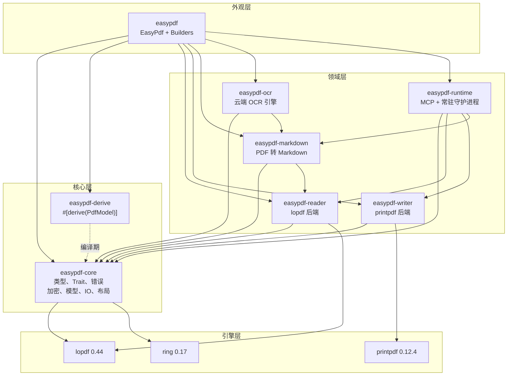

# easypdf-rust 架构设计文档

> **目的**：定义 easypdf-rust 的架构、crate 职责、数据流、trait 体系、安全模型和测试策略 -- v0.1.0 发布的单一可验证架构契约。
>
> **版本**：0.1.0
> **许可证**：Apache-2.0
> **最后更新**：2026-08-12
> **事实来源**：`docs/PROJECT_FACTS.md`

---

## 1. 总览

**easypdf-rust 是一个纯 Rust PDF 操作 workspace，通过 `EasyPdf` 外观入口 + Builder 链式 API，将 PDF 创建、读取、操作、模板填充、Markdown 转换、OCR 和运行时服务统一为类型安全、资源受控、原子输出的操作序列。**

| 指标 | 值 |
|------|-----|
| 总 crate 数 | 9（8 个可发布 + 1 个集成测试） |
| 总测试数 | 1,522 |
| 代码覆盖率 | 91.61% |
| Fuzz 目标 | 6 |
| Rust 代码行数 | ~52,626 |
| MSRV | Rust 1.88 |
| Edition | 2024 |
| 许可证 | Apache-2.0 |
| `unsafe_code` | `forbid`（workspace 级别） |

---

## 2. 架构图



**依赖方向**：外观 -> 领域 -> 核心 -> 引擎。无反向依赖。`easypdf-derive` 是纯编译期过程宏。

---

## 3. 九个 Crate -- 详细职责

### 3.1 `easypdf`（外观）

**路径**：`crates/easypdf/`
**角色**：统一入口。提供 `EasyPdf` 结构体的静态工厂方法和 Builder 模式 API。

**公开 API**：
- `EasyPdf::create(path)` -- 创建新 PDF
- `EasyPdf::read(path)` -- 读取已有 PDF
- `EasyPdf::merge(inputs, output)` -- 合并多个 PDF
- `EasyPdf::split(path)` -- 拆分 PDF
- `EasyPdf::manipulate(path)` -- 旋转/重排/提取页面
- `EasyPdf::fill_form(path, data)` -- 填充 AcroForm 字段
- `EasyPdf::to_markdown(input)` -- PDF 转 Markdown（内存）
- `EasyPdf::export_markdown(input, output)` -- PDF 转 Markdown（文件）
- `EasyPdf::from_html(html)` -- HTML 转 PDF（feature 门控）
- `EasyPdf::from_markdown(md)` -- Markdown 转 PDF（feature 门控）

**Builder**：`PdfCreateBuilder`、`PdfReadBuilder`、`PdfManipulateBuilder`、`PdfSplitBuilder`、`PdfFillBuilder`、`PdfMarkdownBuilder`、`PdfMarkdownExportBuilder`、`HtmlToPdfBuilder`、`PdfTextBuilder`、`PdfImageBuilder`、`PdfTableBuilder`、`PdfPositionedTextBuilder`

**关键文件**：`lib.rs`、`builders.rs`、`pdf_fill_builder.rs`、`writer_helpers.rs`、`html.rs`

**Feature 标志**：`default`（markdown）、`markdown`、`markdown-table`、`markdown-ocr`、`ocr`、`render`、`html`、`runtime`、`mcp`、`resident`、`full`

---

### 3.2 `easypdf-core`（核心）

**路径**：`crates/easypdf-core/`
**角色**：中枢模块。类型、trait、错误定义、加密/签名、语义模型、IO 原语、布局引擎。零引擎依赖。

**子模块**：
- `enums.rs` -- `PageSize`、`Orientation`、`Rotation`、`TextAlignment`、`VerticalAlignment`、`ImageFormat`
- `error.rs` -- `PdfError`（9 种变体）、`PdfErrorCode`
- `content.rs` -- `PdfText`、`PdfTable`、`PdfTableCell`、`PdfImage`、`PdfLine`、`PdfRect`
- `style.rs` -- `PdfFont`、`FontFamily`、`BuiltInFont`（14 种字体）、`PdfColor`、`TableStyle`、`TableBorder`
- `metadata.rs` -- `PdfMetadata`、`PdfBookmark`
- `traits.rs` -- `PdfModel`、`PdfReadListener`、`PdfWriteHandler`、`PdfConverter<T>`、`PdfEngine`、`EngineCapabilities`
- `model/` -- `PdfDocumentModel`、`PdfPageModel`、`PdfBlock`（14 种变体）、`SourceLocation`、`ImageData`、`ListItem`
- `io/` -- `ResourceLimits`、`PdfInput`、`AtomicFileOutput`、`guards.rs`（解压炸弹 + 元素爆炸防护）、`ssrf_guard.rs`、`repair.rs`
- `crypto/` -- `encrypt.rs`（AES-128/256）、`sign.rs` / `sign_pdf.rs` / `sign_cms.rs` / `sign_der.rs`（PKCS#7 RSA-SHA256）
- `layout/` -- `FlowLayout`、`LayoutSink` trait、`Direction`
- `logging.rs` -- `init_logging()` / `init_logging_json()`

**关键文件**：`lib.rs`、`traits.rs`、`model/pdf_block.rs`、`model/pdf_document_model.rs`、`crypto/encrypt.rs`、`crypto/sign_pdf.rs`、`io/guards.rs`、`io/ssrf_guard.rs`

---

### 3.3 `easypdf-derive`（过程宏）

**路径**：`crates/easypdf-derive/`
**角色**：`#[derive(PdfModel)]` 过程宏。编译期代码生成。

**支持的属性**：
- `#[pdf(page = A4, orientation = Portrait)]` -- 页面配置
- `#[pdf(text, position = (x, y))]` -- 定位文本
- `#[pdf(table, position = (x, y))]` -- 表格
- `#[pdf(image, position = (x, y))]` -- 图片
- `#[pdf(field = "name")]` -- 表单字段映射
- `#[pdf(order = N)]`、`#[pdf(ignore)]`、`#[pdf(required)]`、`#[pdf(nested)]`

**依赖**：`syn 3.0`、`quote 1.0`、`proc-macro2 1.0`、`proc-macro-crate 3.5`

---

### 3.4 `easypdf-reader`（PDF 读取）

**路径**：`crates/easypdf-reader/`
**角色**：PDF 读取、文本提取、页面操作（合并/拆分/旋转/重排/水印）。lopdf 后端。

**公开 API**：
- `PdfReader::open(path)` -- 自动策略选择
- `PdfReader::from_bytes(bytes)` -- 从内存字节
- `PdfReader::open_with_strategy(path, strategy)` -- 指定策略
- `PdfReader::open_with_repair(path, repair, strategy)` -- 自修复
- `PdfReader::open_with_limits(input, limits)` -- 资源限制
- `reader.extract_text()`、`reader.extract_metadata()`、`reader.page_count()`、`reader.pages(range)`

**ReadStrategy 自动选择**：
| 文件大小 | 策略 |
|---------|------|
| 0 -- 5 MB | `Full`（lopdf Document 全部加载） |
| 5 -- 100 MB | `Lazy`（按需加载页面） |
| > 100 MB | `Streaming`（字节流扫描，不构建 Document） |

**PdfManipulator**：`merge_files()`、`rotate_page()`、`reorder_pages()`、`extract_pages()`、`add_text_watermark()`、`add_layer()`、`validate_pdfa()`

**Streaming 模块**：`StreamScanner`、CMap/ToUnicode 支持。精度低于 Full/Lazy。

**关键文件**：`reader/mod.rs`、`reader/extract.rs`、`strategy.rs`、`manipulate.rs`、`streaming/scanner.rs`、`streaming/cmap.rs`

---

### 3.5 `easypdf-writer`（PDF 写入）

**路径**：`crates/easypdf-writer/`
**角色**：PDF 创建与写入。printpdf 后端。

**公开 API**：
- `PdfWriter::new(title)`、`PdfWriter::new_from_writer(writer)`
- `writer.add_page()`、`writer.write_text()`、`writer.write_image()`、`writer.write_svg()`
- `writer.draw_line()`、`writer.draw_rect_stroke()`、`writer.draw_circle()`
- `writer.register_font_from_path()`、`writer.register_font_from_bytes()`
- `writer.register_handler(handler)` -- 生命周期钩子
- `writer.finish(path)` -- 原子保存

**WriteBackend**：
- `InMemory` -- 默认，适合小文档
- `Spill` -- 页面级临时文件，恒定内存
- `Auto(threshold)` -- 自动选择

**PdfTemplateFiller**：通过 lopdf 的 AcroForm 表单填充。

**关键文件**：`writer.rs`、`builder.rs`、`backend.rs`、`template.rs`、`font.rs`、`image.rs`、`shape.rs`

---

### 3.6 `easypdf-markdown`（PDF 转 Markdown）

**路径**：`crates/easypdf-markdown/`
**角色**：确定性 PDF 到 Markdown 转换管道，含表格检测、页面渲染和 OCR fallback。

**管道**：`PdfInput -> PdfReader -> PdfDocumentModel -> ProcessorPipeline -> MarkdownRenderer -> String`

**核心组件**：
- `ProcessorPipeline` -- 优先级排序的处理器链
- `MarkdownRenderer` -- 模型到 Markdown 渲染器
- `PdfMarkdownBuilder` / `PdfMarkdownExportBuilder` -- 转换 Builder

**内置处理器**：
- `ReadingOrderProcessor` -- 阅读顺序检测
- `HeadingDetectorProcessor` -- 标题检测
- `LinkExtractorProcessor` -- 链接提取
- `TableDetectorProcessor` -- 表格检测（feature 门控）
- `OcrProcessor` -- OCR fallback（feature 门控）

**Profile**：`MarkdownProfile` 预设（GFM、LLM、Plain）

**渲染**：`PdfRenderer` trait，含 `TextRenderer`（默认）和 `PdfiumRenderer`（feature = "pdfium"）

**OCR**：`OcrEngine` trait，含 `MockOcrEngine`、`ocrs` 后端（feature = "ocrs"）、`llm` 后端（feature = "llm"）

**关键文件**：`pdf_markdown_processor.rs`、`processor_pipeline.rs`、`markdown_renderer.rs`、`table/detector.rs`、`render/traits.rs`、`ocr/engine.rs`

---

### 3.7 `easypdf-ocr`（云端 OCR）

**路径**：`crates/easypdf-ocr/`
**角色**：云端 OCR 引擎集合。同步 HTTP 客户端。

**引擎**：
- **GLM** -- `create_glm_ocr_engine()`、`GlmConfig`、`GlmOcrParser`
- **HunyuanOCR** -- `create_hunyuan_ocr_engine()`、`HunyuanConfig`、`HunyuanOcrParser`
- **百度** -- `BaiduOcrEngine`、`BaiduConfig`、`BaiduOcrParser`、`TokenManager`

**通用 HTTP 层**：`HttpOcrEngine`、`HttpClientConfig`、`AuthMethod`、`RateLimitConfig`、`BackoffStrategy`、`OcrRequest`、`OcrResponseParser`

**依赖**：`reqwest 0.12`（blocking、rustls-tls）、`hmac/sha2`、`base64`

---

### 3.8 `easypdf-runtime`（运行时）

**路径**：`crates/easypdf-runtime/`
**角色**：运行时层，提供 MCP 服务器（LLM agent 接口）和常驻守护进程（内存中 PDF 会话）。

**MCP 模块**（feature = "mcp"）：
- `McpServer`、`ToolDefinition`、`ToolResult`、`ContentBlock`
- 7 个工具：`pdf_read_text`、`pdf_to_markdown`、`pdf_create_text`、`pdf_merge`、`pdf_split`、`pdf_metadata`、`pdf_page_count`
- 二进制：`easypdf-mcp`

**Resident 模块**（feature = "resident"）：
- `ResidentServer`、`ResidentClient`、`ResidentConfig`
- `DocumentSession`、`Request`/`Response` 协议
- `AutosaveMode`：Disabled / Fixed / Adaptive
- 传输层：`TcpTransport`、`UnixTransport`（cfg(unix)）
- `serve()`、`try_attach()`、`default_socket_path()`、`socket_path_for_file()`

---

### 3.9 `easypdf-test`（集成测试）

**路径**：`easypdf-test/`
**角色**：端到端集成测试与 golden samples。不发布。

**结构**：`src/lib.rs`、`src/bin/`、`tests/`、`golden/`、`samples/`

---

## 4. 关键数据流

### 4.1 PDF 读取流

```
用户调用 EasyPdf::read(path)
  -> PdfReadBuilder (easypdf)
    -> PdfReader::open(path) (easypdf-reader)
      -> ReadStrategy::auto(file_size) 选择策略
        -> Full: lopdf::Document::load_mem()
        -> Lazy: lopdf::Document::load_mem() + LazyPageLoader
        -> Streaming: StreamScanner（字节流扫描，不构建 Document）
      -> guard_element_explosion() (easypdf-core::io::guards)
      -> reader.extract_text()
        -> lopdf::Document::extract_text() 或 StreamScanner
    -> PdfReadListener 回调 (easypdf-core::traits)
```

### 4.2 PDF 写入流

```
用户调用 EasyPdf::create(path)
  -> PdfCreateBuilder (easypdf)
    -> PdfWriter::new(title) (easypdf-writer)
      -> WriteBackend 选择（InMemory/Spill/Auto）
      -> writer.add_page(size, orientation)
        -> printpdf 后端创建页面
      -> writer.write_text(text, x, y)
        -> PdfWriteHandler.before_page() 钩子
        -> printpdf 写入文本
        -> PdfWriteHandler.after_page() 钩子
      -> writer.finish(path)
        -> AtomicFileOutput (easypdf-core::io) 原子写入
```

### 4.3 Markdown 转换流

```
用户调用 EasyPdf::to_markdown(input)
  -> PdfMarkdownBuilder (easypdf)
    -> PdfReader::open() (easypdf-reader) 解析 PDF
    -> PdfDocumentModel 构建 (easypdf-core::model)
    -> ProcessorPipeline 执行 (easypdf-markdown)
      -> ReadingOrderProcessor（阅读顺序）
      -> HeadingDetectorProcessor（标题检测）
      -> LinkExtractorProcessor（链接提取）
      -> TableDetectorProcessor（表格检测，可选）
      -> OcrProcessor（OCR fallback，可选）
    -> MarkdownRenderer 渲染为 Markdown 字符串
    -> MarkdownConversionResult 返回
```

### 4.4 签名/验证流

```
用户调用 sign_pdf(pdf_bytes, signer) (easypdf-core::crypto::sign)
  -> PdfSigner 配置（证书 + 私钥 + 元信息）
  -> sign_pdf.rs:
    1. 解析 PDF，定位签名占位区域
    2. 计算 /ByteRange
    3. 构建 CMS SignedData（sign_cms.rs）
       -> RSA-PKCS#1v1.5 + SHA-256（via ring）
       -> DER 编码（sign_der.rs）
    4. 嵌入签名到 PDF
  -> verify_pdf_signature(pdf_bytes)
    1. 解析签名字段
    2. 提取 /ByteRange 和 /Contents
    3. 验证 CMS 签名
    4. 解析 X.509 证书（via x509-parser）
    5. 返回 SignatureInfo
```

### 4.5 加密/解密流

```
用户调用 encrypt_pdf(pdf_bytes, encryption) (easypdf-core::crypto::encrypt)
  -> PdfEncryption 配置（密码 + 算法 + 权限）
  -> encrypt_pdf():
    1. lopdf::Document::load_mem() 解析
    2. generate_file_encryption_key() 生成密钥
    3. build_encryption_version() 构建 V4/V5 配置
    4. lopdf::EncryptionState::try_from() 派生加密状态
    5. doc.encrypt() 透明加密所有对象
    6. doc.save_to() 序列化

用户调用 decrypt_pdf(encrypted_bytes, password)
  -> lopdf::Document::load_mem() 解析
  -> doc.decrypt(password) 解密
  -> doc.save_to() 序列化
```

---

## 5. Trait 体系

### 5.1 Trait 总览

| Trait | Crate | 用途 | 实现者 |
|-------|-------|------|--------|
| `PdfModel` | easypdf-core | 结构体到 PDF 元素映射 | `#[derive(PdfModel)]` |
| `PdfReadListener` | easypdf-core | 事件驱动文本提取（Send） | 用户自定义 |
| `PdfWriteHandler` | easypdf-core | 页面生命周期钩子（Send） | 用户自定义；`PageNumberHandler` |
| `PdfConverter<T>` | easypdf-core | 双向类型转换（Send） | 用户自定义 |
| `PdfEngine` | easypdf-core | 抽象引擎接口（Send+Sync） | 预留（无实现） |
| `PdfMarkdownProcessor` | easypdf-markdown | 语义增强处理器 | `ReadingOrderProcessor`、`HeadingDetectorProcessor`、`LinkExtractorProcessor`、`TableDetectorProcessor`、`OcrProcessor` |
| `OcrEngine` | easypdf-markdown | OCR 识别 | `MockOcrEngine`、`ocrs` 后端、`llm` 后端 |
| `PdfRenderer` | easypdf-markdown | PDF 页面渲染 | `TextRenderer`、`PdfiumRenderer` |
| `LayoutSink` | easypdf-core | 后端无关布局输出 | 布局消费者 |
| `Transport` | easypdf-runtime | 网络传输抽象 | `TcpTransport`、`UnixTransport` |
| `Connection` | easypdf-runtime | 连接抽象 | TCP/Unix 连接 |

### 5.2 Mermaid 类图

```mermaid
classDiagram
    class PdfModel {
        +render() Result~Vec~RenderedElement~~
        +metadata() PdfModelMetadata
        +field_descriptors() Vec~PdfFieldDescriptor~
    }
    class PdfReadListener {
        <<trait Send>>
        +on_page_start(page_number) Result
        +on_text(page_number, text) Result
        +on_page_end(page_number) Result
        +on_document_end() Result
    }
    class PdfWriteHandler {
        <<trait Send>>
        +before_document() Result
        +before_page(page_number) Result
        +after_page(page_number) Result
        +after_document() Result
    }
    class PdfConverter~T~ {
        <<trait Send>>
        +to_pdf_string(value) Result~String~
        +from_pdf_string(s) Result~T~
    }
    class PdfEngine {
        <<trait Send+Sync>>
        +name() &str
        +capabilities() EngineCapabilities
    }
    class PdfMarkdownProcessor {
        <<trait>>
        +name() &str
        +capabilities() ProcessorCapability
        +process(blocks) Result
    }
    class OcrEngine {
        <<trait>>
        +recognize(image) Result~OcrResult~
    }
    class PdfRenderer {
        <<trait>>
        +render_page(index, config) Result~RenderedImage~
        +render_page_to_path(index, config, path) Result
    }
    class LayoutSink {
        <<trait>>
        +push_text(text, x, y)
        +push_image(image, x, y)
    }
    class Transport {
        <<trait>>
        +bind() Result
        +accept() Result~Connection~
    }

    PdfModel <|.. PdfModel_Derive : #[derive(PdfModel)]
    PdfReadListener <|.. UserListener : 自定义实现
    PdfWriteHandler <|.. PageNumberHandler : 页码处理器
    PdfMarkdownProcessor <|.. ReadingOrderProcessor
    PdfMarkdownProcessor <|.. HeadingDetectorProcessor
    PdfMarkdownProcessor <|.. TableDetectorProcessor
    PdfMarkdownProcessor <|.. OcrProcessor
    OcrEngine <|.. MockOcrEngine
    OcrEngine <|.. OcrsBackend : feature="ocrs"
    PdfRenderer <|.. TextRenderer : 默认
    PdfRenderer <|.. PdfiumRenderer : feature="pdfium"
    Transport <|.. TcpTransport
    Transport <|.. UnixTransport : cfg(unix)
```



---

## 6. 数据模型（IR）

### 6.1 PdfDocumentModel 结构

```
PdfDocumentModel
+-- metadata: PdfMetadata
|   +-- title: Option<String>
|   +-- author: Option<String>
|   +-- subject: Option<String>
|   +-- keywords: Option<String>
|   +-- creator: Option<String>
|   +-- producer: Option<String>
+-- pages: Vec<PdfPageModel>
    +-- index: PageIndex（零基）
    +-- blocks: Vec<PdfBlock>（14 种变体）
    +-- width_pt: Option<f64>
    +-- height_pt: Option<f64>
    +-- rotation: u16（0/90/180/270）
```

### 6.2 PdfBlock -- 14 种变体

所有变体均携带 `SourceLocation`（page_index + 置信度 f32）。标注 `#[non_exhaustive]`，未来可扩展。

| 变体 | 字段 | 用途 |
|------|------|------|
| `Heading` | level(u8)、text、source | 分级标题（1-6） |
| `Paragraph` | text、source | 普通段落 |
| `List` | ordered(bool)、items(Vec<ListItem>)、source | 有序/无序列表 |
| `Table` | headers(Vec<String>)、rows(Vec<Vec<String>>)、source | 表格 |
| `Image` | data(ImageData)、source | 图片 |
| `Code` | language(Option<String>)、text、source | 代码块 |
| `Formula` | latex、source | LaTeX 公式 |
| `PageBreak` | source | 分页符 |
| `Footnote` | reference_id、text、source | 脚注 |
| `TableCell` | row_span(u32)、col_span(u32)、text、source | 细粒度表格单元格 |
| `BlockQuote` | text、source | 引用块 |
| `HorizontalRule` | source | 水平分隔线 |
| `Link` | url、text、source | 超链接 |
| `Unknown` | raw、source | 无法识别内容 |

### 6.3 SourceLocation

```
SourceLocation
+-- page_index: PageIndex（零基）
+-- confidence: f32（0.0-1.0，提取置信度）
```

---

## 7. 性能特性

### 7.1 Streaming 内存策略

读取器使用三级策略平衡内存与保真度：

| 策略 | 文件大小 | 内存 | 保真度 |
|------|---------|------|--------|
| `Full` | 0 -- 5 MB | O(document) | 最高 -- 完整对象树 |
| `Lazy` | 5 -- 100 MB | O(page) | 高 -- 按需加载页面 |
| `Streaming` | > 100 MB | O(1) | 较低 -- 字节流扫描，无 CMap |

### 7.2 WriteBackend 策略

| 后端 | 内存 | 使用场景 |
|------|------|---------|
| `InMemory` | O(pages) | 小文档（默认） |
| `Spill` | O(1) 每页 | 大文档，恒定内存 |
| `Auto(threshold)` | 自动 | 按阈值切换 |

### 7.3 基准数据

**Reader 会话复用**（对比每次操作重新打开）：

| 操作 | 延迟 | 加速比 |
|------|------|--------|
| 会话复用 | ~1,047 ns/iter | 1x |
| 重新打开 | ~135,011 ns/iter | ~129x |

**文本提取吞吐量**（100 页 PDF，Criterion）：
- 墙钟时间：2.4 ms
- 吞吐量：28.7 MiB/s

**峰值内存**（对比 pdftotext/Poppler）：
- 小文件：easypdf 使用 pdftotext RSS 的 ~70-73%
- 100 页文件：easypdf 使用 pdftotext RSS 的 ~83%

---

## 8. 安全特性

### 8.1 安全防护

| 防护 | 位置 | 目的 |
|------|------|------|
| `guard_decompression_bomb()` | `easypdf-core::io::guards` | 防止 zip 炸弹（比率 + 绝对大小检查） |
| `guard_element_explosion()` | `easypdf-core::io::guards` | 限制 PDF 元素数量（默认：500 万） |
| `validate_url()` | `easypdf-core::io::ssrf_guard` | SSRF 防护（IPv4/IPv6 私有范围） |
| `AtomicFileOutput` | `easypdf-core::io` | 防止写入失败导致文件损坏 |
| `ResourceLimits` | `easypdf-core::io` | 文件大小（100MB）、页数（10K）、文本（10MB）限制 |

### 8.2 加密与签名

| 特性 | 算法 | 状态 |
|------|------|------|
| 加密 | AES-128（V4/R4）、AES-256（V5/R6） | 已实现 |
| 解密 | lopdf 透明解密 | 已实现 |
| 数字签名 | RSA-PKCS#1v1.5 + SHA-256（via ring） | 已实现 |
| 签名验证 | CMS + X.509（via x509-parser） | 已实现 |
| 时间戳（RFC 3161） | -- | 字段已预留，尚未实现 |
| 权限控制 | PRINT/MODIFY/COPY/FILL_FORMS + 4 种 | 已实现 |

### 8.3 API 密钥保护

所有 OCR 配置类型（`GlmConfig`、`HunyuanConfig`、`BaiduConfig`、`AuthMethod`）均实现自定义 `Debug`，对密钥进行脱敏。

### 8.4 审计状态

安全审计发现 4 个问题（均已修复）：
1. 小压缩载荷绕过比率检查（中等） -- 通过绝对安全阈值修复
2. IPv6 回环 SSRF 绕过（高危） -- 通过 `std::net::IpAddr` 解析修复
3. GlmConfig Debug 泄露 API 密钥（高危） -- 通过手动 Debug 脱敏修复
4. BaiduConfig Debug 泄露 API 密钥（高危） -- 通过手动 Debug 脱敏修复

27 个安全回归测试覆盖所有发现领域。

---

## 9. 测试体系

### 9.1 覆盖率

| 指标 | 值 |
|------|-----|
| 总测试数 | 1,522 |
| 代码覆盖率 | 91.61% |
| Fuzz 目标 | 6 |
| 安全回归测试 | 27 |

### 9.2 测试类型

| 类型 | 范围 | 位置 |
|------|------|------|
| 单元测试 | 每个 crate 内联 | `#[cfg(test)]` |
| 集成测试 | 跨 crate | `easypdf-test/tests/` |
| 安全审计 | 防护 + API 密钥泄露 | `easypdf-test/tests/security_audit.rs` |
| Fuzz 测试 | 输入解析 | 6 个 fuzz 目标 |
| 基准测试 | 读取器性能 | `easypdf-reader/benches/reader_session.rs` |
| 编译期测试 | Derive 宏 | `easypdf-derive` trybuild |
| Golden samples | PDF 对比 | `easypdf-test/golden/` |

### 9.3 CI 验证

```bash
# 全 workspace 构建
cargo check --workspace

# 全部测试
cargo test --workspace

# Clippy（严格模式）
cargo clippy --workspace --all-targets -D warnings

# 基准测试
cargo bench -p easypdf-reader --bench reader_session

# 安全审计
cargo audit
```

---

## 附录 A：术语表

| 术语 | 定义 |
|------|------|
| Facade | 用户可见的统一入口结构体 `EasyPdf` |
| Builder | 链式配置器，最终调用 `do_write()` / `do_export()` 等终态方法 |
| IR | 引擎无关的中间表示（`PdfDocumentModel`） |
| 会话复用 | Reader 解析一次 PDF，后续操作复用已解析对象 |
| 原子输出 | 写入临时文件，成功后 rename 替换目标 |
| Streaming | 字节流扫描，不构建完整对象树 |
| Spill | 页面级临时文件后端，用于恒定内存写入 |
| ProcessorPipeline | 优先级排序的语义增强处理器链 |

## 附录 B：依赖图（文本）

```
easypdf（外观）
+-- easypdf-core（必选）
+-- easypdf-derive（必选）
+-- easypdf-reader（必选）
+-- easypdf-writer（必选）
+-- easypdf-markdown（可选，feature = "markdown"）
+-- easypdf-ocr（可选，feature = "ocr"）
+-- easypdf-runtime（可选，feature = "runtime"）

easypdf-reader     -> easypdf-core, lopdf
easypdf-writer     -> easypdf-core, printpdf, lopdf（template）
easypdf-markdown   -> easypdf-core, easypdf-reader
easypdf-ocr        -> easypdf-core, easypdf-markdown, reqwest
easypdf-runtime    -> easypdf-core, easypdf-reader, easypdf-writer, easypdf-markdown
easypdf-derive     -> syn, quote（仅编译期）
easypdf-core       -> lopdf, ring, aes, x509-parser, bitflags
```

---

**文档版本**：0.1.0
**最后更新**：2026-08-12
