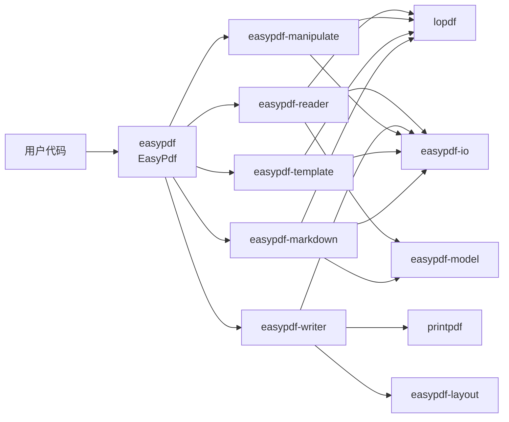
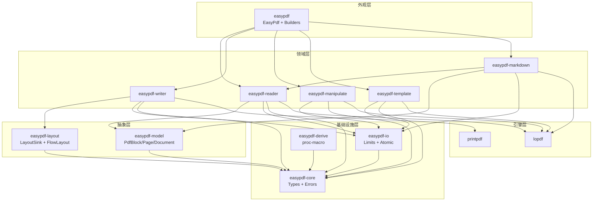
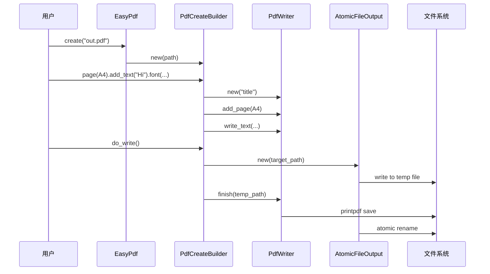
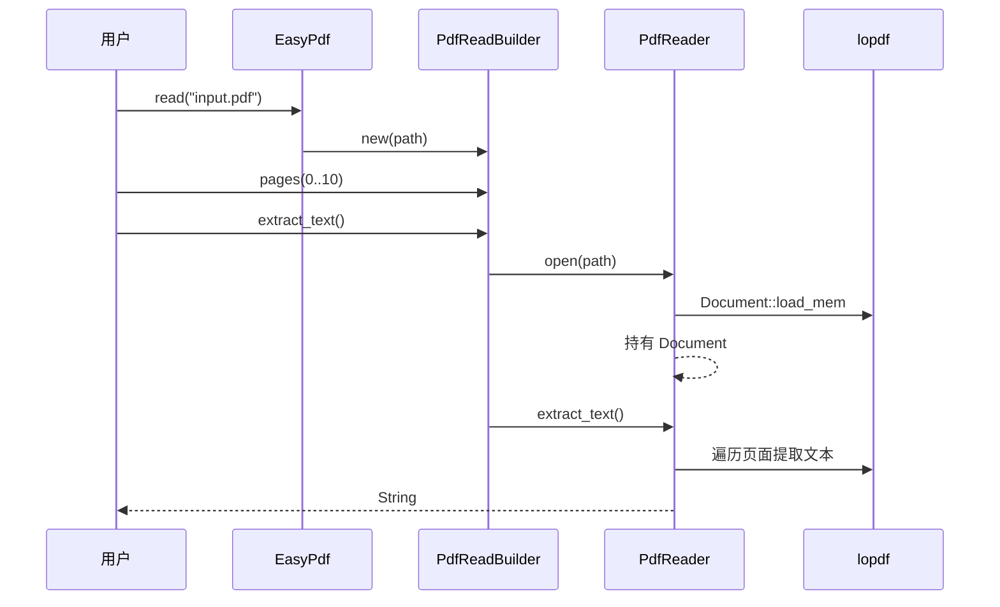
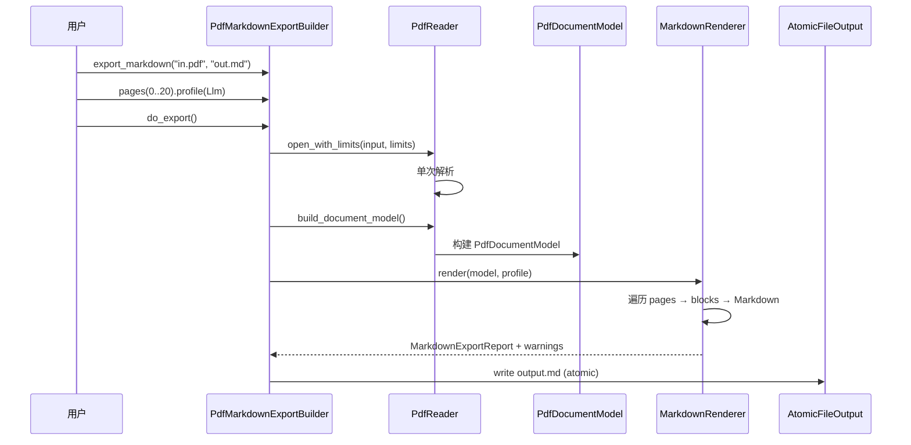
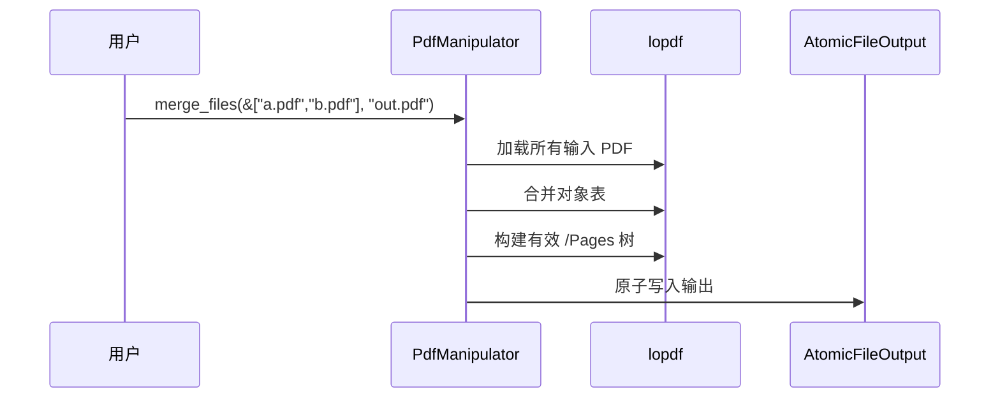
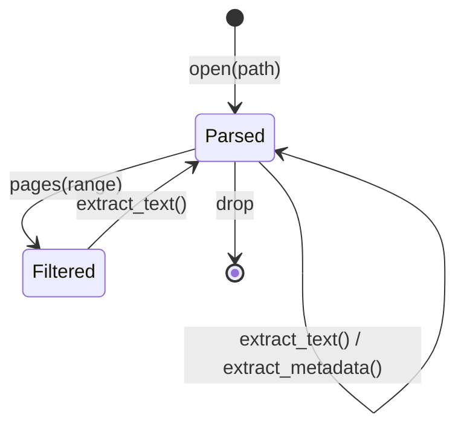
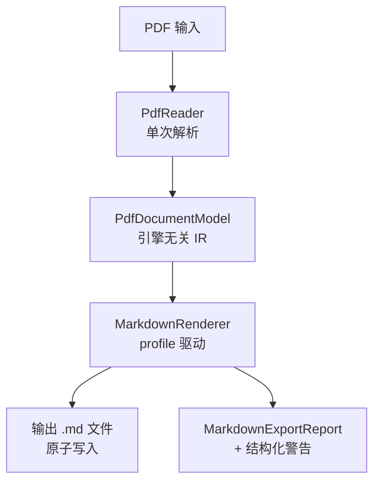

# easypdf-rust 架构设计文档

> **文档版本**：0.1.0
> **适用代码版本**：v0.1.0 (workspace)
> **文档状态**：已批准
> **许可证**：Apache-2.0
> **最后更新**：2026-08-09

---

## 目录

1. [执行摘要](#1-执行摘要)
2. [架构驱动与约束](#2-架构驱动与约束)
3. [范围、边界与非目标](#3-范围边界与非目标)
4. [当前态与目标态](#4-当前态与目标态)
5. [架构原则与关键决策](#5-架构原则与关键决策)
6. [总体架构与分层](#6-总体架构与分层)
7. [Crate 依赖与职责](#7-crate-依赖与职责)
8. [运行时模型与并发](#8-运行时模型与并发)
9. [核心数据流](#9-核心数据流)
10. [状态机与生命周期](#10-状态机与生命周期)
11. [语义模型（IR）](#11-语义模型ir)
12. [错误处理与资源限制](#12-错误处理与资源限制)
13. [原子输出策略](#13-原子输出策略)
14. [Markdown 转换流水线](#14-markdown-转换流水线)
15. [接口与 trait 设计](#15-接口与-trait-设计)
16. [安全与信任边界](#16-安全与信任边界)
17. [性能与资源预算](#17-性能与资源预算)
18. [测试、验证与架构验收](#18-测试验证与架构验收)
19. [风险、技术债与路线](#19-风险技术债与路线)
20. [附录](#20-附录)

---

## 1. 执行摘要

### 1.1 一句话架构

**easypdf-rust 是一个纯 Rust PDF 操作 workspace，通过 `EasyPdf` 外观入口 + Builder 链式 API + 引擎无关语义模型，将 PDF 创建、读取、操作、模板填充和 Markdown 转换统一为类型安全、资源受控、原子输出的操作序列。**

### 1.2 一眼看懂

```text
用户代码
    │
    ▼
EasyPdf 外观入口（easypdf crate）
    │
    ├──► PdfCreateBuilder ──► easypdf-writer (printpdf) ──► PDF 文件
    ├──► PdfReadBuilder ────► easypdf-reader (lopdf) ────► 文本/元数据
    ├──► PdfMarkdownExportBuilder ──► easypdf-markdown ──► .md 文件
    ├──► PdfSplitBuilder ──► easypdf-manipulate (lopdf) ──► 多个 PDF
    ├──► PdfManipulateBuilder ──► easypdf-manipulate ──► 修改后 PDF
    └──► PdfFillBuilder ───► easypdf-template (lopdf) ──► 填充后 PDF
                                   │
                                   ▼
                          easypdf-io（资源限制 + 原子输出）
```

### 1.3 关键架构决策

| 决策 | 选择 | 理由 |
|---|---|---|
| 多引擎后端 | lopdf 读/操作, printpdf 写 | 各取所长，可替换 |
| 单次解析会话 | Reader 持有 `lopdf::Document` | ~129x 性能提升 |
| 引擎无关 IR | `easypdf-model` 独立 crate | Markdown 等转换不绑定引擎 |
| 后端无关布局 | `LayoutSink` trait | Writer 实现消费，layout 不反向依赖 |
| 原子输出 | 临时文件 + rename | 防止写入中断导致文件损坏 |
| 结构化警告 | `MarkdownWarning` 枚举 | 未实现能力不伪装成功 |
| `#![forbid(unsafe_code)]` | 所有 crate | 与 easyexcel-rs 安全策略一致 |

## 2. 架构驱动与约束

### 2.1 业务驱动

| 驱动 | 优先级 | 说明 |
|---|:---:|---|
| 简单 API | P0 | Builder 模式链式调用，一行代码完成操作 |
| 类型安全 | P0 | 编译期检查，无运行时反射 |
| 纯 Rust | P0 | 零 FFI，零 unsafe |
| 引擎可替换 | P1 | lopdf/printpdf 可替换为其他引擎 |
| 与 easyexcel-rs 对齐 | P1 | 相同的 Builder/Listener/Handler/Converter 模式 |
| 资源可控 | P1 | 防止恶意或过大输入导致 OOM |

### 2.2 硬约束

| 约束 | 说明 |
|---|---|
| Rust 1.88+ | MSRV，workspace 级别统一 |
| Edition 2024 | 使用最新语言特性 |
| `unsafe_code = "forbid"` | 所有 crate 强制禁止 |
| `missing_docs = "warn"` | 公共 API 必须有文档 |
| Apache-2.0 | 许可证 |

## 3. 范围、边界与非目标

### 3.1 系统边界



### 3.2 非目标

| 非目标 | 理由 | 替代方案 |
|---|---|---|
| 加密 / 解密 | 未实现，返回 `UnsupportedFeature` | 待 v0.4 实现 |
| 数字签名 | 未实现，返回 `UnsupportedFeature` | 待 v0.5 实现 |
| OCR | 未实现，Markdown 发出 `OcrUnavailable` 警告 | 待接入 OCR 后端 |
| 表格检测 | 未实现，Markdown 发出 `TableDetectionUnavailable` 警告 | 待接入表格检测后端 |
| 图片提取 | 未实现，Markdown 发出 `ImageExtractionUnavailable` 警告 | 待接入图片提取 |
| HTML → PDF | 需要 Chromium，feature-gated | `html` feature |
| PDF → 图片 | 不在范围 | 外部渲染器 |
| 1:1 Java EasyExcel 兼容 | PDF 和 Excel 是不同范式 | API 风格对齐，非功能克隆 |

## 4. 当前态与目标态

### 4.1 能力状态总览

| 能力 | 当前态 | 目标态 | 差距 |
|---|---|---|---|
| 创建 PDF | ✅ 文本、内置字体、元数据 | 表格、图片、矢量、自定义字体 | v0.2 |
| 读取 PDF | ✅ 文本提取、元数据、会话复用 | 流式读取、结构化内容提取 | v0.2+ |
| PDF → Markdown | ✅ 原生文本、GFM/LLM/Plain profiles | 表格检测、图片提取、OCR | v0.2+ |
| 合并 | ✅ 有效 `/Pages` 树 | — | 已完成 |
| 拆分 | ✅ 有效 `/Pages` 树 | — | 已完成 |
| 旋转/重排 | ✅ 按页或全部 | — | 已完成 |
| 模板填充 | ✅ AcroForm 字段 | — | 已完成 |
| 原子输出 | ✅ 临时文件 + rename | — | 已完成 |
| 资源限制 | ✅ 文件大小、页数、文本长度 | 可配置限制 | v0.2 |
| Reader 会话复用 | ✅ ~129x 加速 | — | 已完成 |
| 加密 | ⛔ `UnsupportedFeature` | AES-256 | v0.4 |
| 签名 | ⛔ `UnsupportedFeature` | 数字签名 | v0.5 |
| 布局引擎 | 🚧 `FlowLayout` 骨架 | 自动定位元素 | v0.3 |

### 4.2 已修正的架构问题

| 问题 | 修正 |
|---|---|
| Reader 每次操作重新打开文件 | 改为单次解析会话，`lopdf::Document` 持有在 `PdfReader` 中 |
| 0 基页范围与 PDF 1 基页码混用 | 统一为 0 基，Reader 内部映射 |
| Writer 生命周期不完整 | 补全 `before_document` / `before_page` / `after_page` / `after_document` |
| Merge/Split 生成无效 `/Pages` 树 | 修正为正确构建 Pages 层级结构 |
| `easypdf-layout` 反向依赖 Writer | 引入 `LayoutSink` trait，Writer 实现消费 |
| 加密/签名伪造成功 | 删除伪实现，返回 `UnsupportedFeature` |
| 输出无原子保护 | 所有保存操作使用 `AtomicFileOutput` |

## 5. 架构原则与关键决策

### 5.1 原则

| # | 原则 | 实践 |
|---|---|---|
| P1 | 纯 Rust, 零 unsafe | `#![forbid(unsafe_code)]` 在每个 crate |
| P2 | 类型安全 Builder | `mut self → Self`, `#[must_use]` |
| P3 | 多引擎后端 | lopdf 读/操作, printpdf 写, 可替换 |
| P4 | 引擎无关 IR | `easypdf-model` 不依赖任何引擎 |
| P5 | 编译期反射 | `#[derive(PdfModel)]` 替代运行时注解扫描 |
| P6 | 单一错误类型 | `PdfError` 枚举 + `thiserror` |
| P7 | 关注点分离 | Core ≠ 引擎实现 ≠ 外观 |
| P8 | 原子输出 | 临时文件 + rename，失败不影响原文件 |
| P9 | 结构化警告 | 未实现能力不伪装成功 |

### 5.2 ADR-001：Reader 单次解析会话

- **上下文**：原 Reader 每次调用 `extract_text()` 都重新打开文件
- **决策**：`PdfReader::open()` 解析一次，持有 `lopdf::Document`
- **后果**：~129x 性能提升；Reader 生命周期与 Document 绑定

### 5.3 ADR-002：LayoutSink 解耦布局与写入

- **上下文**：`easypdf-layout` 依赖 `easypdf-writer` 产生循环依赖风险
- **决策**：定义 `LayoutSink` trait，Writer 实现该 trait
- **后果**：layout 与 writer 解耦，可独立演进

### 5.4 ADR-003：结构化警告替代模拟成功

- **上下文**：原实现对未实现功能返回空成功
- **决策**：`MarkdownWarning` 枚举 + `MarkdownExportReport`
- **后果**：调用方可精确知道哪些能力缺失

## 6. 总体架构与分层

### 6.1 分层图



### 6.2 层次职责

| 层 | 职责 | 不负责 |
|---|---|---|
| 外观 | 统一入口、Builder 路由、prelude | 引擎细节、IO 细节 |
| 领域 | PDF 读/写/操作/模板/Markdown 具体逻辑 | 共享类型、IO 基础设施 |
| 抽象 | 引擎无关模型和布局 | 具体引擎调用 |
| 基础设施 | 类型、错误、IO 限制、原子输出、derive | PDF 业务逻辑 |
| 引擎 | lopdf / printpdf | 本项目不修改引擎 |

## 7. Crate 依赖与职责

### 7.1 依赖图

```text
easypdf (facade)
├── easypdf-core          (types, errors)
├── easypdf-model         (IR, depends on core)
├── easypdf-io            (limits, depends on core)
├── easypdf-derive        (proc-macro, depends on core)
├── easypdf-layout        (layout, depends on core)
├── easypdf-reader        (lopdf, depends on core + model + io)
├── easypdf-writer        (printpdf, depends on core + layout + io)
├── easypdf-manipulate    (lopdf, depends on core + io)
├── easypdf-template      (lopdf, depends on core + io)
└── easypdf-markdown      (optional, depends on reader + model + io)
```

### 7.2 各 Crate 详细职责

#### easypdf-core

```text
src/
├── lib.rs          # 扁平重导出
├── enums.rs        # PageSize, Orientation, Rotation, TextAlignment
├── error.rs        # PdfError 枚举, Result<T> 别名
├── content.rs      # PdfText, PdfTable, PdfImage, PdfLine, PdfRect
├── style.rs        # PdfColor, PdfFont, FontFamily, BuiltInFont, TableStyle
├── metadata.rs     # PdfMetadata, PdfBookmark
├── traits.rs       # PdfModel, PdfReadListener, PdfWriteHandler, PdfConverter
└── event.rs        # 重导出 PdfReadListener
```

零引擎依赖。所有其他 crate 的共享词汇。

#### easypdf-model

```text
src/
├── lib.rs
├── pdf_block.rs          # PdfBlock: Text / Table / Image / Vector / ...
├── pdf_page_model.rs     # PdfPageModel: blocks + page metadata
├── pdf_document_model.rs # PdfDocumentModel: pages + doc metadata
└── source_location.rs    # SourceLocation: page + position
```

引擎无关语义 IR。Markdown 流水线消费此模型，不直接依赖 lopdf 对象。

#### easypdf-io

```text
src/
├── lib.rs
├── resource_limits.rs    # ResourceLimits: max_file_size, max_pages, max_text
├── pdf_input.rs          # PdfInput: from_path / from_bytes, 读取+限制检查
└── atomic_file_output.rs # AtomicFileOutput: 临时文件+rename
```

所有领域 crate 共享的 IO 基础设施。

#### easypdf-reader

单次解析会话。`open()` 解析一次，持有 `lopdf::Document`。支持 0 基页范围、事件监听器、资源限制。

#### easypdf-writer

printpdf 后端。支持文本、图片、矢量图形、内置字体、自定义字体注册、元数据、生命周期钩子。实现 `LayoutSink` trait。

#### easypdf-manipulate

lopdf 后端。合并、拆分、旋转、重排。输出有效 `/Pages` 树。原子输出。

#### easypdf-template

lopdf 后端。AcroForm 字段填充。原子输出。

#### easypdf-markdown

PDF → Markdown 转换。消费 `PdfDocumentModel`（来自 easypdf-model）。支持 GFM/LLM/Plain profiles。结构化警告。

#### easypdf-layout

后端无关布局抽象。`LayoutSink` trait（Writer 实现）、`FlowLayout`（方向、边距、间距）。不依赖 Writer。

#### easypdf-derive

`#[derive(PdfModel)]` 过程宏。解析 `#[pdf(...)]` 属性，生成 impl 块。

## 8. 运行时模型与并发

### 8.1 线程模型

- 所有操作均为同步阻塞调用（无 async）。
- `PdfReader` / `PdfWriter` 不是 `Send`/`Sync`（lopdf/printpdf 限制）。
- 用户需在单线程中操作单个 Reader/Writer 实例。
- `PdfError` 和 `Result<T>` 是 `Send`，可跨线程传递错误。

### 8.2 内存模型

| 模式 | 内存复杂度 | 场景 |
|---|---|---|
| Reader 会话复用 | `O(document)` | 多次提取文本/元数据 |
| Writer 增量构建 | `O(pages)` | 创建 PDF |
| Manipulate 加载 | `O(input)` | 合并/拆分/旋转 |
| Markdown 流水线 | `O(document)` | PDF → Markdown |

## 9. 核心数据流

### 9.1 创建 PDF



### 9.2 读取 PDF



### 9.3 PDF → Markdown



### 9.4 合并 / 拆分



## 10. 状态机与生命周期

### 10.1 PdfWriter 生命周期

```mermaid
stateDiagram-v2
    [*] --> Created: PdfWriter::new()
    Created --> PageAdded: add_page()
    PageAdded --> PageAdded: write_text / draw_line / ...
    PageAdded --> PageAdded: add_page() (新页)
    PageAdded --> Finished: finish(path)
    Finished --> [*]

    Created --> Finished: finish(path) (空文档)
```

### 10.2 PdfReader 会话



### 10.3 WriteHandler 回调顺序

```text
before_document()
  ├─ before_page(0)
  │   └─ after_page(0)
  ├─ before_page(1)
  │   └─ after_page(1)
  └─ ...
after_document()
```

## 11. 语义模型（IR）

### 11.1 模型层次

```text
PdfDocumentModel
├── metadata: PdfMetadata
├── pages: Vec<PdfPageModel>
│   ├── page_number: usize
│   ├── blocks: Vec<PdfBlock>
│   │   ├── Text { content, font_info, location }
│   │   ├── Table { rows, location }
│   │   ├── Image { data, location }
│   │   └── Vector { ... }
│   └── source: SourceLocation
└── warnings: Vec<MarkdownWarning>
```

### 11.2 设计决策

- `PdfBlock` 是枚举而非 trait object——便于模式匹配和序列化。
- `SourceLocation` 记录原始页码和位置，便于调试和警告定位。
- 模型是不可变的——构建后只读。

## 12. 错误处理与资源限制

### 12.1 错误枚举

```rust
pub enum PdfError {
    Io(std::io::Error),
    Parse(String),
    InvalidPage(usize),
    UnsupportedFeature(String),
    ResourceLimitExceeded { resource: &'static str, limit: u64, actual: u64 },
    Encryption(String),
    Other(String),
}
```

### 12.2 资源限制

| 资源 | 默认 | 检查点 |
|---|---|---|
| 文件大小 | 100 MB | `PdfInput::read()` |
| 页数 | 10,000 | `PdfReader::open_with_limits()` |
| 文本长度 | 10 MB | `PdfReader::extract_text()` |

超限返回 `ResourceLimitExceeded` 错误，不 panic。

## 13. 原子输出策略

### 13.1 流程


### 13.2 应用范围

| 操作 | 后端 | 原子输出 |
|---|---|:---:|
| PdfWriter::finish() | printpdf | ✅ |
| PdfManipulator::merge/split/rotate/reorder | lopdf | ✅ |
| PdfTemplateFiller::fill | lopdf | ✅ |
| PdfMarkdownExportBuilder::do_export | lopdf | ✅ |

## 14. Markdown 转换流水线

### 14.1 架构



### 14.2 Profile 对比

| Profile | 目标 | 输出风格 | Token 效率 |
|---|---|---|---|
| Gfm | GitHub/GitLab | 标准 GFM 表格 + 围栏块 | 中 |
| Llm | LLM 上下文 | 精简标记 | 高 |
| Plain | 人类阅读 | 最小格式 | 最高 |

### 14.3 结构化警告

| 警告 | 触发条件 | 行为 |
|---|---|---|
| `TableDetectionUnavailable` | 遇到疑似表格但无表格检测后端 | 输出原始文本，警告记录在报告中 |
| `ImageExtractionUnavailable` | 遇到图片但无图片提取后端 | 跳过图片，警告记录在报告中 |
| `OcrUnavailable` | 遇到扫描页面但无 OCR 后端 | 跳过页面文本，警告记录在报告中 |

## 15. 接口与 Trait 设计

### 15.1 Trait 总览

| Trait | 定义位置 | 实现者 | 用途 |
|---|---|---|---|
| `PdfModel` | easypdf-core | 用户 derive | 结构体 → PDF 元素映射 |
| `PdfReadListener` | easypdf-core | 用户实现 | 事件驱动文本提取 |
| `PdfWriteHandler` | easypdf-core | 用户实现 | 页面生命周期钩子 |
| `PdfConverter<T>` | easypdf-core | 用户实现 | Rust ⇄ PDF 字符串 |
| `LayoutSink` | easypdf-layout | easypdf-writer | 后端无关布局消费 |

### 15.2 LayoutSink 接口

```rust
pub trait LayoutSink {
    fn write_text_at(&mut self, text: &str, x: f64, y: f64) -> Result<()>;
    fn write_image_at(&mut self, data: &[u8], x: f64, y: f64, w: f64, h: f64) -> Result<()>;
    fn draw_line(&mut self, x1: f64, y1: f64, x2: f64, y2: f64) -> Result<()>;
    fn new_page(&mut self, size: PageSize) -> Result<usize>;
}
```

`easypdf-writer` 实现此 trait，`easypdf-layout` 通过它消费布局结果，不直接依赖 Writer。

## 16. 安全与信任边界

### 16.1 unsafe 策略

所有 crate 使用 `#![forbid(unsafe_code)]`。lopdf 和 printpdf 内部可能使用 unsafe，但本项目不引入额外 unsafe。

### 16.2 输入安全

| 威胁 | 防护 |
|---|---|
| 超大文件 | `ResourceLimits.max_file_size` |
| 超多页面 | `ResourceLimits.max_pages` |
| 超长文本 | `ResourceLimits.max_text_length` |
| 损坏 PDF | lopdf 解析错误 → `PdfError::Parse` |
| 恶意路径 | 原子输出使用临时文件，不修改输入 |

### 16.3 未实现功能的安全处理

不模拟成功。`UnsupportedFeature` 错误是明确的，不会产生看似有效但实际不安全的输出。

## 17. 性能与资源预算

### 17.1 Reader 会话复用基准

| 操作 | 延迟 | 加速比 |
|---|---:|---:|
| 会话复用 | ~1,047 ns/iter | 1x |
| 重新打开 | ~135,011 ns/iter | ~129x |

### 17.2 资源预算

| 资源 | 预算 | 来源 |
|---|---|---|
| 最大文件大小 | 100 MB | `ResourceLimits` 默认 |
| 最大页数 | 10,000 | `ResourceLimits` 默认 |
| 最大文本长度 | 10 MB | `ResourceLimits` 默认 |
| 栈深度 | Rust 默认 | 无递归 |

## 18. 测试、验证与架构验收

### 18.1 验证矩阵

| 验证类型 | 范围 | 命令 | 状态 |
|---|---|---|:---:|
| 构建检查 | 全 workspace | `cargo check -p easypdf --all-features` | ✅ |
| 无默认 feature | facade | `cargo check -p easypdf --no-default-features` | ✅ |
| 单元测试 | 全 workspace | `cargo test --workspace --quiet` | ✅ (136 pass) |
| Clippy | 新 crate | `clippy -D warnings` on model/io/markdown | ✅ |
| 文档构建 | 全 workspace | `cargo doc --workspace --no-deps` | ✅ |
| 基准 | reader | `cargo bench -p easypdf-reader --bench reader_session` | ✅ |
| 编译期测试 | derive | trybuild (1 ignored legacy) | ✅ |

### 18.2 架构验收

| 架构声明 | 验收条件 | 证据 |
|---|---|---|
| 引擎无关 IR 不依赖引擎 | `easypdf-model` 无 lopdf/printpdf 依赖 | Cargo.toml |
| Reader 单次解析 | `open()` 后复用 Document | 源码 + 基准 |
| LayoutSink 解耦 | `easypdf-layout` 不依赖 `easypdf-writer` | Cargo.toml |
| 原子输出 | 所有 save/finish 使用 AtomicFileOutput | 源码 |
| 结构化警告 | Markdown 返回 `MarkdownExportReport` | 测试 |
| 零 unsafe | 所有 crate `#![forbid(unsafe_code)]` | lib.rs |

## 19. 风险、技术债与路线

### 19.1 风险

| ID | 风险 | 概率 | 影响 | 缓解 |
|---|---|:---:|:---:|---|
| R-001 | lopdf 文本提取质量不足 | 高 | 中 | 接入 OCR 后端 |
| R-002 | printpdf 不支持自定义字体格式 | 中 | 中 | 字体注册抽象 |
| R-003 | 大文件 OOM | 低 | 高 | ResourceLimits 限制 |

### 19.2 技术债

| 债务 | 当前代价 | 目标 | 偿还阶段 |
|---|---|---|---|
| 表格检测未实现 | Markdown 表格输出为纯文本 | 接入表格检测后端 | v0.2 |
| 图片提取未实现 | Markdown 跳过图片 | 接入图片提取 | v0.2 |
| OCR 未实现 | 扫描页无法提取文本 | 接入 OCR | v0.2+ |
| 布局引擎仅骨架 | 手动定位所有元素 | 自动布局 | v0.3 |

### 19.3 实施路线

| 阶段 | 架构交付物 | 退出条件 |
|---|---|---|
| v0.1 ✅ | 11 crates, 核心类型, Builder API, IR, IO, Markdown | 136 tests pass |
| v0.2 | 表格/图片/矢量/自定义字体 | 功能测试 + 集成测试 |
| v0.3 | 布局引擎 + 水印 | 自动定位测试 |
| v0.4 | 加密 | 加密/解密往返测试 |
| v0.5 | 签名 + PDF/A | 合规验证 |
| v1.0 | 稳定 API | 完整测试覆盖 + 基准 |

## 20. 附录

### 附录 A：术语表

| 术语 | 定义 |
|---|---|
| Facade | 用户可见的统一入口结构体 `EasyPdf` |
| Builder | 链式配置器，最终调用 `do_write()` / `do_export()` 等终态方法 |
| IR | 引擎无关的中间表示（`PdfDocumentModel`） |
| LayoutSink | 后端无关的布局消费 trait |
| 会话复用 | Reader 解析一次 PDF，后续操作复用已解析对象 |
| 原子输出 | 写入临时文件，成功后 rename 替换目标 |

### 附录 B：质量门禁汇总

| 门禁 | 命令 | 状态 |
|---|---|:---:|
| 无默认 feature 构建 | `cargo check -p easypdf --no-default-features` | ✅ |
| 全 feature 构建 | `cargo check -p easypdf --all-features` | ✅ |
| 测试 | `cargo test --workspace --quiet` | ✅ |
| 文档 | `cargo doc --workspace --no-deps` | ✅ |
| Clippy (新 crate) | `clippy -D warnings` on model/io/markdown | ✅ |
| 基准 | `cargo bench -p easypdf-reader --bench reader_session` | ✅ |

---

**文档版本**：0.1.0
**最后更新**：2026-08-09
**文档状态**：已批准
