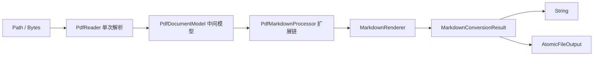

# easypdf-rust 技术选型

> **文档说明**：以 [ddd4j-ddd4r-依赖映射对照表](/Users/wandl/workspaces/workspace-ddd4r/ddd4r/docs/ddd4j-ddd4r-依赖映射对照表.md) 为参考基准，结合 easypdf-rust 作为纯 Rust PDF 操作库的定位，定义各技术域的选型决策。
>
> **Java 基线**：PDFBox 3.x / iText 7.x / Apache POI
> **Rust 基线**：easypdf-rust，Rust 1.88+，Edition 2024，Resolver 3
>
> **版本**：V1.0.0
> **最后更新**：2026-08-10

---

## 1. 映射图例

| 标记 | 含义 |
| :--- | :--- |
| ✅ | Rust 生态成熟，已采用 |
| 🔧 | Rust 有候选，需评估或封装 |
| ⏳ | Rust 生态早期，观望中 |
| ❌ | Java 生态特有，明确不迁移 |
| 🆕 | Rust 原生方案，无直接 Java 对标 |

---

## 2. PDF 核心引擎

| 领域 | Java 组件 | Rust 组件 | crate | 版本 | 状态 | 说明 |
| :--- | :--- | :--- | :--- | :--- | :--- | :--- |
| PDF 读取/解析 | PDFBox `PDDocument.load()` | **lopdf** | `lopdf` | 0.44 | ✅ | 纯 Rust PDF 解析；对象流、交叉引用表、页面树 |
| PDF 创建/写入 | PDFBox `PDDocument.save()` | **printpdf** | `printpdf` | 0.12 | ✅ | 纯 Rust PDF 生成；文本、图片、矢量、字体 |
| PDF 文本提取 | PDFBox `PDFTextStripper` | **lopdf** + 自研 | `lopdf` | 0.44 | ✅ | 基于 lopdf 的流内容解析 |
| PDF 元数据 | PDFBox `PDDocumentInformation` | **lopdf** | `lopdf` | 0.44 | ✅ | `/Info` 字典读取 |
| PDF 表单 | PDFBox `PDAcroForm` | **lopdf** | `lopdf` | 0.44 | ✅ | AcroForm 字段填充 |
| PDF 合并 | PDFBox `PDFMergerUtility` | **lopdf** 自研合并 | `lopdf` | 0.44 | ✅ | 对象表合并 + `/Pages` 树构建 |
| PDF 拆分 | PDFBox `Splitter` | **lopdf** 自研拆分 | `lopdf` | 0.44 | ✅ | 页面提取 + `/Pages` 树重建 |
| PDF 加密 | PDFBox `StandardDecryptionMaterial` | lopdf 加密扩展 | `lopdf` | 0.44 | ⏳ | 当前返回 `UnsupportedFeature`；计划 v0.4 |
| PDF 签名 | PDFBox `PDSignature` | — | — | — | ⏳ | 当前返回 `UnsupportedFeature`；计划 v0.5 |
| PDF/A 合规 | PDFBox `PDFACompliance` | — | — | — | ⏳ | 计划 v0.5 |

---

## 3. 异步运行时与并发

| 领域 | Java 组件 | Rust 组件 | crate | 版本 | 状态 | 说明 |
| :--- | :--- | :--- | :--- | :--- | :--- | :--- |
| 运行时 | Project Reactor | **当前无** | — | — | ❌ | easypdf-rust 全部同步调用；lopdf/printpdf 非 async |
| 并发安全 | `ConcurrentHashMap` | 当前无共享缓存 | std | — | ❌ | Reader 持有独占文档会话，不引入全局缓存与锁竞争 |
| 原子引用 | `AtomicReference` | 当前不需要 | — | — | ❌ | 没有热切换的全局配置 |
| 锁 | `synchronized` / `ReentrantLock` | 所有权与独占借用 | std | — | ✅ | 当前实现未依赖 `parking_lot` |
| 异步任务 | `CompletableFuture` | 🆕 同步阻塞 | — | — | ❌ | 当前无需 async；若未来引入需 tokio |

> **决策**：easypdf-rust 当前为纯同步库。lopdf 和 printpdf 均为同步 API，强行包装 async 无实际收益。若未来引入网络 OCR/LLM 后端，再引入 tokio。

---

## 4. 序列化与数据格式

| 领域 | Java 组件 | Rust 组件 | crate | 版本 | 状态 | 说明 |
| :--- | :--- | :--- | :--- | :--- | :--- | :--- |
| JSON | Jackson | **serde + serde_json** | `serde` / `serde_json` | 1.x | ✅ | 配置序列化、测试 fixtures |
| YAML | SnakeYAML | 当前不需要 | — | — | ❌ | 公共 API 采用类型安全 Builder，不读取 YAML 配置 |
| XML | JAXB / DOM4J | `quick-xml` 候选 | `quick-xml` | — | 🔧 | 仅在实现 XFA 时按 feature 引入 |
| XML DOM | DOM4J | `roxmltree` 候选 | `roxmltree` | — | 🔧 | 当前 Cargo 依赖树未采用 |
| TOML | — | Cargo 原生清单 | — | — | ❌ | 库运行期不解析 Cargo.toml |

---

## 5. 错误处理

| 领域 | Java 组件 | Rust 组件 | crate | 版本 | 状态 | 说明 |
| :--- | :--- | :--- | :--- | :--- | :--- | :--- |
| 检查异常 | `throws IOException` | **thiserror** | `thiserror` | 2.x | ✅ | `PdfError` 枚举，7 个变体 |
| 运行时异常 | `RuntimeException` | **thiserror** | `thiserror` | 2.x | ✅ | 统一 `Result<T, PdfError>` |
| 错误传播 | `try-catch` | `?` 操作符 | std | — | ✅ | Rust 原生错误传播 |
| 通用错误 | `Exception` | **anyhow** | `anyhow` | 1.x | 🔧 | 测试和示例中使用；生产代码用 thiserror |

### easypdf-rust 错误枚举

```rust
pub enum PdfError {
    Io(std::io::Error),
    Parse(String),
    InvalidPage(usize),
    UnsupportedFeature(String),
    ResourceLimitExceeded { resource: &'static str, limit: u64, actual: u64 },
    Encryption(String),
    Other(String),
}
```

---

## 6. 日志与可观测

| 领域 | Java 组件 | Rust 组件 | crate | 版本 | 状态 | 说明 |
| :--- | :--- | :--- | :--- | :--- | :--- | :--- |
| 日志门面 | SLF4J | **tracing** | `tracing` | 0.1 | 🔧 | 当前未集成；计划 v0.2 |
| 日志实现 | Logback | **tracing-subscriber** | `tracing-subscriber` | 0.3 | 🔧 | 支持 env-filter、JSON 格式 |
| 指标 | Micrometer | **opentelemetry** | `opentelemetry` | 0.32 | ⏳ | 计划 v1.0 |
| 追踪 | Spring Cloud Sleuth | **tracing-opentelemetry** | `tracing-opentelemetry` | 0.33 | ⏳ | 计划 v1.0 |

> **决策**：当前版本不引入日志依赖，保持最小依赖树。v0.2 考虑可选 `tracing` feature。

---

## 7. 测试

| 领域 | Java 组件 | Rust 组件 | crate | 版本 | 状态 | 说明 |
| :--- | :--- | :--- | :--- | :--- | :--- | :--- |
| 单元测试 | JUnit 5 | **#[test]** | std | — | ✅ | Rust 内置测试框架 |
| 集成测试 | JUnit + Spring Test | **tests/** 目录 | std | — | ✅ | workspace 级集成测试 |
| Mock | Mockito | **mockall** | `mockall` | 0.13 | 🔧 | trait mock；当前未需要 |
| HTTP Mock | WireMock | **wiremock** | `wiremock` | 0.6 | 🔧 | 若引入 HTTP 后端时使用 |
| 编译期测试 | — | **trybuild** | `trybuild` | 1.x | ✅ | derive 宏编译错误测试 |
| 基准测试 | JMH | Cargo bench（自定义 harness） | std | — | ✅ | 当前没有引入 `criterion`；基准实现必须与 Cargo 清单一致 |
| 覆盖率 | JaCoCo | **cargo-llvm-cov** | `cargo-llvm-cov` | — | ✅ | LLVM 源码覆盖率 |
| 属性测试 | — | **proptest** | `proptest` | 1.x | 🔧 | 边界输入生成 |
| Fuzz | — | **cargo-fuzz** | `cargo-fuzz` | — | ⏳ | 计划用于 PDF 解析器鲁棒性测试 |
| 文档测试 | — | `cargo test --doc` | std | — | ✅ | README/API 示例可执行验证 |

---

## 8. 过程宏与编译期

| 领域 | Java 组件 | Rust 组件 | crate | 版本 | 状态 | 说明 |
| :--- | :--- | :--- | :--- | :--- | :--- | :--- |
| 注解处理 | `@interface` / APT | **syn** | `syn` | 3.x | ✅ | 过程宏解析 |
| 代码生成 | JavaPoet | **quote** | `quote` | 1.x | ✅ | TokenStream 代码生成 |
| 宏辅助 | — | **proc-macro2** | `proc-macro2` | 1.x | ✅ | 测试友好的 proc-macro wrapper |
| crate 路径 | — | **proc-macro-crate** | `proc-macro-crate` | 3.x | ✅ | 从 derive 宏定位用户 crate 路径 |

---

## 9. 文件与 IO

| 领域 | Java 组件 | Rust 组件 | crate | 版本 | 状态 | 说明 |
| :--- | :--- | :--- | :--- | :--- | :--- | :--- |
| 临时文件 | `File.createTempFile()` | **tempfile** | `tempfile` | 3.x | ✅ | 原子输出的临时文件 |
| 原子写入 | `Files.move(ATOMIC)` | 自研 `AtomicFileOutput` | std | — | ✅ | 写临时 + rename；失败不影响原文件 |
| 文件监控 | WatchService | **notify** | `notify` | 8.x | 🔧 | 热重载场景；当前未需要 |
| 路径处理 | `java.nio.file.Path` | **std::path** | std | — | ✅ | Rust 原生 Path/PathBuf |
| 压缩 | commons-compress | **tar + flate2 + zip** | `tar` / `flate2` / `zip` | — | 🔧 | PDF 内部可能有压缩流 |

---

## 10. 资源限制与安全

| 领域 | Java 组件 | Rust 组件 | crate | 版本 | 状态 | 说明 |
| :--- | :--- | :--- | :--- | :--- | :--- | :--- |
| 文件大小限制 | 自研 | `ResourceLimits.max_file_size` | 自研 | — | ✅ | 默认 100 MB |
| 页数限制 | 自研 | `ResourceLimits.max_pages` | 自研 | — | ✅ | 默认 10,000 页 |
| 文本长度限制 | 自研 | `ResourceLimits.max_text_length` | 自研 | — | ✅ | 默认 10 MB |
| unsafe 策略 | — | `#![forbid(unsafe_code)]` | std | — | ✅ | 所有 crate 强制禁止 |
| 输入验证 | Bean Validation | 自研边界检查 | std | — | ✅ | 页码范围、坐标范围、字体大小 |

---

## 11. 类型系统与设计模式

| 领域 | Java 组件 | Rust 组件 | 说明 |
| :--- | :--- | :--- | :--- |
| Builder 模式 | Lombok `@Builder` | `mut self -> Self` + `#[must_use]` | 链式调用，编译期检查 |
| 工厂方法 | 静态工厂 | `EasyPdf::create()` / `read()` / `merge()` | 类型安全入口 |
| 接口 | `interface` | `trait` | `PdfModel`, `PdfReadListener`, `PdfWriteHandler`, `LayoutSink` |
| 泛型 | `<T>` | `<T>` | `PdfConverter<T>` |
| 枚举 | `enum` + switch | `enum` + `match` | `PdfError`, `PdfBlock`, `PageSize`, `Rotation` |
| 编译期反射 | APT / 运行时注解扫描 | `#[derive(PdfModel)]` | 零运行时开销 |
| 关联类型 | — | `trait AssociatedType` | `LayoutSink` 的消费接口 |
| RAII | `try-finally` / `AutoCloseable` | `Drop` trait | Writer 生命周期自动清理 |

---

## 12. 多引擎策略

| 引擎 | 职责 | crate | 可替换性 |
| :--- | :--- | :--- | :--- |
| lopdf | 读取、解析、操作、表单 | `lopdf` | 通过 `easypdf-reader` / `easypdf-manipulate` 封装隔离 |
| printpdf | 创建、写入 | `printpdf` | 通过 `easypdf-writer` 封装隔离 |
| easypdf-model | 引擎无关 IR | 自研 | 不依赖任何引擎；Markdown 等转换消费此模型 |
| easypdf-io | 资源限制 + 原子输出 | 自研 | 不依赖任何引擎 |
| easypdf-layout | 后端无关布局 | 自研 | 通过 `LayoutSink` trait 消费；不依赖 Writer |

> **决策**：引擎替换只需修改对应 domain crate 的内部实现，不影响 facade 和用户 API。

---

## 13. Markdown 转换链路

| 环节 | Java 对标 | Rust 实现 | 说明 |
| :--- | :--- | :--- | :--- |
| PDF 解析 | PDFBox `PDFTextStripper` | `easypdf-reader` (lopdf) | 单次解析会话，~129x 加速 |
| 语义模型 | 自研 Document Model | `easypdf-model` (PdfDocumentModel) | 引擎无关 IR |
| Markdown 渲染 | 自研 | `easypdf-markdown` (MarkdownRenderer) | Profile 驱动：GFM / LLM / Plain |
| 输出 | FileWriter | `easypdf-io` (AtomicFileOutput) | 临时文件 + 原子 rename |
| 结构化警告 | — | `MarkdownWarning` 枚举 | 未实现能力不伪装成功 |

---

## 14. 构建与质量门禁

| 领域 | Java 组件 | Rust 组件 | 命令 | 状态 |
| :--- | :--- | :--- | :--- | :--- |
| 格式化 | Google Java Format | **rustfmt** | `cargo fmt --all -- --check` | ✅ |
| 静态分析 | SpotBugs / PMD | **clippy** | `cargo clippy --workspace -- -D warnings` | ✅ |
| 构建 | Maven / Gradle | **cargo** | `cargo build` / `cargo check` | ✅ |
| 测试 | Maven Surefire | **cargo test** | `cargo test --workspace` | ✅ |
| 覆盖率 | JaCoCo | **cargo-llvm-cov** | `cargo llvm-cov --workspace` | ✅ |
| 安全审计 | OWASP Dependency Check | **cargo-audit** | `cargo audit` | 🔧 |
| 依赖许可 | — | **cargo-deny** | `cargo deny check` | 🔧 |
| 文档 | Javadoc | **cargo doc** | `cargo doc --workspace --no-deps` | ✅ |
| 发布 | Maven Deploy | **cargo publish** | `cargo publish -p easypdf` | ⏳ |

---

## 15. 不迁移项

| Java 生态 | 理由 |
| :--- | :--- |
| PDFBox 的 `PDFRenderer` | 页面渲染为图片；不在 easypdf-rust 范围 |
| iText 的 `PdfHTML` | HTML → PDF；计划 v0.6，需要 Chromium |
| Apache POI | Word/Excel 格式；由 easydoc-rust / easyexcel-rs 负责 |
| Spring Boot Starter | Rust 无 Spring；使用 axum 扩展 crate |
| SLF4J + Logback 绑定 | 保持最小依赖；可选 feature 引入 tracing |
| JVM 内存管理 | Rust 所有权系统替代 GC |
| 反射 / 动态代理 | Rust 编译期零成本抽象替代 |

---

## 16. API 与性能设计（借鉴 easyexcel）

easypdf 采用“静态门面 + 专用 Builder + 终止操作”的三级 API：`EasyPdf::read(...)`、`EasyPdf::create(...)`、`EasyPdf::to_markdown(...)` 负责发现能力；Builder 只保存一次任务配置；`do_read`、`do_write`、`do_convert` 或 `save` 明确触发 I/O。复杂能力留在领域 crate，业务调用只依赖 `easypdf` 门面。

性能原则不是承诺一个脱离数据集的倍数，而是保证：一次任务只解析一次 PDF；页范围尽早下推；按页释放中间数据；字节输入避免临时文件；输出使用缓冲与原子替换；资源上限在昂贵分配前检查。基准结果必须同时记录样本、机器、构建模式和提交号。

## 17. MarkItDown 的吸纳边界

`easypdf-markdown` 是独立模块，也是 PDF→Markdown 的唯一实现边界。推荐链路如下：



已吸纳的设计：转换结果对象（Markdown + 报告）、内存与文件双入口、可声明能力的处理器链、按能力产生结构化警告、表格/图片/OCR 的可选扩展位。下一阶段可借鉴 MarkItDown 的逐页提取、表格优先策略、主提取器失败后的保守回退和 OCR 插件，但必须转成 Rust trait/feature，不能把 Python 运行时变成核心依赖。

不吸纳的内容：Word/Excel/PPT/HTML 的总路由器、LLM 客户端、云 OCR SDK 和多格式 MIME 探测。这些属于 Office/文档转换平台，不属于 PDF 读写核心。OCR 或云服务应由独立 adapter crate 实现 `PdfMarkdownProcessor`。

## 18. OfficeCLI 的吸纳边界

OfficeCLI 值得借鉴的是产品化契约，而不是其进程模型：统一命令语法可映射到 `EasyPdf` 门面；结构化结果与 warning 可映射到转换报告；批处理可复用解析会话；资源预算、超时、临时文件与原子替换应成为所有入口的共同约束；插件代理思想可用于 OCR、表格识别和页面渲染后端。

暂不吸纳常驻服务、MCP server、Office DOM、dump/replay 和跨格式处理器体系。若未来提供 `easypdf-cli`，它应只做参数/JSON 映射与退出码管理，所有业务语义仍由库 crate 提供，避免 CLI 与 Rust API 形成两套实现。

## 19. 版本记录

| 版本 | 日期 | 变更说明 |
| :--- | :--- | :--- |
| V1.1.0 | 2026-08-10 | 校正 Cargo 依赖事实；增加 easyexcel API、MarkItDown 与 OfficeCLI 的吸纳边界 |
| V1.0.0 | 2026-08-10 | 初始版本；16 个技术域 |
